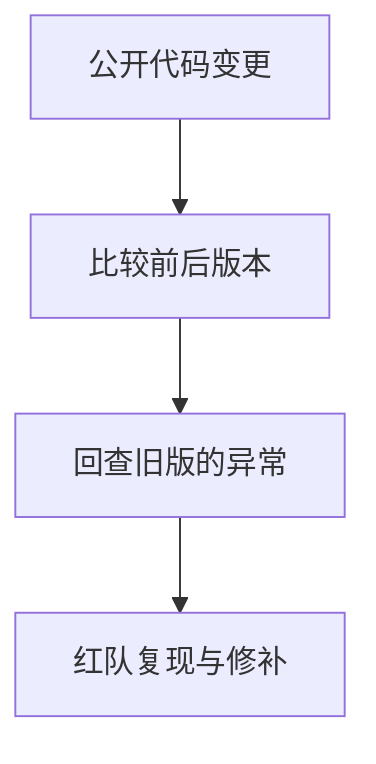
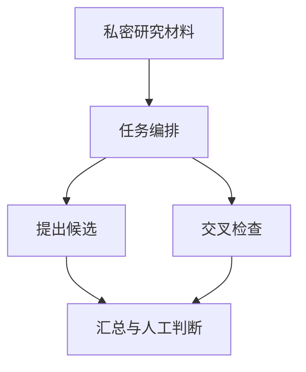
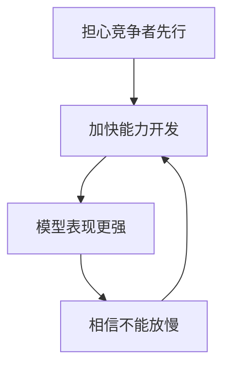

# 私密提示、漏洞补丁与 AI 竞赛

## 一场从 Liquid 被盗案谈到模型隐私与权力分配的圆桌

Stephen、Taylor Monahan、Alex Thorn 与 John

Unchained · 2026 年 9 月 · 1 小时 22 分

讨论从 Liquid 侧链的漏洞开始，随后追问：公开补丁会否成为攻击线索，私密研究输入闭源模型后还能否追溯，以及竞赛中的实验室是否有足够的制衡。

---
layout: default
---

# 节目的四个问题，围绕同一种不对称

谁为漏洞负责

Liquid 的攻击者铸造并兑现了不应存在的 LBTC；返还大部分资金，能否改变取走资金这一行为的性质？

公开修补是否会泄露弱点

嘉宾担心，代码差异与拉取请求会让自动化审查更容易找到旧版本的薄弱处。

私密输入由谁掌握

一场数学证明争议让嘉宾追问：用户能否知道闭源模型是否吸收了自己的新想法？

速度与制衡如何并存

嘉宾把实验室竞争描述为囚徒困境，也提出开放权重、私密推理和任务编排作为另一种路径。

---
layout: default
---

# Liquid 漏洞如何把一份有效证明变成 4,000 LBTC

01
<strong>缓存正常证明</strong>
先让 1 LBTC 转入、1 LBTC 转出的证明进入节点缓存。

02
<strong>碰撞交易被放行</strong>
1 LBTC 转入、4,000 LBTC 转出的交易复用证明键，节点跳过重算而接受它。

03
<strong>兑换为真实 BTC</strong>
LBTC 交给允许退出的联邦成员 SideSwap，再转出到比特币主网。

Alex Thorn 按自己对代码的理解复述此机制；节目没有进行独立审计。他说 Liquid 的提现等共识动作需 15 个联邦节点中的 11 个批准。

---
layout: two-cols-header
---

# 白帽的称呼，不能替代披露与返还的过程

::left::

攻击者在首笔归集交易的 OP_RETURN 中自称白帽；节目随后强调，自我标注本身不说明资金取得方式或返还条件。

按嘉宾盘点，4,000 枚 BTC 中已有 3,400 枚被转回，攻击者仍扣留 15%。节目把这笔比例视为谈判筹码，而不是普通漏洞赏金。

嘉宾估算扣留部分约值 5,000 万美元，并认为以保留资金来要求补偿会给后续攻击制造错误激励；节目没有裁定任何法律责任。

::right::

<strong>负责任披露</strong>
先通知团队修复；赏金由项目方在知情后决定。

<strong>本案中的做法</strong>
先铸造并兑换资产，再以剩余资金要求条件。

右侧归纳的是多位嘉宾的伦理判断：即使最后返还大部分资金，先取走资金也不等同于常规的漏洞披露。

---
layout: two-cols-header
---

# 更新代码后，旧版本也可能成为攻击面的索引

::left::

关于 Liquid 的修补，嘉宾没有得出单一结论：它可能没有补全原有漏洞，也可能引入了新的薄弱处；部分节点未升级也可能造成分叉。

一位参与者说，自己让多个代理红队审查约 1,700 份已部署的 Synthetix 合约。代理有时先发现之后的字节码变化，再回头检查旧代码，并非一开始就识别出漏洞。

因此，节目提出的操作性担忧是：公开提交与补丁发布前，应把它当成可能吸引自动化攻击审查的信号，并用进攻式测试检查修补是否完整。

::right::

这张图概括一名参与者的红队经历，不证明 Liquid 的攻击实际由 AI 找到。嘉宾也承认，相关传言与模型的实时检索会混在一起，难以核验。

---
layout: two-cols-header
---

# 数学证明争议，把训练数据的可追溯性推到台前

::left::

节目提到，一名数学研究者在 Codex 中工作了一年；随后 OpenAI 宣布 Astra 也解决了同一问题。由此出现了是否独立推导的争议。

嘉宾的担心不止针对某个案例：当模型规模与训练流程超出人能逐项检查的范围，实验室可能也无法清楚列出某项输出来自哪些数据。

节目没有提供能够确认数据流向的证据，也没有判定哪一方首先完成证明。它把事件作为私密研究输入闭源模型时的风险讨论。

::right::

<strong>研究者的输入</strong>
证明草稿、代码或尚未公开的假设，可能比一般提问更有独占价值。

<strong>闭源模型的过程</strong>
用户看不到内部训练与版本迭代，外部也难把某项输出追溯回单一输入。

<strong>争议发生时</strong>
即使模型宣称独立完成，用户与实验室未必能提供让所有人信服的核验路径。

最后一项是嘉宾对可验证性的质疑，不是对 OpenAI 或 Anthropic 使用特定私密内容的事实认定。

---
layout: two-cols-header
---

# 隐私与能力之间，嘉宾看到的是一项现实取舍

::left::

嘉宾认为，最强的闭源前沿模型在部分任务上仍有优势；但用户只能依赖平台承诺来相信提示不会用于训练。

John 以 Venice 的立场主张，开放权重模型配合私密推理能减少输入被拿去训练的风险，但承认能力可能不及前沿模型。

模型迭代从过去的数月缩短到嘉宾所说的数周，也使研究者难以依靠下一次发布前的时间差来保护刚形成的想法。

::right::

<strong>闭源前沿模型</strong>
能力可能更强；用户需要相信服务方的训练与数据处理承诺。

<strong>开放权重与私密推理</strong>
更有机会控制输入的去向；嘉宾认为当前仍可能牺牲部分能力。

这是圆桌归纳出的选择框架，不是对任一模型实际性能或隐私政策的独立评测。

---
layout: default
---

# 匿名能降低被锁定的风险，却不能让新颖内容自动保密

<strong>减少身份线索</strong>
避免把姓名、单位与研究方向直接放进账户资料或提示，能减弱针对个人的检索。

<strong>区分普通与新颖输入</strong>
日常搜索式问题的敏感性较低；未公开的数学、发明与专有代码，需要更高标准。

<strong>改变推理环境</strong>
嘉宾认为，真正要避免被用于训练，仍要依赖不经过闭源前沿模型的私密推理。

匿名只是第一层。嘉宾特别指出，模型本身可能识别出输入是否具有价值，因此去掉姓名不能替代数据隔离。

---
layout: two-cols-header
---

# 任务编排可能把能力从单一模型移到工作流里

::left::

嘉宾把 harness 解释为面向特定任务的模板、工具与代理协调层。它不训练新模型，而是安排多个模型如何分工、复核和汇总。

节目设想，数学研究可由多个开放权重模型轮流提出、检查和改写，再把专有材料留在私密的推理环境中。

这仍是待开发的空间。嘉宾提到 Venice 正在做相关工具，但没有给出已发布产品或性能结果。

::right::

这是节目讨论中的设计方向。箭头表示工作流中的信息流，不表示这类系统已经能替代数学研究者或前沿模型。

---
layout: default
---

# 两种竞争路径：更强的单模型，或更合适的组合

<strong>前沿实验室的路径</strong>
持续追逐最强的单一模型；嘉宾认为这是 OpenAI 与 Anthropic 的主要激励。

<strong>任务专用的路径</strong>
组合多种模型、系统提示与工具；目标是把特定任务做得更合适，并控制信息流。

嘉宾并未说两条路径互斥。后一条更接近 Venice 的产品主张，其实际效果仍须逐项验证。

---
layout: two-cols-header
---

# 对失控的担忧，嘉宾指向两种不同的风险

::left::

一位参与者担心递归自我改进可能带来突然的能力跃升；他也说，目前模型缺少持续的长程记忆与连续性，这让他没有陷入最极端的恐慌。

Taylor Monahan 更常担心人的选择：为了抢先竞争者，研究团队可能抛开学术伦理、隐私或原先承诺的安全边界。

这不是对未来结果的预测。节目持续区分模型能力的风险，与人如何部署、宣传和争夺它的风险。

::right::

<strong>能力层面的担忧</strong>
模型是否会出现快速、自我强化的能力增长，以及人能否理解其过程。

<strong>治理层面的担忧</strong>
人是否会在竞争、注意力与利益压力下削弱本应存在的规则与约束。

两侧是不同嘉宾强调的风险来源；节目没有把任何一侧当作已经发生或必然发生的结局。

---
layout: two-cols-header
---

# 安全实验室也可能被竞赛逻辑推着加速

::left::

John 将 OpenAI、Anthropic 与中国实验室之间的关系比作囚徒困境：每方都担心自己慢下来后，能力更强却约束更少的对手会先行。

他认为，Anthropic 的安全使命也可能产生反向压力：若相信只有自己能负责任地控制超级智能，就更容易用这个理由加速、甚至为缩短安全步骤辩护。

嘉宾提出的回应是分散权力、让用户可以检查和制衡服务方；开放权重被当作一种可能手段，不是无条件的安全保证。

::right::

这是 John 对实验室激励的解释，不是对任何一家机构内部决策的事实还原。节目围绕它主张需要外部制衡。

---
layout: end
---

# 这场讨论留下的，是三项需要验证的条件

<strong>漏洞修补</strong> 公开变更可能暴露旧代码；披露流程、升级覆盖率与红队测试要一起检查。

<strong>私密研究</strong> 匿名会降低被锁定的风险，却不能证明输入不会进入训练或被模型识别出价值。

<strong>模型竞赛</strong> 把权力放在少数实验室，还是让能力、推理环境与监督更分散，是节目没有替读者做出的选择。

