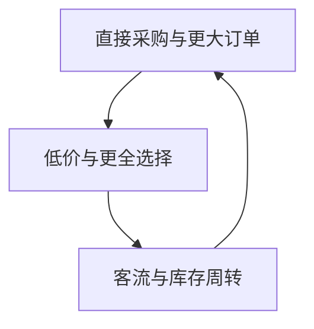
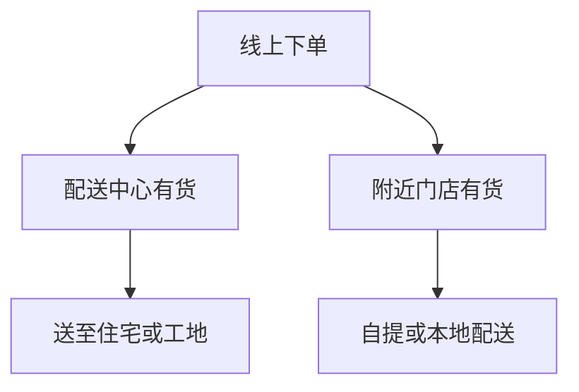

# Home Depot

把仓储、专业服务和即时履约做成一门大生意

Acquired · Ben Gilbert、David Rosenthal · 2026 年 9 月

---
layout: default
---

# 这期讨论的四个问题

<strong>仓储店为何有效</strong>
低价、全品类与一站式采购怎样同时成立。

<strong>现金从哪里来</strong>
两百万美元启动资金如何撑起大量库存。

<strong>规模带来哪些新问题</strong>
标准化提高效率，也可能削弱门店服务。

<strong>门店为何没有被电商取代</strong>
实体密度被改造成面向项目的履约网络。

节目依次回看创立、扩张、管理危机与物流转型。

---
layout: default
---

# 原有建材零售，很难一次完成一个项目

20 世纪 70 年代的市场高度分散：木材、工具、水暖和园艺常由不同小店供应。节目提到，当时最大的 Lowe's 年收入也只有约 1.5 亿美元，门店多是小型陈列室加木材场。

<strong>传统门店</strong>
店面较小、商品有限；消费者要在多个地方补齐材料。

<strong>仓储式构想</strong>
把仓库直接开放给顾客，商品从厂家进店，所有面积都可销售。

仓储并非只为省租金；它让单店能够容纳完成一个家装项目所需的品类。

---
layout: default
---

# 四种能力在同一家公司会合

1978 年，Bernie Marcus、Arthur Blank 与 Ron Brill 被 Handy Dan 解雇。Ken Langone 认为这反而给了他们另起炉灶的机会；不久后，HomeCo 的 Pat Farrah 以商品经营负责人身份加入。

<strong>Bernie Marcus</strong>
零售经营与门店领导。

<strong>Arthur Blank</strong>
财务与日常运营。

<strong>Ken Langone</strong>
募集资本、连接投资人。

<strong>Pat Farrah</strong>
选品、陈列与供应商关系。

节目把这四项能力视为早期模式得以落地的互补条件。

---
layout: two-cols-header
---

# 两百万美元的启动资本，决定了早期客户是谁

::left::

第一家店计划容纳约 25,000 个 SKU，面积约 60,000 平方英尺；这比 Handy Dan 的约 8,000 个 SKU 和较小店型更占资金。创始人最初筹到的 200 万美元不足以把库存长期压在账上。

因此，Home Depot 争取更长的供应商账期，同时优先服务付款即到的消费者和小型专业客户。大企业通常要求赊销，早期公司承受不起这类应收账款。

::right::

01
<strong>争取账期</strong>
供应商先发货，付款日在后。

02
<strong>快速售出</strong>
高周转把库存变为现金。

03
<strong>到期付款</strong>
用顾客付款结清货款。

节目称，按付款期限计算，约一半库存可由供应商融资。

---
layout: default
---

# 亚特兰大让仓储概念先跑起来

<strong>选址</strong> 美国东南部住宅郊区仍在扩张，房地产比加州和东北部便宜；J.C. Penney 又提供了 Treasure Island 遗留店址的转租机会。

<strong>开业</strong> 1979 年 6 月 22 日，两家店在亚特兰大同日开张。早期店面更像改造后的折扣商场，并非后来熟悉的高架仓库。

<strong>验证</strong> 到 1979 年年底，公司已开出第三家店；约半年的运营期累计销售额达到 700 万美元。

先在一个都市圈密集开店，也让广告投放能被多家门店分摊。节目将这称为其后来进入新城市时反复采用的扩张方式。

---
layout: two-cols-header
---

# 低价、全品类与周转，构成同一个运营循环

::left::

Home Depot 的早期目标毛利率约为 30%，低于当时五金零售约 45% 的行业水平。它直接向制造商采购，再把部分规模收益让给顾客；节目引用的早期研究估计，价格比竞争者低 10% 至 25%。

但低毛利和大量 SKU 不能单独成立。更多商品需要更高频的购买和更快的库存周转，才能支撑门店库存与员工成本。

::right::

主持人以此解释：规模带来的采购条件必须回流为价格和客流，循环才会继续。

---
layout: two-cols-header
---

# 专业服务让消费者敢于动手

::left::

顾客不会天然知道怎样铺地板、装百叶窗或修水管。Home Depot 招募木匠、电工、管道工等从业者做门店员工，让他们在货架旁演示材料和做法。

对这类技工而言，门店工作虽未必比接工程收入高，却有稳定工时、较少奔波和福利保障。公司也把股权与日常服务挂钩：管理岗位获得期权，小时工可用折扣价购股，早期还设有下跌补偿。

::right::

<strong>节目转述的内部故事</strong> 
一名员工没有把漏水水龙头换成数百美元的新件，而是推荐了 25 美分的垫圈。主持人用这个故事说明：解决眼前问题能建立信任，顾客随后可能把更大的改造项目交给同一家店。

<strong>服务与收益的连接</strong> 
员工帮助顾客完成项目，顾客回店购买更多材料，门店销售和公司股价随之受益；这正是当时员工持股设计所要建立的连接。

---
layout: default
---

# 1980 年的数据支持了大门店假设

<strong>门店面积</strong> Home Depot 约为 Lowe's 的 2 倍。

<strong>商品数量</strong> Home Depot 约为 Lowe's 的 3 倍。

<strong>交易笔数</strong> Home Depot 约为 Lowe's 的 4 倍。

三项都是同一时期的单店比较；节目据此认为，更大面积与更广选择带来的客流足以覆盖额外投入。

<strong>1984 年</strong> 31 家门店

<strong>1986 年</strong> 60 家门店、销售额 10 亿美元

<strong>1989 年</strong> 118 家门店，超过 Lowe's

---
layout: default
---

# 快速增长也积累了三个问题

<strong>分权过度</strong> 地方采购更贴近市场，但全国扩张后，分散的采购办公室难以统一谈判、使用同一套系统。

<strong>竞争者改变</strong> Lowe's 在 1990 年代改为仓储大店，并更面向年轻、休闲型和女性消费者；互联网也开始降低知识获取门槛。

<strong>治理与继任</strong> 1997 年公司达成当时规模很大的性别歧视诉讼和解；创始团队也没有培养出明确的 CEO 接班人。

到 2000 年，Home Depot 的收入超过 400 亿美元、门店超过 1,000 家、员工超过 20 万人。董事会由此从外部寻找能整顿运营的继任者。

---
layout: two-cols-header
---

# Nardelli 修好了系统，也削弱了门店的专业性

::left::

Bob Nardelli 从 GE 到任后，把 9 个采购办公室并为一个，投入信息系统，并在最初数年解决了不少运营问题。其任内收入和利润翻倍，门店数量也从约 1,100 家增加到 2,000 家。

但主持人指出，增长主要来自新增门店；同店销售在其任内基本持平。全国化的规模收益与门店一线的判断空间，并不在同一张损益表里显现。

::right::

<strong>一线能力被压缩</strong> 
节目引用的研究称，2000 至 2006 年每店员工从约 200 人降到 170 人，减少约 15%。公司更多使用兼职普通零售劳动力，并偏好有大学学历的店长候选人。

<strong>激励传递出相反信号</strong> 
Nardelli 拒绝把自己的薪酬与股价挂钩；同期 Home Depot 股价疲软，而 Lowe's 股价上涨。2006 年的股东大会加剧了对薪酬和治理的反弹，董事会在 2007 年初将他解职。

---
layout: default
---

# Blake 用三个动作重置了优先级

<strong>重新理解文化</strong> Frank Blake 上任后先拜访 Bernie Marcus。管理层重新强调：公司各层级应支持门店员工，员工才直接影响顾客体验。

<strong>重做激励</strong> 他提出把本人薪酬的 90% 放入股票期权，让 CEO、股东与员工重新面对同一条股价曲线。

<strong>停止用开店掩盖问题</strong> 公司关闭约 30 家店、核销约 10 亿美元在建项目，并在随后十余年几乎不新增门店。

节目给出的 11 年结果是：收入从约 700 亿美元升至约 1,300 亿美元，净利润从约 40 亿美元升至约 110 亿美元；单店销售额从约 3,000 万美元升至约 6,500 万美元。增长的衡量重点转向既有门店的生产率。

---
layout: two-cols-header
---

# 电商把实体门店变成即时履约网络

::left::

视频教学削弱了门店独占的知识优势，却没有消除项目材料的时效需求：缺一袋填缝剂或一盒钉子，工程就会停下来。

2009 年，Home Depot 建立 12 个快速部署中心，把供应商来货分拨至门店，也为线上订单提供集中发货能力。门店库存则能支持更快的自提和本地配送。

::right::

节目所述当前目标是：90% 的美国家庭可在 2 至 24 小时内，经配送、门店或工地收货取得超过 100 万个 SKU。

---
layout: default
---

# 面向专业客户，仓储系统延伸到店外

<strong>零售门店</strong>
补齐施工中的材料缺口；消费者和专业客户都可即时采购。

<strong>HD Supply</strong>
面向维修、保养与运营客户，依赖门店以外的专业配送。

<strong>SRS</strong>
服务屋顶、园林、泳池等行业，以计划性大宗订单和专用车队履约。

这些渠道服务的订单节奏不同；节目因此把它们视为平行的配送能力，而非同一间门店的延伸货架。

2007 年，Home Depot 以约 83 亿美元出售 HD Supply，集中资源回到零售核心；后来又购回其中最有价值的一部分，以服务更复杂的维修、保养与运营需求。

2024 年，公司以 182.5 亿美元收购 SRS。节目认为，此时物流与履约已成为核心能力，扩展到计划性大宗订单的条件与 Nardelli 时代不同。

---
layout: default
---

# 节目所述的当前经营底盘

<strong>1,650 亿美元</strong> 年收入；节目预计年增速约 2.5% 至 4.5%。

<strong>2,400 家门店</strong> 约 90% 的门店物业为自有。

<strong>一半以上来自专业客户</strong> 专业客户比 DIY 顾客购买更频繁、订单更大。

<strong>规模仍带来采购能力</strong> 节目引用的 2026 年口径中，Home Depot 占美国家居建材门店市场约 51%，Lowe's 约 29%；两者合计约 80%。

<strong>但库存并不轻</strong> 店内约 35,000 个 SKU、线上超过 100 万个 SKU。节目称其库存年周转约 4.5 次，高于 Lowe's 的约 3.3 次，却远低于 Costco 的约 13 次。

---
layout: end
---

# Home Depot 的规模，建立在几个仍要同时满足的条件上

低价、广选择和能解决问题的员工，曾一起把仓储卖场变成消费者愿意反复进入的地方。

公司保留了服务与门店密度的价值，却把早期的直送门店、无专业价等做法换成了集中配送、专业客户计划和多渠道履约。

节目最后把长期需求放回美国住房：房屋老化、较高的自有住房比例和专业施工市场，共同决定了这套系统的适用范围。

