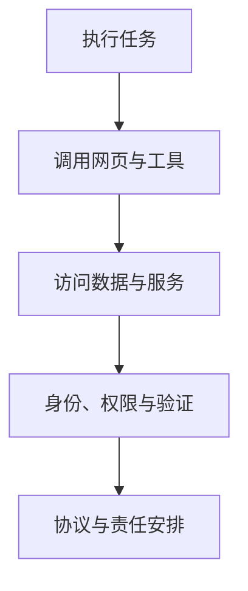

# DeepSeek 一年后：技术走到哪里，钱又押在何处

## Vol.85 写在 DeepSeek 发布一年之后

屠龙之术 × 厚雪长播 · 2026 年 1 月

嘉宾：庄明浩 · 屠龙之术主理人、投资人

---
layout: default
---

# 一年讨论，落在四个相连的问题上

<strong>R1 改变了什么</strong>

开源推理模型让中国厂商从跟随者进入全球模型竞争的中心，也让训练成本成为焦点。

<strong>Agent 为何没有直线普及</strong>

模型能展示执行过程，不等于网页、权限、身份和责任已经为它准备好。

<strong>下一代能力从哪里来</strong>

预训练、强化学习、持续学习和多模态仍在并行推进，世界模型也开始被重新关注。

<strong>资本市场在给什么定价</strong>

市场押注远期收入与平台位置，同时要面对模型成本、资本开支和现金流的约束。

---
layout: two-cols-header
---

# R1 的冲击，来自能力、开源和成本叙事的叠加

::left::

主持人回顾，DeepSeek-R1 于 2025 年 1 月发布后迅速成为焦点。庄明浩认为，推理模型把行业从普通聊天机器人推进到更强调分步求解的阶段；更重要的是，DeepSeek 公开了训练方法及其在其他开源模型上的尝试。

节目里被反复传播的成本落差放大了震动：美国一侧是巨额 AI 资本计划，R1 则被描述为以数百万美元完成一次训练。两者的口径并不相同，前者是大规模投资计划，后者是单次训练成本；讨论的重点是这种落差如何改变了市场预期。

::right::

<strong>推理能力</strong>
用户能看到模型分解问题的过程。

<strong>开放方法</strong>
训练做法与适用范围被公开讨论。

<strong>成本叙事</strong>
不同量级的投入被放到同一场竞争中比较。

三项因素同时出现，才形成节目所说的 DeepSeek moment。

---
layout: two-cols-header
---

# 开源把模型竞争从单点能力带到工程实施

::left::

庄明浩的判断是，R1 之前，主流叙事更偏向闭源公司：高投入、顶尖人才和计算资源被视为必要条件。R1 之后，中国厂商频繁开源，加上 Meta Llama 在 2025 年的竞争力下滑，开源模型的重心出现了变化。

他没有把开源等同于一条唯一技术路径。基础模型的原创研究仍然重要；但在已有路线被验证后，数据处理、工程优化、成本效率和具体场景的实施，也会决定一家厂商能否把能力做出来、用起来。

::right::

01
<strong>公开可复现的做法</strong>
更多团队能理解并试验同一条路线。

02
<strong>改进工程与成本</strong>
清洗数据、训练和部署都成为竞争环节。

03
<strong>接入不同场景</strong>
模型进入消费端、企业服务和制造等应用。

这是受访者对中国路径的概括，不表示每家模型公司都采取同一种策略。

---
layout: two-cols-header
---

# Agent 从对话走向行动，先遇到的是环境问题

::left::

Manus 让更多用户第一次看见 AI 打开网页、点击、收集资料和制作内容。庄明浩把这种可见的执行过程看作 Agent 在 2025 年初获得关注的原因：语言交互之外，人们开始期待模型能完成工作。

但 Agent 要访问网站、数据库、外卖或出行服务，面对的并非只有模型能力。如今的浏览器、账号验证、访问权限和数据库主要是为人设计的。网页端的演示因此只是表层，底下还有身份、协议、权限与责任如何划分的问题。

::right::

环境尚未配套，是节目认为 Agent 热度回落、基础设施受关注的原因之一。

---
layout: two-cols-header
---

# 用户体验的变化：推理可见，多模态开始合在一起

::left::

庄明浩提到，DeepSeek 在产品中展示深度思考和在线搜索后，用户能看到模型如何拆解问题；这让推理能力从答案质量变成可感知的体验。

他也用为小学课堂制作 AI 主题演示文稿的经历说明多模态进展：Google 的工具把《西游记》或游戏风格的故事结构，同模型训练、使用边界对应起来，不止是套用视觉元素。这次体验显示，文字、图像和表达结构开始共同参与一次生成；其可靠性仍要在具体任务中检验。

::right::

<strong>多种输入</strong>
文字、图片、视频与语音提供上下文。

<strong>共同的模型核心</strong>
不再只把语言、视觉和编程当作互不相干的流水线。

<strong>多种输出</strong>
报告、图像、视频或其他内容可在同一任务中协作生成。

千问提出的“三进三出”被节目用来说明这一方向，仍是厂商正在实现的目标。

---
layout: default
---

# 模型研发还没有走到一条单行道

庄明浩把过去与接下来的研发拆成三个层次。每一层都没有替代前一层：预训练仍可通过更好的数据清洗与工程继续改进；强化学习仍在解决可验证任务；持续学习则是 2026 年被硅谷频繁讨论、但尚缺成熟基准的新方向。

01
<strong>预训练</strong>
数据总量受限后，数据质量和训练工程仍有改进空间。

02
<strong>后训练与强化学习</strong>
数学、编程等有明确反馈的任务进展更快，也要防止模型为得分取巧。

03
<strong>持续学习</strong>
设想让模型接收持续反馈；资源、复杂度和评测方法都仍是难题。

第三项是受访者对 2026 年研究重点的推演，并非已经实现的行业能力。

---
layout: two-cols-header
---

# 世界模型想补上具身系统缺少的经验

::left::

语言模型可利用的大量文本，并不能直接变成机器人在现实里抓取、行走或操作物品的经验。节目以此解释具身智能的难处：现实数据少，逐条采集和试错又很昂贵。

世界模型的设想是生成遵守物理规律的虚拟环境，让机器人或自动驾驶系统在可控条件中训练。庄明浩同时强调，业内尚未确定哪条路线更重要，也没有把它当作已经成熟的解决方案。

::right::

<strong>物理路线</strong>
构建符合物理规则的场景，服务机器人、自动驾驶等训练。

<strong>视觉路线</strong>
从图像和视频生成延伸到可实时渲染、可交互的空间。

两条路线的目标和成熟度不同，节目没有断言其中一条会胜出。

---
layout: two-cols-header
---

# 从工具到平台，是 2026 年的商业化考题

::left::

在受访者看来，过去三年的 AI 产品大多仍是工具：帮助写作、搜索、编程或处理某项任务。工具能够形成收入，却未必形成最大的商业体量；头部公司因而开始尝试让 AI 产品成为包含社交、内容、电商或广告的入口。

这只是一个发展方向，不是已兑现的结果。平台化需要商业模式和网络效应，AI 目前在这些方面仍不强。ChatGPT 开始广告尝试，是节目用来说明头部产品在寻找收入结构的一个例子。

::right::

01
<strong>技术能力</strong>
模型提升语言、推理与多模态表现。

02
<strong>具体应用</strong>
产品把能力放进工作与消费场景。

03
<strong>平台尝试</strong>
收入、入口与网络效应是否成立，仍待市场验证。

箭头表达受访者的商业化推演，而非所有公司都必须经过的固定顺序。

---
layout: two-cols-header
---

# 高估值押注远期位置，现金流先承受扩张压力

::left::

谈到 OpenAI、Anthropic、xAI 等美国公司时，庄明浩认为，市场并不只按当前收入估值，而是提前给未来少数头部平台可能占据的位置定价。节目中的 OpenAI 案例以约 1 万亿美元估值、约 200 亿美元年收入估算，主持人将其概括为约 50 倍 PS。

这也带来风险：模型公司、云厂商、数据中心和设备供应商都要先投入。节目特别提到，杠杆较高的新云公司和需要大额资本开支的企业，更容易因未来订单与现金流错配而被重新估值。

::right::

<strong>远期定价</strong>
押注未来收入、平台位置和少数赢家可能获得的规模。

<strong>当期约束</strong>
资本开支、融资条件和收入兑现速度影响现金流。

节目给出的数值是对谈中的市场估算，不是对公司价值的独立核定。

---
layout: two-cols-header
---

# 中国大厂的差异，首先是已有业务与投入节奏不同

::left::

庄明浩把阿里、字节和腾讯放在不同状态下讨论。阿里在云、千问和面向消费者的产品整合上更激进；字节维持偏闭源和多模态的取向，并推动豆包的消费端产品；腾讯拥有游戏、广告和支付等稳定业务，因此能够更耐心地把 AI 用于提效，也在调整组织和人才配置。

这种比较并非给出谁一定更优的答案。受访者认为，创始人和公司的既有资源会影响选择；对巨头而言，模型、云、基础设施、应用和分发越来越像一张需要补齐的能力表。

::right::

<strong>阿里</strong>
云、模型和应用整合推进较快，投入姿态更积极。

<strong>字节</strong>
偏闭源，强调多模态与豆包的消费端发展。

<strong>腾讯</strong>
既有业务提供缓冲，也在把 AI 接入效率工具与组织调整。

这是节目中的阶段性观察；各公司的产品、组织与市场表现都仍在变化。

---
layout: end
---

# 台积电上调资本开支，不能替应用层回答所有问题

节目末段提到，台积电把下一年资本开支预估从 490 亿美元上调至 520 亿至 560 亿美元，并称已向客户及客户的客户调研 AI 需求。庄明浩把它视为供应链末端对需求较有信心的信号。

不过，应用的毛利、模型的收入、云与数据中心的现金流，以及市场是否已充分计入远期增长，仍是不同的问题。转录在这一讨论尚未结束时中断，无法据此补写节目原本的最终判断。

