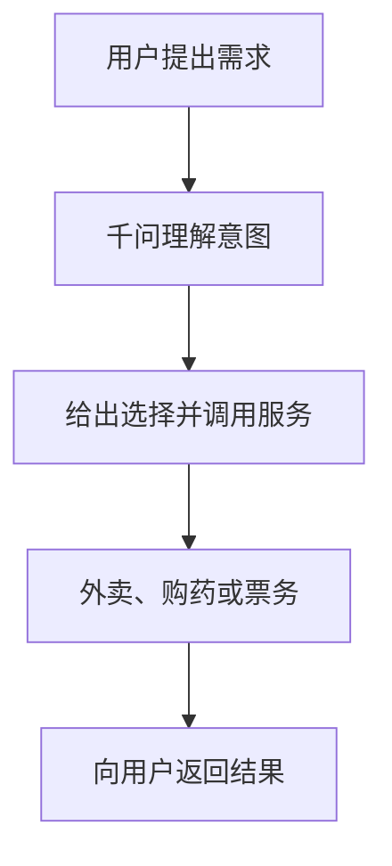

乱翻书 · 2026 年 2 月 · 1 小时 39 分

# 春节 AI 红包大战

## 从元宝链接被限制，到三家 AI 应用争夺入口

圆桌嘉宾：潘乱、阑夕、明浩、一泽

这场讨论没有给出市场排名，而是追问：一次刷屏的红包活动，能留下什么样的使用习惯？

---
layout: default
---

# 围绕红包事件，圆桌展开了四个问题

<strong>平台规则</strong> 
元宝红包链接先进入微信群聊，数日后被限制分享。微信内部为何改变判断，节目没有可靠答案。

<strong>增长能否沉淀</strong> 
红包能带来点击和新用户；更难的问题是，用户离开活动后是否还有理由继续打开应用。

<strong>入口怎样设计</strong> 
豆包强调快速、语音与多模态输入；千问试图接入生活服务；元宝仍在寻找清晰的独立应用价值。

<strong>组织怎样协同</strong> 
AI 是一个新业务，还是需要全公司调度资源的优先事项？嘉宾把分歧放在这里。

---
layout: two-cols-header
---

# 从放行到限制：被反复追问的是时间差

::left::

元宝活动开始后，嘉宾很快在多个群里看到大量链接；部分群管理者主动要求不要转发。

圆桌没有把焦点只放在限制本身，而是追问：既然最初可以分享，为什么在热度已开始衰减后才出现限制？

节目提到媒体曾报道微信内部回应，但也承认没有正式文件。内部决策过程不能据此下结论。

::right::

01
<strong>2 月 1 日</strong>
节目回忆活动开放分享。

02
<strong>2 月 2 日</strong>
媒体报道内部回应，未见正式文件。

03
<strong>2 月 4 日</strong>
节目称链接被限制传播。

日期和顺序均来自嘉宾回忆，用于说明讨论的起点，不构成内部决策证据。

---
layout: two-cols-header
---

# 低门槛裂变很快，留存还要看活动之后

::left::

嘉宾体验到的机制是：进入活动、把链接发往群聊或朋友圈、完成任务，都会增加抽取红包的机会。它把转发动作压得很短。

他们提到首日金额更有吸引力，之后奖励下降；集卡和反复抽取也让一部分人感到厌烦。这是使用体验，不是完整的用户数据。

元宝把春节图片和问答放进任务，但节目没有留存或复访数据，群聊刷屏不能直接推成日活增长。

::right::

01
<strong>领取入口</strong>
低门槛进入，先获得抽取机会。

02
<strong>分享或做任务</strong>
转发与春节 AI 任务换取次数。

03
<strong>活动结束后</strong>
能否留下日常用途，尚待观察。

前两步解释传播速度；第三步才决定补贴是否变成长期使用。

---
layout: two-cols-header
---

# 2015 年红包的参照：绑卡只是进入支付网络的第一步

::left::

圆桌把微信红包当作历史参照：当年红包的重要动作是绑卡，但它本身只是一次转账，不足以解释后来的支付规模。

嘉宾列举了打车、外卖、商品购买和线下收款码等后续场景。反复发生的交易，才把支付留在日常生活里。

按这套参照，元宝红包既要说明能拉来多少人，也要说明活动之后会形成什么稳定、可重复的使用场景。

::right::

01
<strong>红包</strong>
促使用户完成一次绑卡。

02
<strong>支付场景</strong>
打车、外卖和线下收款逐步接上。

03
<strong>日常使用</strong>
高频交易让支付网络扩大。

这是嘉宾对微信支付扩张的回顾，用来提出元宝活动的留存问题。

---
layout: two-cols-header
---

# 元宝派的社群想象，碰上了产品识别与留存的问题

::left::

嘉宾起初把元宝派理解为兴趣社群或频道式产品：真人与 AI 在同一个场景里交流，围绕具体需求组织互动。

实际体验里，私聊和群聊可以发生，但没有个人 ID、个人主页和联系人列表；想找回聊过的人，需要记住头像、名字和群聊位置。

讨论中还提到百人上限。第一天的热闹过去后，嘉宾没有看到足以说明社群会自然留存的迹象。

::right::

<strong>原先设想</strong>
兴趣、场景和 AI 共同组织社群。

<strong>现有互动</strong>
群聊与私聊都能发生。

<strong>识别缺口</strong>
缺少主页与联系人列表。

<strong>待验证处</strong>
活动热度能否变成持续交流。

产品特征来自嘉宾试用；它们不足以预测元宝派后续是否会改进或增长。

---
layout: two-cols-header
---

# 千问想把聊天框变成生活服务的统一入口

::left::

一泽把千问的目标概括为智能体助手（agent）：用户可以在同一个对话入口里提出点外卖、买药、购票等需求，而不是逐个打开服务应用。

圆桌把阿里的产品方向与 2023 年作了对照：当时强调 AI 接入电商提效；现在更强调让淘宝、飞猪和闪购等服务在千问里直接面向用户。

这条路径的条件是内部协作。各业务本身也有 AI 转型诉求，谁来定义入口、怎样分配服务能力，仍是千问必须处理的组织问题。

::right::

这是节目对智能体助手的功能设想；接入范围和实际体验仍要由后续使用检验。

---
layout: two-cols-header
---

# 豆包优先降低发问门槛，强调快速反馈

::left::

嘉宾在移动端的比较里，认为豆包的语音输入更顺、回复更快。圆桌认为它把尽快给出可用反馈放在更高优先级。

节目举的需求很日常：问附近餐馆、识别眼前物品、处理养花等问题。圆桌据此把豆包放在搜索替代与多模态交互的方向上理解。

一位嘉宾引用豆包 2025 年日均消耗 60 万亿 tokens；他同时提醒，音视频本来比文本更耗 token，不能把这个数直接当作用户规模或使用质量的比较。

::right::

01
<strong>说出或拍下</strong>
语音与多模态输入减少打字。

02
<strong>快速反馈</strong>
先满足即时提问的需要。

03
<strong>形成习惯</strong>
把一部分搜索行为改成提问。

步骤表达圆桌对产品方向的理解，不是对性能或市场份额的结论。

---
layout: default
---

# 三个应用面对的，是不同的入口难题

<strong>豆包：发问摩擦</strong>
用语音、多模态与速度，让更多人更容易开口提问。

<strong>千问：服务协同</strong>
把生活服务接进对话，争取成为消费决策的起点。

<strong>元宝：后续用途</strong>
红包带来注意力后，独立应用与社群能留下什么价值。

这是圆桌的阶段性归纳，不是功能强弱或市场排位；三条路径也可能同时调整。

同为春节投入，目标未必相同：有人更看重拉新，有人希望培养新习惯，也有人在测试新的社交形态。

红包金额与群聊热度只能说明短期注意力。留存、服务完成率和使用场景，才是之后可以比较的指标。

---
layout: default
---

# AI 应用背后，还有四个没有定论的公司问题

<strong>新产品还是旧产品</strong>
在已有应用中加入 AI，还是另建 AI 原生入口。

<strong>模型投到什么程度</strong>
哪些公司需要长期押注基础模型，边界在哪里。

<strong>谁来做产品</strong>
老团队的经验与新人探索模型边界，怎样组合。

<strong>优先级有多高</strong>
AI 由一个事业部承担，还是能调度全公司资源。

四个问题由一位嘉宾提出，圆桌只给出了不同公司处境下的判断，并未形成统一答案。

对腾讯而言，微信已经是强大的社交入口；把移动端用户再导向一个独立聊天应用，是否值得付出迁移成本，正是元宝最难说明白的一层。

---
layout: two-cols-header
---

# 腾讯的争论，最终落在资源、团队与耐心

::left::

嘉宾认为，腾讯长期让各业务线自行作战，带来了成熟业务的自主性；当 AI 需要跨产品调度时，这种结构也会增加协调成本。

关于人才，讨论并非简单地否定老团队。圆桌更强调，产品负责人要持续试用模型、识别能力边界，再把可行体验变成具体产品。

游戏业务被当作反例：财务结果出现得快，团队容易形成战斗力。嘉宾也提到《三角洲行动》的成功会强化腾讯原有的产品与组织信心。

::right::

<strong>公司判断</strong>
愿不愿意投入资源，并给产品留下时间。

<strong>团队探索</strong>
理解模型边界，找到具体场景。

<strong>产品验证</strong>
用持续使用和结果检验，而非一次投放。

这是对圆桌观点的整理：产品命运受公司判断影响，不能只归因于某一个团队。

---
layout: end
---

# 红包战之后，仍要回到留存与协同

元宝事件说明，平台规则能很快改变一种增长手段的传播范围；内部原因在节目中仍然未知。

豆包、千问与元宝各自押注输入体验、服务入口和活动导流，春节投入还不足以回答谁会留下用户。

圆桌提出在第二季度复盘留存、渗透和场景。到那时，红包带来的注意力才有机会接受产品与组织能力的检验。

