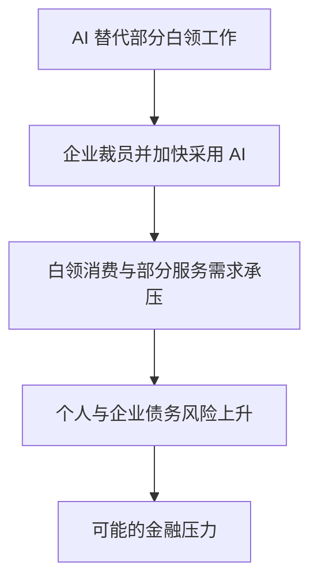

# Vol.89 AI行业2025年度总结补充篇

V4 不等了版：2026 年 2 月的 AI 行业观察

屠龙之术 · 明浩独讲 · 录制于 2026 年 3 月 9 日

---
layout: default
---

# 一个月里，哪些变化值得拆开看

<strong>美国：投入与估值</strong>
科技巨头继续加码 Capex；英伟达业绩强劲，市场却在寻找更早的风险信号。

<strong>美国：Agent 与软件</strong>
本地权限和即时通信让 Agent 更可感；软件股下跌引出一条尚未兑现的风险推演。

<strong>中国：模型与产品</strong>
版本密集发布、视频生成升级、春节获客和模型公司估值同时发生。

本期大部分数字和判断来自主持人对财报、媒体报道、平台统计及市场表现的整理；它们描述的是录制时的观察，不构成独立核验或投资建议。

---
layout: two-cols-header
---

# 四家巨头的 Capex 预期仍在抬升

::left::

主持人整理微软、Google、Meta、亚马逊的口径后认为，资本开支的增速并未因基数变大而放缓。

- 2023 年约 1,470 亿美元
- 2024 年约 2,228 亿美元，较上年增 55%
- 2025 年约 3,760 亿美元，较上年增 65%
- 2026 年预期约 6,300 亿美元，较上年增 68%

这组数不含 Oracle 和部分新云厂商。它说明市场争论已经从是否投入，转向投入会持续到何时、由谁承担风险。

::right::

2023
<strong>1,470 亿美元</strong>
主持人整理的四家公司合计

2024
<strong>2,228 亿美元</strong>
同比增长 55%

2025
<strong>3,760 亿美元</strong>
同比增长 65%

2026
<strong>6,300 亿美元</strong>
财报季给出的预期

同一统计口径下的年度序列；2026 年是预期值。

---
layout: default
---

# Capex 的压力，落在收入、债务和边界行业上

<strong>收入占比不同</strong>
主持人称 Meta 的 Capex 已超过收入一半，Google 约四成、微软约三成、亚马逊约四分之一；苹果约 3%。

<strong>债务增速更快</strong>
他观察到 2025 年第四季度科技巨头发债明显增加，债券市场对长期债也保持需求。

<strong>叙事扩散到供应链</strong>
数据中心投资曾依次带动芯片、建设、电力和存储；主持人以 Toto 股价为例，提示关联叙事可能延伸得很远。

这些并不能单独证明泡沫已经出现。主持人提出的难题是：AI 基础设施究竟在什么规模上才算供给超过需求。

---
layout: two-cols-header
---

# 英伟达的业绩很强，市场却不只看业绩

::left::

主持人列举本季财报：收入 680 亿美元、同比增长 73%、毛利率 75%、单季利润超过 430 亿美元。他认为数据中心业务已远超过游戏业务，短期需求没有明显转弱迹象。

但财报发布后次日股价下跌 5.3%，过去约六个月股价大致横盘。连续 14 个季度超预期后，超预期本身不再足以改变市场预期。

::right::

<strong>财报指标</strong>
收入、毛利率和利润仍在高位。

<strong>市场反应</strong>
强劲业绩没有换来同步上涨。

<strong>下一类信号</strong>
GPU 租赁价格和折旧年限，或比单季收入更早反映供需变化。

后两项是主持人提出的观察指标，不是确定的预警阈值。

---
layout: default
---

# GPU 租赁价格仍稳，竞争正在改写生态

<strong>A100 与 H100 的租赁价格</strong>
主持人称，较早发布的 A100、H100 在过去一年多租赁价格仍稳定，显示供需尚未明显松动；但他也提醒，英伟达对云厂商和生态公司的扶持会影响这一指标。

<strong>竞争不只发生在芯片参数上</strong>
主持人提到 AMD 与 OpenAI、Meta 的大额合作，以及 Google 以投资、贷款和 TPU 供给扶持新云厂商。竞争者都在争取把算力、资金和客户连接起来。

游戏显卡在英伟达收入中的占比已是个位数。主持人据此判断，消费级产品在公司的资源配置中变得次要。

---
layout: two-cols-header
---

# 被称作龙虾的 Agent，为何带来不同体感

::left::

主持人认为，给 Agent 一台电脑并非新想法：云端虚拟机、控制本地设备的产品此前已经出现。它的差别更多在工程组合：

- 用本地文件保留记忆
- 调用工具完成执行
- 读写本地文件，获得更高系统权限
- 接入飞书、Telegram 等即时通信工具

对非技术用户而言，随时在聊天窗口里交代任务、等待结果，比单次使用 Chatbot 更像持续协作。

::right::

记忆
<strong>本地文档</strong>
保存项目背景和约定

执行
<strong>工具与权限</strong>
处理文件和系统任务

交付
<strong>即时通信</strong>
在既有消息渠道反馈

这是一种实现方式，不代表所有 Agent 都具备相同权限或可靠性。

---
layout: default
---

# Agent 热潮同时暴露了规模和可靠性问题

<strong>主持人的极端推演</strong>
他估计当时国内部署此类产品的用户或在数十万至不足一百万；若按十几亿人口和一百万安装量计算，普及到人人可用至少是千倍量级。

<strong>算力需求还会叠加</strong>
更长任务会消耗更多 Token。主持人称，热度上升后，云服务、模型服务和聚合平台已出现响应慢、容量紧张的体验。

<strong>能力并不均匀</strong>
有些任务能高度自动化，另一些仍需用户处理繁琐步骤。安装门槛和任务稳定性仍留给产品公司解决。

用户量与千倍结论是主持人为说明需求缺口作出的假设计算，不是平台公布的装机统计。

---
layout: two-cols-header
---

# 软件股下跌，触发了一条尚未兑现的风险推演

::left::

主持人观察到，软件、SaaS 和云相关 ETF 在过去数个季度下跌明显，一些公司收入和利润仍在增长。市场担心的是更远期的需求：企业的新增需求会不会被 Agent 吸收，而非由传统软件公司承接。

一篇被称为 2028 年末世论的文章，把这个担忧推向就业、消费和债务风险。主持人同时保留了反方意见：政府政策、技术扩散速度和企业调整路径，都可能改变结果。

::right::

这是文章的条件性推演，不是节目确认的因果事实。

---
layout: default
---

# 风险推演的已知事实与未知后果

<strong>主持人列为已见现象</strong><ul class="mt-2 opacity-80"><li>基础设施投入和债务增加</li><li>AI 渗透加快，软件股走弱</li><li>美国失业率有所上升，而 GDP 尚可</li></ul>

<strong>仍无法从现状推出的后果</strong><ul class="mt-2 opacity-80"><li>AI 投入回报普遍恶化</li><li>中介行业利润大规模消失</li><li>白领消费崩盘或广泛债务违约</li></ul>

ATM 的普及曾长期增加银行网点和柜员数量，后来才进入替代阶段。主持人借此提醒：技术方向和调整速度是两回事，AI 的时间尺度尚无法从这类历史类比中直接得出。

---
layout: two-cols-header
---

# OpenAI 融资的公布金额之外，还有付款条件

::left::

主持人称，本轮公布的融资为 1,100 亿美元，来自亚马逊、英伟达和软银；实际先到位的首付款约 350 亿美元。

其中，亚马逊承诺的 500 亿美元里有 150 亿美元首付，其余部分与实现 AGI 或启动 IPO 等条件相关。主持人还称，英伟达先投 300 亿美元、软银先投 100 亿美元，后续同样受里程碑影响。

这笔金额由首付款及有条件的长期承诺构成，不能视作一次性到账的现金。

::right::

<strong>公布规模</strong>
1,100 亿美元

<strong>首付款</strong>
约 350 亿美元

<strong>后续资金</strong>
受 AGI 或 IPO 等条件影响

金额和条款均为主持人对当时公开信息的转述。

---
layout: default
---

# 收入竞赛也在逼近 OpenAI

<strong>OpenAI</strong>
主持人称周活跃用户为 9 亿，年化经常性收入约 250 亿美元。

<strong>Anthropic</strong>
主持人称年化经常性收入约 190 亿美元；并引用 Ramp 的企业支付统计，认为其在企业聊天和 API 支付中占比很高。

主持人引用的预测认为 Anthropic 可能在 2026 年中收入超过 OpenAI。预测平台赔率、第三方支付统计和 ARR 口径不可互相替代。

---
layout: two-cols-header
---

# 春节前后，中国模型发布密集到以天计算

::left::

主持人把 1 月下旬至 2 月中旬称为一次大版本集中发布：

- 1 月 22 日：文心 5.0
- 1 月 27 日：Kimi K2.5
- 2 月 2 日：阶跃 3.5
- 2 月 11 日：智谱 GLM-5
- 2 月 13 日：MiniMax M2.5
- 2 月 14 日：豆包 Seed 2.0 全系列
- 2 月 16 日：千问 3.5 Max

版本号虽多为小数更新，但主持人把它们视为实质性升级，也认为半年一次的大版本节奏正在加快。

::right::

1 月
<strong>文心、Kimi</strong>
窗口开启

2 月上旬
<strong>阶跃、智谱、MiniMax</strong>
文本与推理模型更新

除夕前
<strong>豆包、千问</strong>
多模态与通用模型更新

按节目列举日期排序；这里不评价各模型能力的独立优劣。

---
layout: default
---

# 榜单、蒸馏争议和组织变动，是同一轮竞争的不同侧面

<strong>OpenRouter 用量</strong>
主持人援引 2 月数据：MiniMax M2.5 为 5.44T Token、Kimi K2.5 为 4.2T；他也承认该平台不能代表全网算力。

<strong>蒸馏指控仍有争议</strong>
Anthropic 指称 DeepSeek、Kimi 与 MiniMax 使用多账号蒸馏其数据；主持人认为蒸馏的边界尚无公认答案。

<strong>团队怎样组织</strong>
林俊阳离开引出讨论：原生多模态若需协同团队，预训练、后训练、强化学习和模态团队分设是否合适，节目没有定论。

节目还转述了通义团队可能受算力和组织调整制约的信息，但没有足以确认具体原因的一手材料。

---
layout: two-cols-header
---

# Seedance 2.0 把视频生成推到多模态协同

::left::

主持人以四类演示判断其能力跃升：人物滑板穿越四季的连贯画面、人物和车辆的角色一致性、经过后期加工的动画改编，以及仍留有瑕疵的动作对战片段。

他关注的不只是单帧好看，而是镜头控制、角色一致性、环境变化、配音与画面的协同。可灵 3.0 的镜头控制与声画同步，以及 Genie 3 的可互动视频，也让视频模型竞争继续升温。

::right::

<strong>一致性</strong>
人物、物体与画风在镜头中延续。

<strong>控制力</strong>
镜头、动作和场景变化更可指定。

<strong>多模态</strong>
文字、图像、视频和声音一起参与生成。

演示样片能说明能力边界在移动，不能据此推断所有生产流程已被替代。

---
layout: default
---

# 视频成本下降，把选择权与安全问题推到前面

<strong>制作流程会变</strong>
主持人转述的观点是：当生成多个候选镜头变得便宜，能从中判断哪一个可用的审美与编辑能力更重要。

<strong>版权与隐私更紧迫</strong>
Seedance 发布后，海外讨论集中在训练和生成的版权边界；节目没有给出可行的新制度。

<strong>真人素材需要防护</strong>
主持人转述测试者 Tim 的经历：上传脸部照片后生成视频匹配了其声音。随后字节调整为不支持上传真人脸部图片生成视频。

产品围栏能减少一类风险，但不能解决伪造内容、权利归属与验证机制的全部问题。

---
layout: default
---

# DeepSeek V4：预期很高，录制日仍未发布

<strong>节目能确认的状态</strong>
截至 3 月 9 日录制时，主持人称 DeepSeek V4 尚未正式发布。V3.2 之后的论文、架构更新、与合作机构推出的内容及一次灰度测试，使外界持续预期新版本临近。

<strong>外界期待仍是期待</strong>
节目提及媒体对代码能力、原生多模态和国产芯片适配的报道。这些报道不是已发布功能，不能当作 V4 的能力清单。

---
layout: two-cols-header
---

# 春节红包大战：活动带来峰值，留存很快回落

::left::

三家的路径不同：豆包偏向春晚合作和科技产品抽奖；千问把免单卡与点单结合；元宝尝试社交传播、群聊红包和金色朋友圈。

千问在自家总结中称，6 天活动期间 AI 完成 1.2 亿笔下单，其中包括 5,220 万杯奶茶。元宝在 2 月 18 日的总结中称，日活达到 5,000 万、月活 1.14 亿，并完成超过 10 亿次 AI 创作。

::right::

<strong>豆包</strong>
主持人援引 QuestMobile：春晚当晚 DAU 峰值约 1.4 亿。

<strong>千问</strong>
峰值出现在春节前公布免单活动时，DAU 超过 7,000 万。

<strong>元宝</strong>
峰值在春晚当晚，DAU 超过 4,000 万。

口径分别来自公司总结和主持人转述的 QuestMobile 数据，不能直接相加比较。

---
layout: default
---

# 获客峰值没有改写 Chatbot 的使用习惯

主持人称，千问和元宝的使用次数峰值都发生在推活动当天，节后迅速回落；不同产品回到日均约 3 至 5 次的区间。他据此判断，Chatbot 的形态难以单独承担很长使用时长、高留存和高频使用。

活动
<strong>红包、免单与传播玩法</strong>
短期拉高下载和使用

节后
<strong>峰值回落</strong>
高频使用未能持续

约束
<strong>促销推广监管</strong>
2 月 14 日相关平台被约谈，要求规范促销和避免内卷竞争

这是主持人对活动效果的解读；留存还会受到产品能力、分发渠道和节日周期影响。

---
layout: two-cols-header
---

# 二级市场上涨，也抬高了一级市场的预期

::left::

主持人称，智谱与 MiniMax 的市值峰值都接近 3,000 亿港元；相较上市前被讨论的四五百亿港元，涨幅约五到六倍。

他用 OpenAI 8,400 亿美元估值的 1% 作参照，折合约 650 亿港元：两家公司上市初期大致相当于一个单位，峰值接近五个单位。这是主持人的估值尺子，不是可验证的公允价值。

::right::

二级市场
<strong>智谱与 MiniMax 上涨</strong>
市场情绪推高估值预期

一级市场
<strong>Kimi 获得更高估值融资</strong>
主持人称 2 月融资 7 亿美元，估值 100 至 120 亿美元

相邻公司
<strong>阶跃获得关注</strong>
融资、管理层与上市传闻共同改善叙事

主持人归因于情绪的外溢；股价、融资和长期经营表现不是同一个指标。

---
layout: two-cols-header
---

# 樊麾与 AlphaGo：能力变化先带来认知冲击

::left::

节目最后借樊麾的叙述回看 2015 年的十局对弈：他首日战成一比一，随后不断失利，十局只赢两局；之后加入 AlphaGo 团队。2016 年李世石对阵 AlphaGo，前三局失利后在第四局取胜。

主持人用围棋史说明职业者面对能力跃迁时会经历怀疑、调整与重新判断；这段经历不能直接推导今天各职业的就业结果。机器没有情绪反馈，也会放大人对自身经验的动摇。

::right::

2015
<strong>十局试弈</strong>
樊麾两胜，认识到对手能力变化

之后
<strong>加入团队</strong>
协助补充职业棋手视角

2016
<strong>李世石对局</strong>
第四局获胜，系列赛仍由 AlphaGo 取胜

这是节目引用的历史故事，用于讨论心理经验，而非预测 AI 对各职业的具体影响。

---
layout: end
---

# 本期留下的，是三组还不能仓促回答的问题

投入的边界

Capex 继续上行，但算力供给何时超过真实需求，尚没有可用的阈值。

产品的边界

Agent 的权限和交互方式改变体验，稳定性、部署门槛与规模成本仍待检验。

制度的边界

视频生成把版权、隐私和真实性校验推到眼前，现有规则仍在调整。

主持人看到常用 AI 的人仍只占很小一部分；行业扩张还会继续，但每一项具体结论都需要新的证据。

