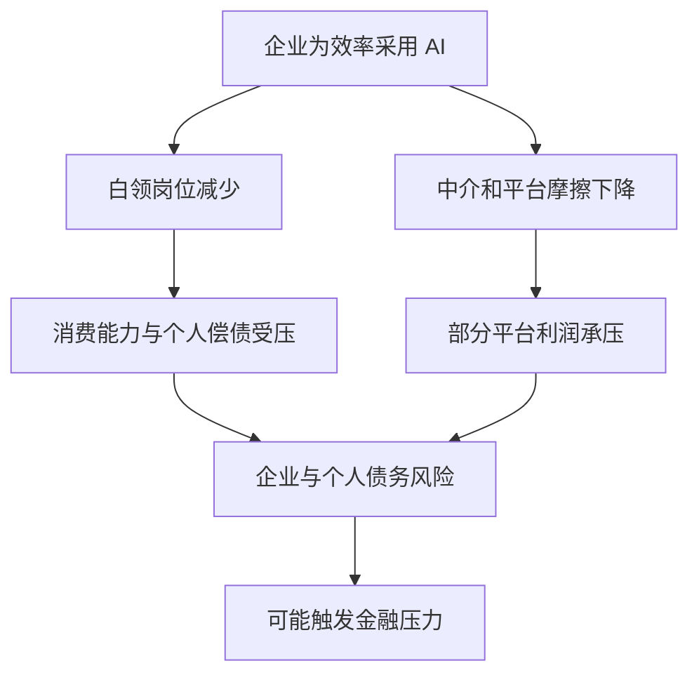

# AI 加速之后，先分清哪些事变了

## 从 Open Claw、算力焦虑到个人与小公司的生意

对谈：潘乱、Koji（口及）｜主持：庄明浩

屠龙之术 · 2026 年 3 月 · 96 分钟

这场杭州线下对谈记录了一个共同感受：模型、智能体和视频生成的进展变得更快。但对谈者并未把它等同于确定的商业结果；他们把目光放在工作流、基础设施、获客与个人选择这些更具体的问题上。

---
layout: default
---
# 一场加速，四组不同的问题

智能体改变了什么

它未必立刻增加新能力，却让人开始把日常事务重新拆成可委派的任务。

风险叙事是否成立

从按席位收费的 SaaS 到债务压力，节目讨论的是一条待观察的条件链。

算力为何仍然紧张

写代码会消耗大量 Token，但效率提升取决于需求、测试与基础设施是否同时调整。

个人和小公司如何落地

生产变快不等于获客变容易；可重复任务、流程协作和信任媒介仍要逐项处理。

---
layout: two-cols-header
---
# Open Claw 的影响，先是让人重新发现任务

::left::

一位对谈者装好 Open Claw 后发现，它没有立刻做到旧工具完全做不到的事；变化在于，他开始追问还有哪些事能交给 AI。

他用它每天搜集 Open Claw 生态的新产品与创业者；遇到华人创始人时，再查背景、寻找联系方式，并在自己决定联络后起草邮件。

另一位把任务设为每天查看某款眼镜是否补货，补货后购买。重复、目标明确的事务，比抽象的万能助手更容易成为起点。

::right::

01
<strong>找出重复需求</strong>
例如盯库存、收集新项目。

02
<strong>设定可执行动作</strong>
定时查看、整理背景或起草邮件。

03
<strong>保留人的判断</strong>
联系谁、关注什么，仍由使用者决定。

节目中的两个个人案例说明任务如何被重新组织，不代表所有智能体都能可靠完成同类动作。

---
layout: default
---
# 能力跨过阈值时，先出现的是对既有软件的担心

庄明浩描述的体感是：模型能力一旦超过某个阈值，原先难以实现的场景会集中出现。对按席位收费的美国 SaaS 而言，市场很自然会联想到白领岗位与软件席位可能一起受冲击；这是一种直观推断，不是已经验证的替代比例。

01
<strong>模型能力提高</strong>
更多任务看起来可以交给 AI 完成。

02
<strong>应用场景增多</strong>
智能体、编程与工具调用同时被讨论。

03
<strong>席位模式受关注</strong>
若岗位和流程改变，按人头收费的软件可能承压。

这是节目解释市场情绪的一条推断链；现实替代速度、范围和商业后果仍待观察。

---
layout: default
---
# 一篇末世文章，把担忧推演成债务危机

节目转述了一篇由对冲基金撰写的文章：它假设企业为维持效率而裁减白领，并更积极采用 AI；消费、平台利润和产业债务随后彼此牵连。对谈者认为这条叙事完整，但没有人能确认它会在何时、以何种强度发生。

图中是文章的假设关系，不是节目确认的经济预测；任何一个环节的幅度和时间都没有定论。

---
layout: two-cols-header
---
# 中国缺少成熟 SaaS，会让企业智能体更快吗

::left::

<strong>一种乐观判断</strong> 美国企业有大量既有 SaaS 嵌进生产流程，改造成智能体要面对组织与迁移摩擦；中国的旧系统负担较轻，可能更容易直接尝试面向企业的智能体。

这也解释了节目中听到的一种创业热情：一些人把企业智能体视为新的切入点，而不是等待传统 SaaS 估值回升。

::right::

<strong>旧系统较少</strong>
迁移负担可能较小，给新流程留下更多空间。

<strong>环境不可硬比</strong>
另一位对谈者以云服务的市场经历提醒，政策、客户选择和商业结构都会改变结果。

节目没有裁定哪一方正确：缺少旧系统既可能减少阻力，也不能自动推出更快的商业落地。

---
layout: two-cols-header
---
# Token 烧在编码上，也要把前后流程接起来

::left::

对谈者观察到，多家 AI 编程平台开始限制购买或优惠，说明高强度使用正在挤压供应。节目没有给出可外推的行业总量，因此不能据此估算整体算力缺口。

把大量 Token 只投入编码，可能得到难维护的代码。需求定义、质量检查和基础设施没有配套时，局部速度不会自动变成整体效率。

对谈把这比作电力进入工厂：真正的生产率变化来自工厂重新组织，而不只是接上电。软件迭代或许更快，但节目没有给出时间表。

::right::

01
<strong>定义需求</strong>
先说明要解决的实际问题。

02
<strong>生成与修改代码</strong>
这是当前最密集消耗 Token 的环节之一。

03
<strong>测试并接入环境</strong>
质量检查与基础设施决定能否真正使用。

箭头表示工作依赖，不表示每个团队都必须采用同一套工具或顺序。

---
layout: default
---
# AI 进步越过使用者，评测反而更难

有明确答案的任务

数学题与部分编程题能较清楚地判断对错，因此更容易比较模型结果。

没有唯一答案的任务

开放问题的好坏很难统一打分；节目提到，后训练与强化学习团队正投入很多精力处理评测。

一位对谈者用人的智力差距作比喻：当模型已经超出普通使用者的理解范围，能力从一个高水平继续提升，日常聊天未必让人察觉。这个比喻说明感知边界，不是对模型或人的实际测量。

---
layout: two-cols-header
---
# 漫剧的变化，来自流程切分而不只来自模型

::left::

节目把漫剧视作视频和图片模型带来效率变化的一个实例：原来受拍摄等物理条件限制的内容生产，开始能用更少的人完成更多环节。

对谈者强调，快不只因为模型生成画面，而是生产被切成若干边界清楚的环节：前一环交付什么，后一环接收什么，人负责各自明确的部分。

这种协作方法可以启发其他行业，但不等于每个行业都能复制漫剧的成本、速度或市场规模。

::right::

01
<strong>拆成有限环节</strong>
把生产过程分解为可交接的工作。

02
<strong>写清输入与交付</strong>
每一环知道接收什么、产出什么。

03
<strong>人负责衔接与判断</strong>
人员也承担环节之间的整合工作。

节目用这一结构解释漫剧的扩张速度；它描述的是一种协作方式，并非行业标准流程。

---
layout: two-cols-header
---
# 面对焦虑，两种注意力分配并不冲突

::left::

<strong>从自己的问题出发</strong> 潘乱担心许多新产品只是快速流过的内容。与其追逐每个关键词，不如先问：我想完成什么，什么事情对我有用。

他进一步把人放在管理者的位置：明确需求、判断方向、安排工作，而不是只学习怎样配合工具。

::right::

<strong>筛掉短期噪音</strong>
避免把每个热点都当成必须立即掌握的能力。

<strong>关注边界机会</strong>
庄明浩认为，新模型进展仍值得看，因为它可能孕育创业和投资机会。

分歧在于投入多少注意力，不在于否认技术变化；两种做法都要求把热点落回具体问题。

---
layout: default
---
# AI 进入物理世界，终端成熟度各不相同

手机

保有量最大，但节目认为它首先为看屏幕而设计，不是为长时间执行工作流而设计。

电脑与常驻设备

需要持续执行任务时，电脑也未必是终点；一位对谈者设想的是全天候运行的服务器。

智能眼镜

它被看作潜在入口，但节目转述的一位从业者判断是：应用生态、续航和佩戴问题在十年内都难解决。

这些判断解释了为什么硬件会被讨论，却没有给出某个设备取代手机或电脑的时间预测。

---
layout: two-cols-header
---
# 产品更容易做，获客和信任仍是另一道题

::left::

听众提出的困境是：AI 能降低做产品的门槛，但上线后的冷启动、投放成本和持续获客没有随之消失。

对谈者也不把一人公司当作自动成立的终局。他们观察到资源向超级平台和个体集中，中型公司承受的压力尤其明显；这是趋势判断，不是普遍规律。

内容越来越多时，能传递信任的媒介仍重要。节目把个人品牌和播客视为建立信任、推广项目的可能渠道，而非可保证回报的流量配方。

::right::

01
<strong>做出产品</strong>
工具降低了部分制作与试错成本。

02
<strong>获得注意力</strong>
冷启动仍要面对平台、投放与竞争。

03
<strong>建立信任</strong>
用户为什么相信并持续选择，仍需长期回答。

节目借创业者提问区分生产与分发：前者变快，不足以单独说明后者会变容易。

---
layout: end
---
# 从一周反复出现的事开始试

找重复任务

一位对谈者建议按一周盘点：哪些工作、娱乐或日常事务重复出现五次以上。

先验证是否有用

围绕自己的目标试着缩短这件事，再检查结果，而不是为了追赶热点而囤积工具。

别忽略商业后半程

即使生产效率提高，获客、信任和持续交付仍要由具体的人与组织解决。

