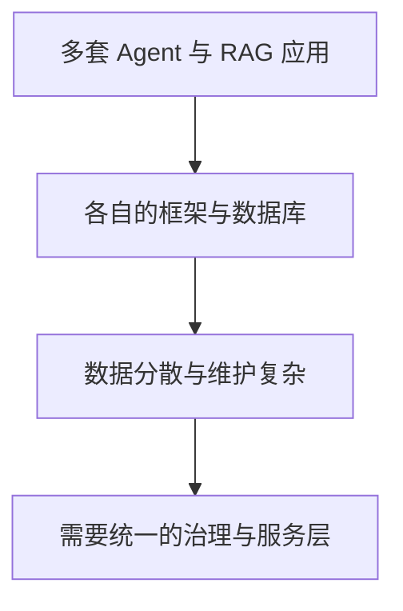
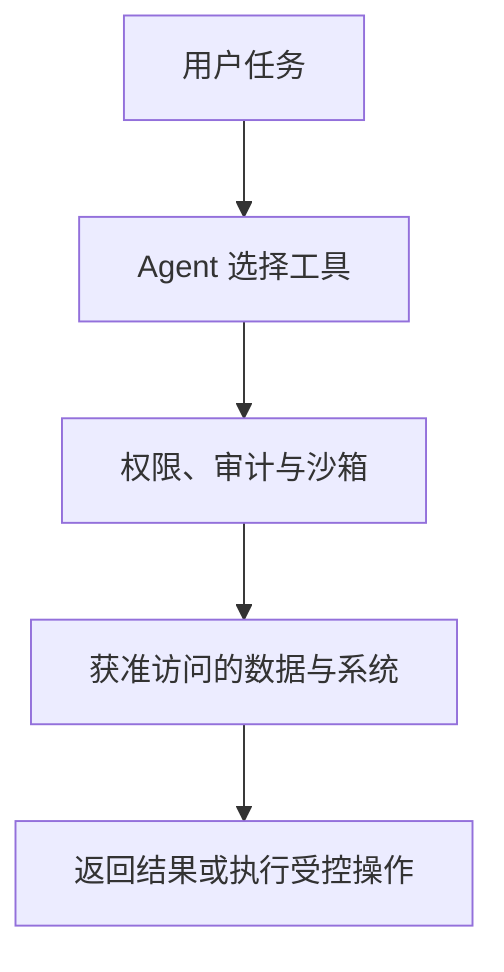

# 数据角度看 OpenClaw 的企业落地

## 从个人助手到受控的企业智能体

一场围绕 OpenClaw、数据底座、记忆与权限边界的对谈。

屠龙之术 · 2026 年 3 月 · 嘉宾：刘华阳、戴涛（OceanBase）

---
layout: default
---

# 企业真正要解决的，不是把个人工具复制一遍

<strong>角色差异</strong>
个人助手为何难以直接变成企业数字员工。

<strong>数据治理</strong>
新技术栈会不会再次制造数据孤岛。

<strong>检索与记忆</strong>
混合搜索、RAG 与外置记忆各自处理什么。

<strong>部署边界</strong>
权限、审计与安全如何进入智能体架构。

节目从数据库从业者的视角讨论企业采用 AI 时需要补齐的基础能力。

---
layout: two-cols-header
---

# 个人助手与企业数字员工，起点不同

::left::

戴涛认为，OpenClaw 的原始吸引力在于个人助理：用户在自己的环境中授权，让它完成搜索、写作或自动化任务。

企业希望沉淀员工经验，并在限定范围内提高效率。它因此需要处理组织里的系统、数据与职责，而不是只为一台个人电脑打开权限。

嘉宾把这一差异视为企业采用 OpenClaw 时的第一道门槛：个人场景可接受的方便，不一定符合企业的控制要求。

::right::

<strong>个人助手</strong>
用户自行授权，服务个人任务与偏好。

<strong>企业数字员工</strong>
访问组织资源，也要受角色、流程和审计约束。

两类产品都可使用 Agent，但部署范围和责任边界不同。

---
layout: default
---

# 企业先问三件事：数据会去哪，谁能用，事后能否追溯

<strong>敏感信息</strong> 戴涛在一次演示中看到，直接询问 token 的位置就返回了结果。企业不能把这类暴露当作正常交互。

<strong>系统权限</strong> 企业少则有七八套系统，多则数百上千套；不能因为接入智能体就默认开放所有接口、电脑或 IP 权限。

<strong>操作记录</strong> 刘华阳强调，企业的数据与操作需要在既有安全范围内保存、检查和留痕。

节目中的做法是把办公电脑排除在 OpenClaw 试用范围之外，转而在云端或独立设备上探索。这是嘉宾所在团队的风险取舍，不是对所有企业的统一方案。

---
layout: two-cols-header
---

# AI 应用增多后，旧的数据孤岛问题会再出现

::left::

刘华阳担心重复大数据时期的经历：数据在传输、清洗和多份存储中变慢、丢失或失去一致性，成本也随副本和工具增加。

戴涛观察到，企业在近两年已引入多套 Agent、RAG 与开源组件。每个应用都带着不同的框架、数据库和处理方式时，技术复杂度会重新沉到数据层。

讨论聚焦于减少技术栈分裂，让后续维护、检索和治理能有共同基础。

::right::

这是嘉宾对企业技术栈演化的判断：应用先增多，治理需求随之出现。

---
layout: default
---

# 推进节奏可以分开：业务先试，基础能力随后补齐

01
<strong>局部试点</strong>
在知识库、营销生成或某个业务域先验证需求。

02
<strong>扩展应用</strong>
把智能体、知识库和提效场景铺到主要业务板块。

03
<strong>治理与整合</strong>
再处理统一数据底座、调用方式与共享能力。

戴涛用从 0 到 1、再到更大范围推广的过程说明：企业不必等所有治理完成才开始，但也不能永远停在零散试用。

---
layout: default
---

# 向量能力只是混合搜索的一部分

| 要解决的问题 | 单纯向量检索能处理的部分 | 企业场景还会提出什么 |
| --- | --- | --- |
| 语义相近 | 将非结构化内容表示为高维向量，寻找相似内容 | 用户的问题往往还有地点、价格、时间等明确条件 |
| 数据类型 | 以文本等可向量化内容为主 | 图像、音频、视频与结构化字段要一起参与检索 |
| 业务请求 | 找到相近内容 | 跨领域请求还要组合筛选、排序与后续任务 |

嘉宾用餐厅搜索举例：附近、适合约会、宠物友好、人少、可预订并不是同一种条件。大模型带来的语义搜索扩大了向量检索的用途，但没有让标量条件和多模态数据消失。

---
layout: two-cols-header
---

# 统一数据底座要同时容纳多种数据和访问方式

::left::

戴涛提出的方向是 AI 数据湖库：文本、图片、音频和视频不必分别落在孤立系统中；同一个底座还要支持实时访问、轻量分析与 API 调用。

这是一种面向未来架构的主张，并非节目给出的既成行业标准。它试图回答的是：当业务把需求直接交给 Agent 或 Web Coding 工具时，底层如何避免再次按应用复制数据能力。

::right::

<strong>多模态数据</strong>
文本、图像、音频、视频与业务字段。

<strong>统一存储与处理</strong>
支持检索、分析、实时访问和 API。

<strong>上层应用</strong>
Agent、RAG、搜索、编排与业务服务。

层次表达的是依赖关系：上层应用依赖可共享的存储与处理能力。

---
layout: two-cols-header
---

# 记忆不等于不断扩大上下文窗口

::left::

节目将 Agent 概括为推理、工具与记忆的组合。戴涛认为，模型窗口再大也有处理和成本的上限；从企业架构看，模型适合尽量保持无状态，把需要保留的信息放到外部方案中。

外部记忆的选择取决于要保存什么，而不是只看文件格式。OpenClaw 使用 Markdown 是一种现阶段的工程做法；企业还要考虑存储期限、访问与淘汰规则。

::right::

<strong>知识记忆</strong>
企业文档和专有资料可通过 RAG 检索。

<strong>交互记忆</strong>
对话、偏好与长期或短期记录需要单独管理。

<strong>技能记忆</strong>
重复的 SOP 可被整理为可调用的 Skill。

三种方式处理的对象不同，也可以在一个应用中并存。

---
layout: two-cols-header
---

# 能记住什么，也要规定怎样新增、调用和淘汰

::left::

刘华阳提出了企业会遇到的实际难题：传统数据常按三年、五年等规则清理；与用户长期互动的 AI 记忆却很难预先规定何时删除。

戴涛因此把记忆看作有生命周期的服务。长期与短期、私有与团队共享的记录，不能只靠把全部历史对话重新塞进模型窗口。

节目举的应用包括购物搜索保存此前的问题，以及健康助手记录用户上传的报告和既往问询。它们的共同点是只提取下次回答需要的关键信息，以缩小发送给模型的上下文。

::right::

01
<strong>新增</strong>
提取值得保留的事实、偏好或记录。

02
<strong>检索</strong>
按当前任务取回相关内容。

03
<strong>更新</strong>
让新信息覆盖或补充旧记录。

04
<strong>淘汰</strong>
按价值、期限和权限处理不再需要的数据。

这些环节来自嘉宾列举的 API 级操作；具体保留期限仍须由业务与合规要求决定。

---
layout: two-cols-header
---

# 当 Agent 成为入口，权限控制必须插在任务链路中

::left::

主持人设想，OpenClaw 可能成为搜索、企业制度查询、知识库、问数和编程任务的统一入口。入口越集中，智能体触及的账户、文件与内部系统也越多。

戴涛的企业侧设想包括：把需要管控的记忆或 Skill 放入可管理的存储，把本地操作放进云上或内部沙箱，并为调用叠加安全控制。Agent 可做的事由受控范围决定，默认权限不随入口集中而扩大。

::right::

图示是节目中企业部署思路的抽象：控制层决定哪些访问可以发生，而不是自动放行全部资源。

---
layout: end
---

# 企业采用 AI 的节奏：先获得结果，再扩大边界

刘华阳的建议是，使用 AI 前先保证数据处于可治理的安全范围。戴涛则建议企业主动试用，但以小步推进：先在一个业务域验证价值，再扩展到更多场景，随后把分散的能力接入统一的数据与治理基础。

对谈没有把 OpenClaw 当作企业落地的现成答案。它更像一次压力测试：当智能体开始连接数据、工具和行动，企业必须同时处理效果、成本、记忆和责任边界。
