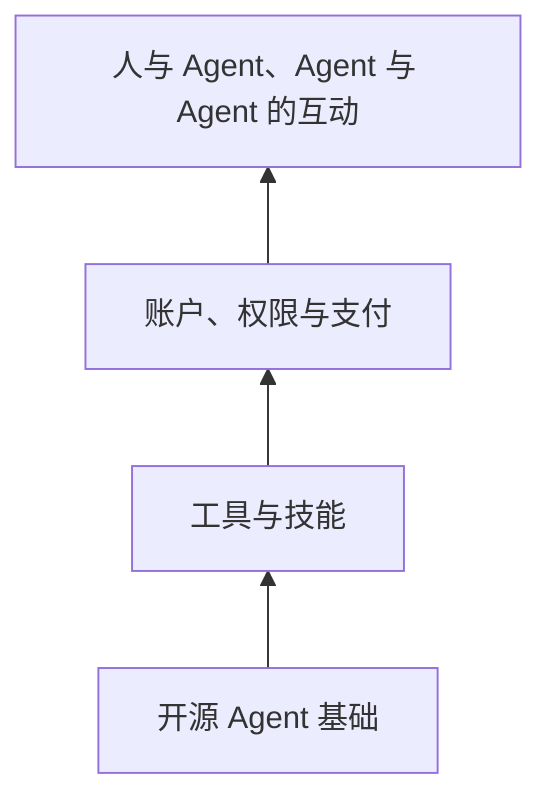
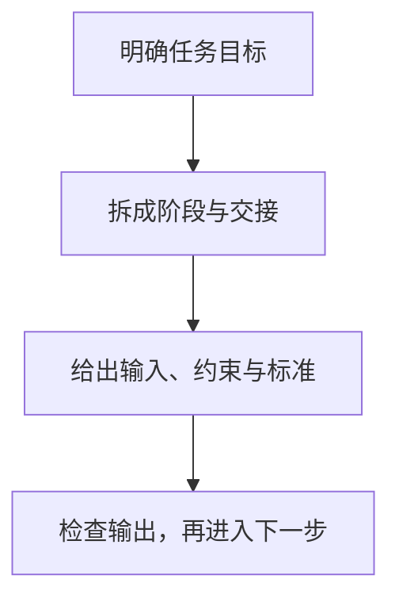

# 回头听 3 月初的 AI 讨论

## Open Claw、工作流与仍未落定的判断

庄明浩｜互联网公司战略与投资从业者、涂鸦之书主播

串台藏金阁 · 2026 年 3 月 · 1 小时 22 分

节目回看 3 月初的讨论：一个开源 Agent 如何突然进入日常对话工具，模型能力为何需要被拆进工作流，以及面对快速变化时，普通人可以怎样开始。

---
layout: default
---

# 这场讨论从 Open Claw 展开，最后回到四个问题

为什么突然有体感

它没有被说成单一技术突破；交互入口、开源生态和时机共同让更多人看见 Agent。

为什么还不够好用

账户、浏览器、通知与权限都要配置。能跑起来，不等于可以放心交给普通用户。

怎样把 AI 用进任务

提示词的作用是收窄任务范围；复杂工作还需要分阶段、交接和验收。

行业在争什么

模型正把语言、多模态和 Agent 放到同一张产品图里；算力、数据与评价标准仍是约束。

---
layout: default
---

# Open Claw 的新鲜感，来自已有能力的重新组合

<strong>操作真实环境</strong>
不只在虚拟机里完成任务，还会触及文件、账户和权限。

<strong>进入熟悉的聊天入口</strong>
它可以待在飞书等即时通信工具里，少了一次打开新应用的切换。

<strong>开源带来扩展</strong>
更多人能安装、改造并围绕它组织活动，生态随之变得可见。

庄明浩把它称为工程上的重新组合：技术、体验感知与传播时机共同形成了这次热度。

他的区分是：熟悉 AI 工具的核心用户未必觉得能力有断层式变化；对较少使用 Agent 的人，聊天入口和拟人化交互更容易带来明显体感。

---
layout: two-cols-header
---

# 试用与本地部署，解决的不是同一个问题

::left::

庄明浩建议，第一次体验可先从云端开始：成本和操作门槛较低，足以了解 Agent 如何接收任务、调用工具并返回结果。

他后来把 Open Claw 放到闲置笔记本上，是因为要让它处理商城账号、浏览器和文件时，更在意设备与数据是否属于自己。

他的补货提醒看似简单，却要登录账户、授予浏览器和飞书通知权限、设定时间与频率；Windows 环境还让安装反复遇到教程没有覆盖的细节。

::right::

<strong>云端试用</strong>
适合先感受流程；成本与操作负担较低。

<strong>本地部署</strong>
更接近自己的设备与数据，也要自己处理模型接口、环境和权限。

这是庄明浩按使用目的给出的建议，不是对两种方案安全性的绝对排序。

---
layout: default
---

# 代理替人行动时，权限边界成为产品的一部分

<strong>凭证与数据</strong>
任务可能要求账号、浏览器访问或本地文件；授权范围不能因为方便而失去控制。

<strong>外部技能</strong>
安装现成技能会扩大它能访问的服务，也会带来来源与配置风险。

<strong>对外行为</strong>
即使已设偏好，它发布了什么、联系了谁，仍需要人在使用初期查看。

节目没有给出通用的安全方案。庄明浩的判断是，早期产品面对复杂网络环境与个人偏好时，很难靠一条固定规则解决所有情况。

---
layout: two-cols-header
---

# 开源让更多层可以被补上，也放大了未定的关系

::left::

节目提到，有人给 Agent 做可视化办公室，有人设想让多个 Agent 同屏互动。它们说明开源项目可以被别人继续包装和连接。

庄明浩把这种层层叠加，与早年 Web3 所描绘的认证、支付、权限和交互体系作类比：底层基础设施原本主要为人设计，AI 参与后可能需要新的接口。

这是一种演化方向的讨论，不是已经完成的技术路线。节目也提到相关项目的创始人并不一定愿意进入代币等金融叙事。

::right::

箭头表示节目设想中的依赖关系，不表示这些层已形成统一标准。

---
layout: two-cols-header
---

# 提示词不是咒语：它在缩小模型要填补的范围

::left::

庄明浩把模型能力比作在已知信息之间补全。给出的目标相距太远，输出就可能在很宽的范围内摇摆。

因此，复杂任务要先说清阶段、每一步的输入与交付结果，以及谁来检查。提示词、技能和流程设计都在收窄这个范围。

模型也会带着训练团队的偏好；后训练中的打分和反馈，使不同产品的回答风格不完全相同。用户的记忆与反馈还会继续改变体验。

::right::

这是节目对复杂任务的操作性建议；它不能消除模型理解偏差或工具调用错误。

---
layout: two-cols-header
---

# AI 漫剧的经验：流程被验证后，能力才容易落地

::left::

庄明浩认为，视频模型进步是前提；行业更重要的收获，是逐步摸索出从剧本到成片的可执行流程。

每个环节都要明确人和 AI 分别做什么、交接什么、怎样验收。流程跑得通，产出才可能稳定地进入生产。

主持人用同一段提示词生成视频时得到差异很大的结果。庄明浩把原因放在提示范围、模型理解与镜头处理等仍未完全内化的部分。

::right::

01
<strong>剧本与分镜</strong>
先确定叙事与镜头要求。

02
<strong>文字到图片</strong>
把镜头设计转为可用画面。

03
<strong>图片到视频</strong>
模型生成动态片段。

04
<strong>导演与验收</strong>
检查片段，再决定保留和调整。

节目将它作为行业工作流的例子；不同内容、模型与团队不必采用同一套步骤。

---
layout: two-cols-header
---

# 语言、多模态和 Agent，正被放进同一个任务里

::left::

庄明浩回顾，语言模型与图像、音频、视频曾常被当作不同赛道；他认为到录制时，各家公司正在把它们收拢到同一个目标中。

他用生成一张文章信息图举例：模型要找到材料、理解文字、归纳重点并产出图像。搜索、语言理解和视觉生成不再是孤立体验。

智谱偏向编程、Kimi 偏向 Agent、MiniMax 持续投入多模态，是他对国内公司阶段性侧重的概括；这些侧重并不意味着它们各自只做一种能力。

::right::

<strong>较早的分工</strong>
语言、图像、音频、视频与执行能力常以不同产品或团队呈现。

<strong>录制时的方向</strong>
同一任务要求多模态输入、理解、检索、生成与执行共同完成。

右侧是庄明浩对产品方向的归纳，并非各家已经达到同等能力的比较。

---
layout: default
---

# AGI 的判断还没有共同的尺子

<strong>定义没有定论</strong>
行业对何时算实现 AGI 仍没有统一标准。

<strong>测试难隔离</strong>
即使限制训练资料的时间范围，也难判断模型靠独立推导，还是靠提示或已有信息完成任务。

<strong>百分比也难解释</strong>
用覆盖多少场景、替代多少工作来定义，同样会遇到场景与工作的边界问题。

庄明浩没有给出实现时间表；他强调，评价标准本身仍是未解决的问题。

---
layout: two-cols-header
---

# 对用户显眼的是算力，对模型公司更难的是数据

::left::

节目把算法、数据、算力并列。庄明浩认为，底层算法的零到一突破难以按时间表预期；模型公司当下仍在持续改进与优化。

用户会直接感到排队、限量和价格压力。复杂 Agent 运行在人类软件与工具上，新的使用量会很快吃掉算力。

对模型厂商，他更强调数据的边际差异：独特而广泛的数据不保证模型一定更好，但缺少这类输入会限制竞争空间。

::right::

<strong>用户侧的体感</strong>
算力不足表现为等待、限量或难以持续运行复杂任务。

<strong>厂商侧的竞争</strong>
算法、数据和算力彼此牵连；节目尤其提示数据会拉开差异。

这是节目嘉宾的分析框架，不是对所有模型厂商成本结构的统计。

---
layout: default
---

# 行业变化按周发生，项目和指标也难再照旧看

项目会反复调整

庄明浩说，AI 团队可能连续试验多项功能或方向；投资人不宜仍按半年到一年的刻度判断所有项目。

新产品未必有旧指标

谈到 AI 游戏，他认为移动互联网时代的用户量不必足以说明价值；行业连该看什么仍在摸索。

先看到的可能是 ROI

他把降本增效视为较容易观察的结果：实施路径与投入回报能被计算，但这类项目未必最受追捧。

这不是对某个赛道的投资建议。节目反复强调，行业口号只能解释为什么开始尝试，不能替代对具体场景、成本和产出的判断。

---
layout: default
---

# 所谓套壳，也可能是在完成用户真正缺的一层

模型本身

提供语言、推理、生成或工具调用能力，但普通用户不必直接面对原始接口。

交互与流程

界面、任务步骤、账号接入和反馈方式，把模型能力转成可以使用的产品。

权限与安全

当产品开始代替人访问账户或执行动作，这些设计不再只是附加功能。

主持人担心套壳容易被模仿。庄明浩的回答是：狭义的简单包装确实可能只存在短暂窗口；但从模型到可用产品的交互、流程和安全设计，本来就是用户体验的一部分。

---
layout: end
---

# 普通人的起点，是找一件会反复发生的事

节目没有给出押注某个模型或职业的答案。庄明浩更愿意让人先在线体验，再从工作、生活或娱乐里找一件每周反复出现的事，观察 AI 能在哪个环节减少等待、整理信息或补足步骤。

把它当作工作台，而不是自动给出正确结果的权威：明确目标，保留检查，随着任务变化调整流程。关于教育、社交和未来评价标准，节目承认仍没有成熟结论。

这是基于节目讨论整理的实用建议，不构成投资或职业建议。

