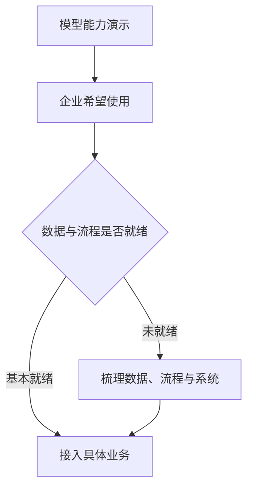

# AI 来到成熟互联网之后

## 从平台 ROI、个性化交付到企业落地

图灵之书 × 难得正经 · 2026 年 4 月 · 54 分钟

嘉宾：庄明浩 · 投资人、播客主播

---
layout: default
---

# 这场讨论从成熟平台的约束出发

<strong>互联网也积累了行业壁垒</strong>

投流、算法、供应链和运营经验已经把许多线上业务推到精细优化阶段。

<strong>新机会的窗口很短</strong>

小游戏、短剧、漫剧等新玩法会迅速扩张，也会被复制、投流和平台规则压平。

<strong>服务有机会被重新交付</strong>

AI 能降低个性化内容和陪伴式服务的成本，但高精度需求仍受数据、专业知识和供应链限制。

<strong>试错更快，差距也更大</strong>

团队可借反馈快速调整；同时，拥有数据、场景和长期投入能力的巨头也会拉开距离。

---
layout: two-cols-header
---

# 成熟互联网为何有了传统行业的难题

::left::

庄明浩先把移动互联网定义为一种成熟行业：它并不缺产品和流量，反而积累了投放、算法、运营和细分场景的复杂经验。许多利润来自对既有体系的精细调节。

通用模型短时间内能把能力推到可用水平，却未必能接住每一个细分流程里接近满分的要求。节目用 60 分与 99.5 分作比：前者是快速获得的基础能力，后者依赖行业里长期沉淀的细节。

::right::

<strong>平台机制</strong>
流量价格和转化效率持续被计算。

<strong>行业经验</strong>
场景细节藏在运营和流程里。

<strong>高标准交付</strong>
局部任务常要求接近满分。

模型能力提高后，落地难点从基础生成转向细分流程的最后一段质量。

---
layout: two-cols-header
---

# 新玩法如何在成熟平台里迅速熄火

::left::

嘉宾把小游戏、短剧和漫剧放在同一类现象里：新形式在短时间内找到尚未被定价的流量或变现方法，随后迅速吸引制作方、投放资金和围观者。

他以六个月、约百亿元规模概括这类细分市场的膨胀速度，也提醒这是平台与投放体系挤出的短期高点。平台抽成、买量成本和同质化竞争叠加后，制作方实际留下的利润可能只有约 8%，漫剧甚至更低。

::right::

01
<strong>出现异常值</strong>
新形式暂时找到有效的内容或投放组合。

02
<strong>快速复制</strong>
资金、团队与相似内容集中涌入。

03
<strong>ROI 被校准</strong>
算法、竞价与成本重新压缩利润。

六个月与 8% 是嘉宾对这类窗口的经验性概括，不是所有内容生意的统一结果。

---
layout: two-cols-header
---

# AI 让规模化与个性化同时靠近

::left::

节目把产品和服务看作两种不同的商业属性。标准产品可以批量生产，靠规模经济摊薄成本；服务需要按人、按地点或按情境交付，通常难以复制。

AI 提供的可能性是：在部分领域，用接近产品化的成本交付带有个人差异的服务。漫改被拿来作例子——传统动画依赖手艺人，AI 改写部分流程后，个性化内容的单分钟成本可以明显下降。

::right::

<strong>标准产品</strong>
批量生产，成本随规模下降。

<strong>传统服务</strong>
依赖人员和场景，交付难以复制。

<strong>AI 辅助交付</strong>
在部分场景兼顾低成本与个性化。

这是一种可探索的交付方式，不代表所有服务都能被自动化。

---
layout: two-cols-header
---

# 按需生产先要跨过容错与供应链

::left::

定制 T 恤、插画、音乐等按需生产业务，对输出样式有较高容错度；图案略有差异，用户仍可能接受。医疗等科学性场景则要求准确，错误的代价更高，模型的概率性输出因此难以直接承担核心判断。

当定制内容要变成实体商品，问题又从生成转向制造。转印、UV 打印、数码喷涂等环节需要柔性供应链配合。节目据此判断，许多实体行业的按需生产仍要经历较长改造。

::right::

<strong>内容容错度</strong>
审美类内容可接受多种合格结果。

<strong>精度要求</strong>
医疗等场景不能把概率输出当作定论。

<strong>柔性制造</strong>
实体交付还要接住小批量、个性化生产。

生成成本下降只是起点；可否交付取决于场景容错度和后端能力。

---
layout: two-cols-header
---

# 内容增产后，分发会重新依赖信任

::left::

庄明浩以抖音每天约一亿条视频上传为参照，认为推荐算法已经在帮助用户处理极大内容量；用户仍会感到疲劳。若 AI 继续压低视频生产成本，供给规模可能远超今天。

他没有断言下一代分发机制已经出现，只推测算法之外的筛选会更重要：创作者的个人品牌、用户对小群体的信任，以及编辑判断，都可能帮助人们在大量相似内容中作选择。

::right::

01
<strong>生成更便宜</strong>
视频与内容供给继续增加。

02
<strong>推荐承受压力</strong>
相似内容和选择疲劳加重。

03
<strong>信任参与筛选</strong>
个人关系、社群和编辑可能补充推荐。

后两步是嘉宾对未来分发的推测，节目没有把它当作已经发生的事实。

---
layout: two-cols-header
---

# 不确定的市场，用反馈代替长周期押注

::left::

模型能力和用户偏好都在变，团队很难提前写出完整路线图。节目讨论的 building public，指的是把尚未完善的东西更早推向市场，在真实使用中获取信号。

这种做法会让先行团队得到注意力、用户反馈，甚至吸引人才和资金；但它不会保证成功。能力基线也在上升，三个月前成立的项目可能很快失去意义，投入会变成沉没成本。

::right::

01
<strong>做出可试版本</strong>
先验证用户是否愿意使用。

02
<strong>获得市场信号</strong>
观察反馈、传播和实际问题。

03
<strong>继续或重做</strong>
根据新信息调整方向和投入。

试验适合答案尚未明确的领域，不能替代对成本、质量和风险的判断。

---
layout: two-cols-header
---

# 企业采用 AI，缺的常是中间那一段工作

::left::

节目提到，一家模型公司面对传统行业 MBA 学员时，需要同时解释模型能力与企业可以从哪里开始使用。模型演示会引起兴趣，企业却未必有可直接接入的数据、在线化水平和流程基础。

这段从能力展示到稳定使用之间的实施工作，类似早期数字化里的现场调研、流程梳理和系统对接。嘉宾把它称为脏活累活；也正因为业务知识藏在这些细节里，懂行业的人有机会把功能整合成可用的 AI 服务。

::right::

模型能力不会自动变成业务结果；图中的实施环节来自节目对传统行业落地的描述。

---
layout: two-cols-header
---

# AI 也会把超级团队的优势放大

::left::

小团队能用 AI 做原先不敢想的事，节目同时强调大团队的杠杆更强。庄明浩以字节跳动的视频模型和腾讯探索 AI 与游戏结合为例，认为数据、主场景、成本承受能力和持续投入会让领先者更难被追上。

这不是说创业公司没有空间。嘉宾的条件是：不要只复制巨头最核心的战场。视频、运动品牌等市场会持续出现较小的新需求；团队能否识别特定人群与使用场景，决定了能否在缝隙中增长。

::right::

<strong>巨头的主战场</strong>
数据、平台、资本与长期战略可以共同投入。

<strong>小团队的位置</strong>
围绕特定需求、用户关系或交付方式寻找空间。

节目讨论的是资源条件不同带来的策略差异，不是对某一类团队的胜负判定。

---
layout: default
---

# B 端的价值，常藏在 80 分之后

嘉宾认为，许多国内 SaaS 产品尚未真正理解客户业务，也难把零散功能组织成能完成一项工作的 AI 体系。通用模型能给出基础答案，企业真正付费的部分往往是把经验、例外和协作关系编码进流程。

节目用健康服务作过对照：陪伴、记录、提醒等服务可以先从低风险场景尝试；涉及诊断、用药和医疗对接时，准确性、伦理、病历数据和设备连接都会成为额外约束。能力越接近真实决策，实施越不能只看模型分数。

<strong>基础生成</strong>
通用模型先解决可接受的常规任务。

<strong>业务流程</strong>
接入规则、数据、协作与例外处理。

<strong>高风险决策</strong>
面对准确性、责任和行业约束。

层次越往下，价值越贴近具体业务，对专业知识和可靠性的要求也越高。

---
layout: end
---

# 本期讨论留下的三项约束

<strong class="!text-slate-800">成熟平台</strong>

会迅速把流量、投放和内容创新的异常利润重新定价。

<strong class="!text-slate-800">真实交付</strong>

仍受容错度、行业知识、数据质量和供应链能力约束。

<strong class="!text-slate-800">竞争位置</strong>

试错节奏加快后，巨头的主战场和小团队的细分机会会同时存在。

