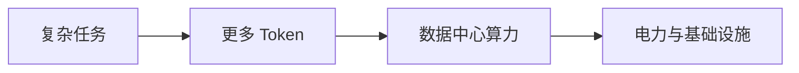
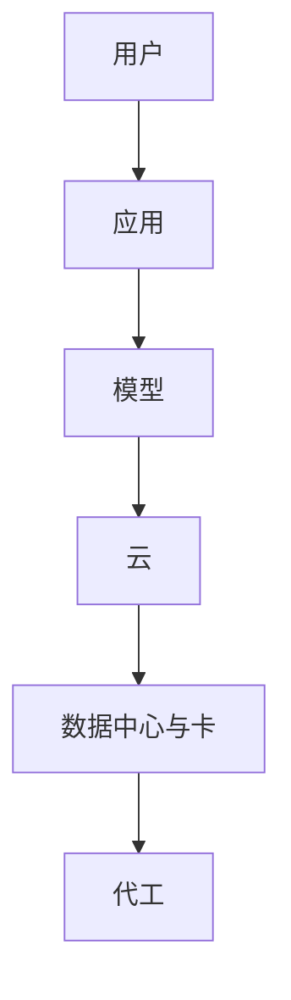

# OpenClaw 热潮的来处与去向

## 从使用门槛、Token 消耗到投资周期

图灵之书 × 知本论 · 2026 年 4 月

嘉宾：庄明浩 · 科技投资人、图灵之书主播

---
layout: default
---

# 一轮热潮，同时暴露了四个问题

<strong>OpenClaw 到底补上了什么</strong>

它把模型接入记忆、工具、文件权限与既有通信软件，却不自动变成可靠员工。

<strong>为什么使用仍然困难</strong>

复杂任务需要人提供标准、上下文、工具和持续反馈，权限也随之扩大。

<strong>Token 为什么重新成为焦点</strong>

长时间、多工具的任务会放大消耗，并把竞争带回数据中心、芯片与电力。

<strong>投资人究竟在判断什么</strong>

开源生态、低成本试错和巨额资本开支并存，泡沫所处阶段无法在当下确认。

---
layout: two-cols-header
---

# OpenClaw 不是另一种更聪明的聊天框

::left::

庄明浩把大模型比作发动机，把 OpenClaw 这类软件比作让发动机能够上路的简易车辆。它的重点不在训练出新模型，而在工程上把模型与记忆、偏好、工具、本地文件和即时通信连接起来。

只让它搜索信息、整理报告时，体验未必比优化过的聊天产品好。任务被拆成多个阶段，并且每一步都有交付和验收时，接入工具与流程才更有价值；编程是受访者反复提到的例子。

::right::

<strong>基础模型</strong>
提供推理与生成能力。

<strong>OpenClaw 架构</strong>
接入记忆、偏好和通信渠道。

<strong>任务环境</strong>
提供文件、工具、标准与权限。

三者结合后才可能执行复杂任务；它们并不保证任务一定完成。

---
layout: two-cols-header
---

# 安装之后，Agent 还要逐步熟悉工作

::left::

受访者把初始状态的 Agent 比作刚入职的人：它有基础能力，却不了解组织的规范、流程、上下游、数据库和产出格式。用户给出的任务要求越复杂，这些缺失的信息越会影响结果。

因此，OpenClaw 的使用差异取决于谁在配置、提供哪些工具，以及如何检查结果。庄明浩的概括是：“它不是一个安装好了用就结束的事情。”

::right::

01
<strong>交代任务标准</strong>
说明目标、格式和上下文。

02
<strong>接入工作资源</strong>
按需开放工具、数据与权限。

03
<strong>检查并反馈</strong>
根据结果调整配置与做法。

这是持续配置的过程，不同个人和团队得到的能力边界会不同。

---
layout: two-cols-header
---

# 个人先能试，企业还要重做流程

::left::

庄明浩的观察是，目前 To C 的使用更多，To B 的实施较慢。企业已经很少停留在要不要用 AI 的问题上，而是在决定用在何处、是提高效率还是改造流程、购买服务还是自行搭建。

他认为，模型与 Agent 对既有软件和 SaaS 的挑战来自软件建造成本下降；但企业内的数据流转、安全、隐私、权限、工作方式以及考核机制，不可能在一夜之间改变。

::right::

<strong>个人使用</strong>
安装和尝试相对直接，可从日常任务开始。

<strong>企业实施</strong>
还要处理流程、数据、安全、权限与组织安排。

受访者认为，企业会从观望转向争抢，还是继续等待，仍存在分歧。

---
layout: two-cols-header
---

# 权限越大，安全与隐私越难留在后台

::left::

OpenClaw 起初由个人开发者为自己的需求制作，默认使用者能够判断风险。受访者说，原始本地版本可以被赋予电脑的全部权限；爆发式传播后，安全、隐私和权限成为高频更新的重点。

给 Agent 一台电脑或浏览器会扩大它可以完成的工作，也会增加文件、数据和操作失控的风险。此前许多产品把能力限制在特定场景，正是为了兼顾安全与成本。

::right::

<strong>受限的实施</strong>
在特定场景开放能力，便于控制数据与操作范围。

<strong>广泛的本地权限</strong>
可做的事更多，也要求用户承担更高的判断责任。

热潮让安全议题从网络安全的专业问题，变成个人、公司和政府都要面对的问题。

---
layout: default
---

# Token 是模型与 Agent 的燃料

庄明浩沿用发动机的比喻：Token 是燃料，背后对应数据中心和电力。早期聊天往往只运行几十秒；他认为，先进模型如今可以运行十几个小时的任务，编程、搜索、图像和视频等调用叠加后，消耗会迅速放大。

任务持续时间和调用类型会改变消耗；这是一条受访者用来解释算力紧张的关系链。

---
layout: two-cols-header
---

# 国内外的热度差异，来自不同的使用起点

::left::

受访者认为，OpenClaw 在中国的热度高于美国。在美国，主流使用者已沿着 ChatGPT、Claude、Gemini 等产品逐步接触更复杂的工具，因此会把 OpenClaw 视为适合部分个人场景的小幅改进。

中国的许多用户此前主要使用对话产品。Agent 把交互从聊天带到实际行动，例如订餐、叫车或完成任务，这种跨越会放大新鲜感和需求。他不为这轮热度下泡沫定义，却认为它让更多人理解 AI 可以做事。

::right::

<strong>美国的递进体验</strong>
模型与编程工具已形成连续的使用路径。

<strong>中国的跨越体验</strong>
从对话直接感受能够执行动作的 Agent。

节目据此区分了成熟度不同的市场，而非比较两国技术能力的高低。

---
layout: two-cols-header
---

# 开源项目的价值，首先出现在生态里

::left::

OpenClaw 软件本身不容易按一家传统公司来估值。庄明浩认为，个人作者、代码贡献者和项目本身的狭义商业价值都难以直接计算；影响力、传播、覆盖和周边生态可以成为阶段性的观察指标。

这也解释了为什么安装服务、培训、硬件和 Token 会在热潮中出现。受访者把卖课视为新技术热潮最先赚钱的一环：高门槛与用户焦虑之间，出现了降低门槛的中间服务。

::right::

<strong>开源软件</strong>
代码可被广泛使用与改造。

<strong>传播与影响</strong>
扩大使用者、贡献者和讨论范围。

<strong>周边服务</strong>
安装、培训、硬件和 Token 承接需求。

项目不直接收费，不表示围绕它的服务没有收入；两者也不是同一项商业价值。

---
layout: two-cols-header
---

# 早期投资，开始把更多钱留给试验

::left::

庄明浩不认为早期资本失去意义，但他看到评判与支持方式正在变化：启动成本下降、变化加快，小团队可以尝试原本中型团队才能做的事，也可能在找到方向前连续更换方案。

他举出一个具体做法：Koji 与真格基金合作，向 AI 初创者或个人提供价值 5 万美元的 Token；完成作品后再评估项目是否值得投资。这个案例是孵化方式之一，不代表所有早期项目都按同样路径融资。

::right::

01
<strong>提供 Token</strong>
降低个人开发者的初始调用成本。

02
<strong>完成作品</strong>
用实际产品测试一个方向。

03
<strong>再做评估</strong>
决定项目是否进入下一轮支持。

流程来自节目中的单一案例，重点是把资源先用于验证，而不是替代投资判断。

---
layout: two-cols-header
---

# 一人公司扩大了边界，也保留了生意的约束

::left::

AI、供应链和互联网工具确实让个人能做的事变多，但庄明浩对一人公司的普遍前景较为谨慎。成立更小的主体之前，仍要回答做什么、有没有价值、能否养活自己。

他举过在线教育公司的拆分案例：原来的几十人团队变成十多家四五人的小公司，教育内容、线下运营等工作被拆开，成员也可以承接外部项目。原有业务没有消失，组织与协作方式发生了变化。

::right::

<strong>可以拆分的工作</strong>
任务可模块化，个体能独立承接并与外部协作。

<strong>仍要验证的生意</strong>
需求、收入与工作价值不能由 AI 能力自动生成。

受访者把 AI 形容为协作中的润滑剂，而非所有行业都能照搬的组织方案。

---
layout: two-cols-header
---

# 产业链在增长，现金流却可能变紧

::left::

谈二级市场时，庄明浩用一条从用户到代工厂的链路说明：应用、模型、云和基础设施相互依赖。应用与模型要支付算力成本，云厂商和芯片企业也要为扩张投入资本开支。

因此，收入增长并不能单独回答风险。受访者尤其关注大型投入对现金流的压力：需求还在增长时，各环节都可能继续扩张；一旦市场情绪改变，彼此抬升的估值也可能反向传导。

::right::

箭头表示受访者所说的运行与供给依赖，不表示每一环的利润都相同。

---
layout: default
---

# 没有人能在曲线中确认自己站在哪里

受访者一面看到模型能力、个人渗透和算力需求仍在推进，另一面也看到存储、封装、电力、土地审批等物理限制，以及市场已经透支部分预期的迹象。两边都有理由，不能只凭某一个信号给热潮定性。

<strong>继续扩张的理由</strong>
能力提升、任务更复杂、仍有大量潜在使用者。

<strong>需要警惕的理由</strong>
资本开支巨大，现金流和市场预期承受压力。

庄明浩用一句话概括这种拉扯：“市场永远都是有效的，市场永远都是过头的。”

---
layout: two-cols-header
---

# Agent 的下一步，是在任务里自行验证和纠偏

::left::

受访者把近期的脚手架、Harness 和环境搭建都放入同一方向：让 AI 少受人工干预，能够检查任务的每个环节、自己寻找解决方案并纠正偏差。他称这个方向为自主进化。

在简单程序生成等场景，他认为能力已经接近可用；复杂任务仍受具体领域的验证、监管、安全、隐私与权限约束。能力路径并不等于现实世界会同步接受。

::right::

<strong>L3 Agent</strong>
当前重点是执行任务。

<strong>L4 研究者</strong>
能够完成研究员所做的工作。

<strong>L5 组织者</strong>
把强大的个体编排成主体。

这些定义来自受访者转述的 OpenAI 五级框架；节目并未断言实现时间。

---
layout: end
---

# 在不确定里做选择，仍要回到自己的承受范围

庄明浩没有给出热潮会在何时结束的答案：站在过程之中，难以画出泡沫曲线的顶点或回落节点。他也不把任何一环视为天然的价值股，因为每一环都在押注需求能否持续扩张。

对于投资和使用，节目最后回到更具体的判断：明确自己在参与什么游戏，依据风险承受能力安排阶段性选择；在抽离与入局之间观察产品、市场和他人正在作出的决定。

