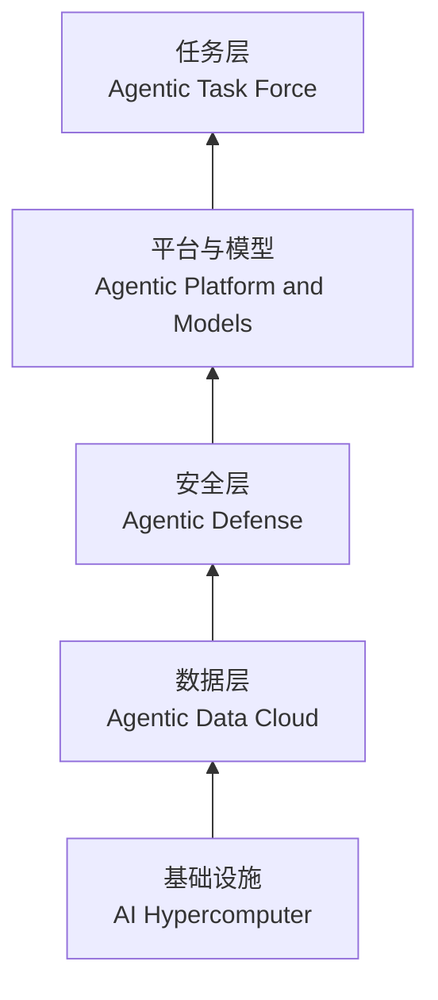
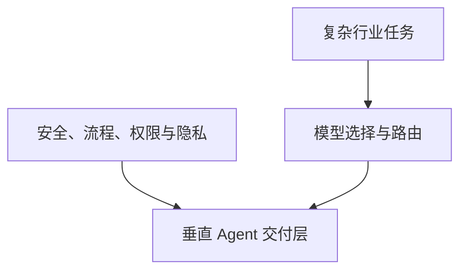

# Google Cloud 在押注什么

## 从 Agent、TPU、安全到生态的现场速记

明浩｜Google Cloud Next 现场观察者

美国拉斯维加斯现场录制 · 2026 年 4 月 · 34 分钟

一次主 Keynote、四场分论坛与会场观察，被整理成 Google Cloud 面向企业 AI 的产品路线：算力、数据、安全、模型、任务，以及围绕它们展开的合作网络。

---
layout: default
---

# 这期围绕五个相互关联的问题

企业 AI 的入口

Google Cloud 用 Gemini Enterprise 和五层服务，描述 Agent 进入企业后的产品结构。

TPU 为什么要分工

训练与推理被分配给不同型号；主播把这与推理需求上升联系起来。

安全处在什么位置

安全被单列为平台层，Wiz 也进入主 Keynote 的讲述。

垂类 Agent 靠什么留下来

法律、金融和遗留系统改造的从业者，强调路由、治理与交付能力。

较量为何延伸到生态

互操作、长期 TPU 路线、投资与并购，共同构成主播对 Google Cloud 战略的观察。

---
layout: two-cols-header
---

# 主 Keynote 把企业 AI 组织成五层服务

::left::

主播将 Gemini Enterprise 视为面向企业的 Agent 平台，并按主 Keynote 的顺序梳理出五层服务。

安全位于数据层之上、模型层之前。主播据此判断，安全在这次发布会中不只是附带功能。

转录稿列出了服务层次，但没有说明各层之间的具体技术调用方式。

::right::

根据主播对主 Keynote 的复述，自下而上排列服务层次。

---
layout: default
---

# 两组内部指标被用于说明企业采用速度

<strong>第一方 API Token</strong>
按主播转述：2024 年 Q3 为每分钟 70 亿，上季度为 100 亿，当期为每分钟 160 亿。

<strong>Google 内部新代码</strong>
按主播转述：由 AI 生成的比例从上季度的 50% 升至当期的 75%。

两项数字来自主播转述的 Google CEO 现场视频内容；节目没有展开 Token 的产品范围，也没有说明代码生成比例的审核口径。

---
layout: two-cols-header
---

# TPU v5p 与 v5e：训练和推理分开处理

::left::

Amin 在主舞台公布 TPU v5p 与 v5e。主播记录，两款芯片对应不同工作负载，且由不同代工厂商制造。

主播援引未具名的第三方预测：未来数年，推理需求可能超过总需求的一半；他用这个背景解释两种型号的分工。

现场案例中，Thinking Machines 称使用 TPU 后，训练效率提升到原来的两倍。节目没有给出测试配置或基准任务。

::right::

<strong>TPU v5p</strong>
面向模型训练。

<strong>TPU v5e</strong>
面向模型推理。

节目没有提供两款芯片的规格、功耗或价格，因此无法据此比较性能与成本。

---
layout: default
---

# 安全在发布会中被放到模型之前

独立服务层

在五层结构里，Agentic Defense 排在 Agentic Platform and Models 之前。

主 Keynote 的比重

主播多次提到安全内容占比很高，并把它列为当天最清晰的产品信号之一。

Wiz 的参与

Wiz 的联合创始人兼产品负责人登台，讲述 AI 安全与 Agent 安全评估。

主播的重点不在某一项安全功能，而在发布会如何把安全嵌入企业 AI 的整体服务结构。

---
layout: two-cols-header
---

# 开放性体现在与竞争者的连接上

::left::

主播把 Apple、Microsoft、NVIDIA 和 AWS 在发布会上的出现视为一条开放性线索，而非单一产品的功能清单。

这些例子横跨模型入口、办公软件、芯片供给和数据库服务。主播据此看到 Google Cloud 同时处于合作与竞争关系中。

::right::

<strong>Apple</strong>
主播转述，Google Cloud 将为下一代 Apple AI 模型提供能力，并可能出现在新 Siri 中。

<strong>Microsoft 365</strong>
Gemini Enterprise 支持与 Microsoft 365 对接。

<strong>NVIDIA Blackwell</strong>
Google Cloud Infra 被介绍为较早提供这代芯片服务的厂商之一。

<strong>AWS 与微软云</strong>
主播称新的数据库服务可以对接两类其他云服务。

每个案例都有各自的服务场景；主播据此提出 Google Cloud 的开放性观察。

---
layout: two-cols-header
---

# 垂直 Agent 的交付层，解决两类企业问题

::left::

Agents in Action 分论坛的嘉宾来自法律、金融和遗留 IT 改造领域；主播还提到三家公司都获得过 Google Ventures 投资。

从业者的说法是：复杂任务往往难由一家模型厂商完全满足，需要在中间管理模型选择与路由。

金融、法律、银行和保险客户还要求严格的数据安全、流程、权限与隐私控制。

::right::

三家从业者把模型路由和治理要求都放进垂直 Agent 的交付内容中；节目未比较各家实际效果。

---
layout: default
---

# 当前收入结构仍以订阅为基础

<strong>基础订阅</strong>
三位嘉宾都将其视为目前的收入底座。

<strong>扩展包</strong>
在订阅之外，为更多能力和更复杂交付收费。

<strong>按结果尝试</strong>
嘉宾认为理想化的按结果付费暂时仍难大规模实现。

他们还共同提到人才缺口：既了解垂直业务，又了解 AI 能力边界的人很少。

---
layout: default
---

# Anthropic 将企业收益分为三种

<strong>更聪明的员工</strong>
搜索企业信息、自动化研究、分析数据并创建新文件。

<strong>更快的流程</strong>
加速开发、提高软件质量，并自动化部分流程。

<strong>变革性的产品</strong>
构建以 AI 为中心的应用，解决客户问题并带来新增收入。

这是 After Software 分论坛中 Anthropic 演讲者对企业机会的分类，不是对所有企业现状的统计。

---
layout: two-cols-header
---

# Anthropic 估计，能力增长来自三个变化

::left::

Anthropic 演讲者称，其内部观察到 AI 能力大约每七个月翻一倍。

这个速度是演讲者的内部判断。节目没有给出统一评测、样本范围或与外部模型的对照。

::right::

<strong>问题更复杂</strong>
模型面对的任务难度继续上升。

<strong>运行更久</strong>
单次执行可以覆盖更长的工作时间。

<strong>框架更复杂</strong>
Agent 的编排与工具框架持续扩展。

演讲者把这三项变化共同归为能力加速的原因。

---
layout: two-cols-header
---

# Anthropic 预期：AI 编程改变软件工作的重心

::left::

Anthropic 的讲法是，过去大量工作量集中在实施、验证、部署与维护；识别问题和决定是否解决它，占比相对较小。

随着 AI 编程能力增强，演讲者预计前端的判断会占据更多比重：界定问题、设定目标，并决定哪些问题值得解决。

他还用 Claude Code 举例：软件可由模型调用工具、围绕一个目标反复调整。

::right::

<strong>过去的侧重</strong>
实施、验证、部署与维护占用较多工作量。

<strong>演讲者的预期</strong>
识别、定义和选择问题的重要性上升。

这是 Anthropic 演讲者对软件工作的判断，节目没有提供行业占比数据。

---
layout: two-cols-header
---

# 长期 TPU 路线，会碰到物理世界的约束

::left::

在 Acquired 的现场录制中，Amin、DeepMind 首席科学家 Jeff 与两位主播回顾了 TPU 十多年的发展，包括失败与持续投入。

他们把后续挑战推到算力之外：电力、数据中心建设、先进封装和代工，都可能限制进一步扩张。

主播听完后的判断是，Google 的组织文化与长期战略选择，帮助 TPU 路线穿过了早期困难。

::right::

<strong>电力</strong>
大规模算力需要稳定供给。

<strong>数据中心</strong>
建设速度与容量成为问题。

<strong>先进封装</strong>
硬件制造能力要继续跟上。

<strong>代工</strong>
生产环节也是长期变量。

这是分论坛对未来瓶颈的推演，而非已经发生的成本或供给数据。

---
layout: default
---

# 投资与并购，贯穿主播看到的生态线索

<strong>DeepMind 与 Wiz</strong>
主播分别把它们放在研究能力与云安全产品线的延伸中。

<strong>Anthropic</strong>
早期资金联系与 TPU 训练实践，被主播视为模型生态的案例。

<strong>Google Ventures</strong>
法律、金融和遗留 IT 改造的分论坛公司，构成垂直 Agent 的投资样本。

这是主播根据当天议程做的生态归纳；节目没有量化这些关系各自带来的商业回报。

---
layout: end
---

# 主播的收束：竞争已扩展到生态层面

主播当天没有看到能够单独改变行业格局的发布。大会内容通常提前数月确定，很难完全追随以月为单位变化的模型竞争。

他因此把观察收束到一组相互依赖的能力：TPU 与数据基础设施提供底座，安全与任务平台承接企业部署，互操作、投资和伙伴关系把这些能力带进更广的市场。

这是一份现场速记中的战略判断，不是 Google 的单一官方表述。

