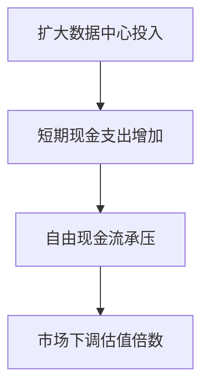

# 语言、coding、多模态

## 到底谁坐 AI 的主桌？

一场围绕技术、产业与资本的 2026 年 4 月现场复盘

狂喜 98 页 PPT · 单人演讲 · 1 小时 26 分钟

本期数据、预测与案例均为演讲者在现场展示和解读的材料

---
layout: default
---

# 一场需要不断重做的行业复盘

<strong>更新周期缩短</strong>

演讲者原本约每三个月整理一次；春节后，他在不到两个月内连续更新了两版材料。

<strong>讨论对象在变化</strong>

OpenClaw 等产品很快从热点变成旧闻，模型发布与产品迭代的节奏也在加快。

<strong>三个入口</strong>

语言模型、coding 与多模态曾像三张并列的桌子；本期追问的是各自如何影响产业与资本。

<strong>阅读这一期的尺度</strong>

现场图表有明确的时间点和统计口径；演讲中的预测、估值与因果解释不等于独立核验后的事实。

---
layout: default
---

# 从技术到生活：本期的阅读路线

<strong>01 · Agent 与 Harness</strong>

模型怎样从回答问题，变成能调用工具、持续完成任务的系统。

<strong>02 · coding 的领先</strong>

代码能力为何从补全工具扩展到生成、评审与通用任务入口。

<strong>03 · 模型与应用竞争</strong>

OpenAI、Anthropic、开源模型与多模态应用的不同衡量尺度。

<strong>04 · 资本与约束</strong>

软件估值、数据中心投资、一级市场与地方阻力如何同时出现。

---
layout: two-cols-header
---

# Agent 的关键不只在模型，而在让模型持续行动的系统

::left::

演讲者把近几年的路径概括为：聊天模型先提供基础能力，推理模型提高解题能力，当前重点转向能执行任务的 Agent。

<strong>Agentic Thinking</strong>

模型需要决定何时行动、选择与排列工具、接收环境信息，并在失败后调整计划。

<strong>目标是自主学习，而非一次回答</strong>

演讲者将多轮调用中的连贯性、评估和反馈视为当前训练与产品设计的共同重点。

::right::

L1
<strong>聊天模型</strong>
回答问题，提供基础语言能力。

L2
<strong>推理模型</strong>
借助后训练与强化学习处理更复杂的问题。

L3
<strong>任务型 Agent</strong>
在多轮工具调用中执行、检查和修订。

这是演讲者借用的能力分层，用来解释研发重点为何转向行动与反馈。

---
layout: two-cols-header
---

# Harness 把模型能力装进可运行的工作流

::left::

演讲者用发动机与汽车作比：更强的基础模型像更强的发动机；真正完成任务还要有外围系统。

OpenClaw 和 Claude Code 在演讲中的作用，是说明这类外围系统已成为产品能力的一部分：模型并非孤立地接收提示词，而是在一套任务运行环境中工作。

Harness 在这里既指驾驭模型的过程，也指围绕模型的上下文、权限、记忆与编排基础设施。

::right::

<strong>上下文与记忆</strong>
保留任务、用户偏好与过程信息。

<strong>工具与权限</strong>
规定可以调用什么，以及哪些操作受限。

<strong>评估与反馈</strong>
识别失败，推动下一轮修订。

<strong>任务编排</strong>
安排多轮步骤与多个 Agent 的协作。

并列模块共同把静态模型能力收束为有目标的行动。

---
layout: default
---

# 开源项目的名字，记录了开发者注意力的迁移

<strong>从提示词到上下文</strong>

演讲者认为，模型输入不再只是写好一句提示词，还要管理长期任务所需的信息。

<strong>从给人写软件到给 Agent 写软件</strong>

工具调用、技能封装、编排和自我演化，成为新项目常见的组织方式。

<strong>coding 与通用 Agent 的边界变浅</strong>

使用者只需用自然语言说明任务，往往不再关心底层是代码路径还是通用 Agent 路径。

演讲者引用蚂蚁开源对 GitHub 项目的整理：2026 年 Q1 的新兴热门项目中，围绕 Agent 的项目约占四成；若看最受关注的 1,000 个项目，相关比例被概括为约八成。这些是该整理的粗略分类，不是整个开源生态的普查。

---
layout: two-cols-header
---

# coding 从代码补全，走向更大的任务入口

::left::

早期 coding 工具帮助程序员补全代码。演讲者认为，它现在已延伸到生成、评审、调试和需求管理，因而能覆盖更多工作流。

在他看来，coding 的重要性在于它正成为很多数字化任务的实现入口。

现场材料还把 GitHub 提交、新网站与新 App 的增多，作为 AI 辅助开发扩大供给的信号；这些信号不能单独说明所有新增产品的质量或留存。

::right::

01
<strong>补全</strong>
在既有代码中辅助编写片段。

02
<strong>生成</strong>
根据需求产出更完整的实现。

03
<strong>审查与修订</strong>
检查、调试，并参与需求管理。

这是演讲者对 coding 产品边界扩张的归纳。

---
layout: two-cols-header
---

# OpenAI 与 Anthropic 的领先，取决于看哪一组指标

::left::

演讲者没有把两家公司放进同一条简单排名。ChatGPT 的周活、留存和使用时长仍被他视为消费者产品侧的领先信号；Anthropic 则在企业采用和收入增长上被描述为追得更快。

按现场引用的 2026 年 Q1 数据，OpenAI 的 ARR 为 250 亿美元、Anthropic 为 300 亿美元。演讲者同时提醒，两者收入是否扣除云服务渠道费用，可能并非同一口径。

因此，这里呈现的是一场竞争中的两套尺度，而不是对企业价值的最终判定。

::right::

<strong>ChatGPT</strong>
用户规模、月留存、日活与使用时长，是演讲者观察其消费端位置的指标。

<strong>Anthropic</strong>
企业端的默认选择与收入增长，是演讲者强调的企业侧信号。

同一家公司可以在用户规模和商业化上呈现不同的相对位置。

---
layout: default
---

# 版本更新更密集，能力与价格也在一起竞争

<strong>更替速度</strong>

演讲者对中美头部模型发布时间的整理显示，过去以半年计的大版本更替，已经被更短的更新间隔取代；这也是他感到行业加速的直接来源。

<strong>DeepSeek 的位置</strong>

他把 DeepSeek 的意义放在能力与价格的组合：不一定追逐最高能力上限，却试图以更低成本提供很强的表现，并促使其他厂商降价。

<strong>开源的竞争含义</strong>

现场引用的下载量和模型占比材料，将中国厂商视为开源模型的重要供给方；演讲者由此把开源放进中美 AI 竞争的语境。

---
layout: two-cols-header
---

# 多模态没有退场：图片开始带着世界知识工作

::left::

演讲者展示了两类图片生成示例：一类能组织出直播界面中的评论、榜单和商品卡；另一类在四款游戏联动海报底部补上版权说明，并列出所属公司。

他的判断是，图片生成不只是画图：模型还要理解界面结构、行业惯例和对象之间的关系。示例展示的是演讲中的模型输出，不等于对稳定性或正确率的测试。

Sora 应用的关闭也没有被他当作视频生成价值消失的证据。他更关心模型公司如何在训练、服务和研发之间分配有限的 Token 与算力。

::right::

<strong>图像结构</strong>
知道直播页面有哪些区域和常见元素。

<strong>对象关系</strong>
把多个作品、公司与版权信息联系起来。

<strong>资源取舍</strong>
产品是否保留，也受算力与组织优先级影响。

这些是演讲者从示例推导出的产品判断。

---
layout: default
---

# SaaS 估值受冲击，分歧却没有消失

<strong>担忧的一面</strong>

AI 可能压低软件公司的利润率，并让客户绕开既有软件、直接购买能完成任务的服务；演讲者用这一逻辑解释软件股的重估。

<strong>仍然成立的一面</strong>

另一种观点认为，领先软件公司的增长依旧稳定，AI 还会扩大可服务的市场。现场没有把这场分歧宣告为结束。

过去
<strong>6 个月、50 万元</strong>
传统方式完成一项相关任务的假设。

低代码
<strong>6 周、5 万元</strong>
演讲者用来对比的较低成本路径。

Vibe Coding
<strong>6 小时、50 美元</strong>
用于说明极端效率预期的算例。

三个数字是演讲中的示意性比较，用来说明市场担心成本结构被重写。

---
layout: two-cols-header
---

# 高增长并未消除 Capex 带来的现金流压力

::left::

演讲者观察到，软件股之外，持续扩大数据中心投资的科技巨头也被重新定价。收入和利润仍可增长，但大规模 Capex 会先占用现金，回报未必在短期出现。

他引用的材料显示，三家云公司和 Meta 一年合计计划投入约 3,000 亿美元 Capex。这一数字在现场被用来解释市场为何更关注自由现金流。

同样的逻辑也被用于理解英伟达等公司：增长预期与估值倍数可能朝相反方向变化。

::right::

演讲者把这条路径作为解释 Mag 7 重估的框架；它描述的是他的市场判断。

---
layout: two-cols-header
---

# 算力需求增长，仍要经过芯片、工地与审批

::left::

训练时代的焦点是 GPU。演讲者认为，Agent 的多轮编排和任务处理提升了 CPU 的重要性，因此市场开始重新关注 CPU、存储与光互连。

他还把 H100 租赁价格没有随新卡发布而明显走低，视为供需仍紧的一个市场信号。这个信号只反映租赁市场，不能代替全部算力供给的衡量。

半导体公司无法按投资意愿立刻扩产：先进制造、封装、产线设计、土地、电力、工人和政府审批都在限制速度。

::right::

需求
<strong>训练与 Agent 推理</strong>
模型服务和多轮任务都消耗计算资源。

设备
<strong>GPU、CPU、存储与光</strong>
不同工作负载带动不同硬件环节。

落地
<strong>工厂、数据中心与电力</strong>
建设速度受供应链和行政条件约束。

需求的金融预期，不能直接跳过实体建设的时间表。

---
layout: two-cols-header
---

# 一级市场以集中资金，延续模型公司的竞争

::left::

演讲者引用的 2026 年 Q1 图表把一级市场描述为创纪录的季度：投资金额约 3,000 亿美元。他强调，资金并没有平均流向所有项目。

按现场材料，前五大基金募走约四分之三资金，前五大项目也吸收约四分之三资金；OpenAI、Anthropic、SpaceX 等大公司成了关注中心。

演讲者的解释是：当公开市场给成熟科技公司更低倍数，而私募资本仍愿意高价投入时，后期公司未必急于上市，融资与收购仍可在私募市场完成。

::right::

资金
<strong>少数大基金聚集资本</strong>
现场图表显示，募集额高度集中。

项目
<strong>头部公司获得大额融资</strong>
模型、数据与算力竞争需要持续投入。

选择
<strong>上市不再是唯一出口</strong>
公司可以在后期私募市场继续融资和并购。

这是演讲者对私募市场如何影响竞争节奏的归纳。

---
layout: default
---

# AI 短剧的商业投入，与真人短剧扶持同时发生

<strong>公开扶持的表态</strong>

演讲者转述，红果短剧负责人在中国网络视听大会上宣布拿出 5 亿元支持真人短剧拍摄。

<strong>平台上的实际投放</strong>

他又引用 4 月 15 日的数据：字节巨量引擎投向 AI 剧的消耗为 9,968.92 万元，并预计很快超过单日 1 亿元。

演讲者用这组并列材料说明，平台会在监管与创作者的压力下表达对真人内容的支持，同时也会跟随广告投放和用户榜单中已经出现的 AI 内容需求。这里呈现的是一次行业现场观察，不足以推断整个短剧市场的长期结果。

---
layout: default
---

# 数据中心的承诺，最后要落到地方生活里

<strong>建设进度未必跟上叙事</strong>

演讲者展示星际之门计划的卫星图，认为多处建设明显滞后；他举出的预期是 5GW，现场估计实际运营规模可能仅 0.3GW。

<strong>社区开始提出限制</strong>

他提到缅因州限制数据中心建设的法案，以及多个州正在讨论禁令或暂缓措施；电价、用水、环境和审批都成为地方议题。

<strong>经济增长不自动转化为每个人的收益</strong>

演讲者借恩格斯暂停讨论一种担忧：技术可以推高 GDP，而工资和福利未必同步改善。他反对用历史的大叙事轻易覆盖具体的人生处境。

---
layout: end
---

# 演讲者留给观众的选择

AI 会越来越擅长完成标准明确、容错很低的任务。演讲者希望人把这类工作交出去，也保留去做可能犯错、因而需要判断和承担的事的空间。

本期没有试图判定泡沫、估值或技术路线的最终答案；它记录的是 2026 年 4 月一组快速变化的信号，以及这些信号已经带来的取舍。

