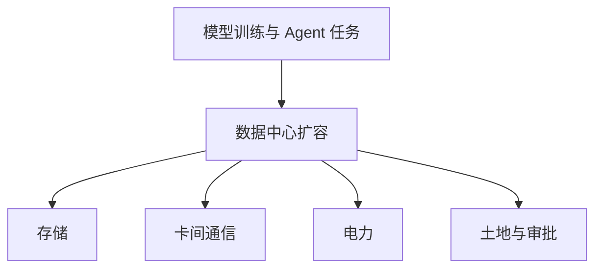

# 没有中间地带

大国 AI 博弈、执行成本骤降与白领的恩格斯停滞

《屠龙之术》× 大内串台对谈 · 2026 年 5 月

从 Manus 的收购风波，谈到 Agent、数据中心与个人在不稳定周期里的选择。

---
layout: default
---

# 四个问题，把这场对谈串在一起

<strong>Manus 为何变成监管难题</strong>

公司迁移、美元资本与收购传闻叠在一起，商业交易被放进中美竞争的语境。

<strong>Agent 多做了哪一层工作</strong>

模型给出能力；Harness 负责权限、记忆、评测与任务衔接，让模型能持续处理任务。

<strong>效率压缩先落在哪里</strong>

软件、视频和短剧制作的执行成本下降，需求定义、判断和分发的重要性随之上升。

<strong>速度受到什么约束</strong>

存储、通信、CPU、电力与审批仍限制着数据中心，也把技术问题带进公共议题。

---
layout: two-cols-header
---

# Manus 风波：一笔交易被放进更大的竞争里

::left::

对谈者回溯称，Manus 的核心团队曾从武汉迁往新加坡，并获得美国基金 Benchmark 的投资。就公司和既有投资人而言，这是一种可以理解的融资安排；它也让公司的身份、服务市场和资本结构变得更敏感。

节目提到 Meta 曾提出全资收购，传闻价格为 20 亿至 30 亿美元。对谈者同时强调，交易金额和交割细节没有官方确认，只能把它们当作当时流传的信息。

随后出现的官方表述很短，要求相关当事人撤销交易、恢复到此前状态。谁承担责任、软件和人员已变动后如何恢复，节目中都没有确定答案。

::right::

01
<strong>迁移与融资</strong>
团队和公司重心转向新加坡，接入美元资本。

02
<strong>收购传闻</strong>
Meta 的全资收购报价进入公共讨论。

03
<strong>撤销要求</strong>
短公告留下当事人和恢复方式等执行问题。

前两步含节目转述的报道与传闻；最后一步是对谈中提及的官方处理方向。

---
layout: default
---

# 同一交易，面对两套不同的判断

<strong>公司与投资人的视角</strong>
融资、退出和海外市场可以按合同、估值与股东利益来衡量。

<strong>监管与竞争的视角</strong>
AI 人才、应用和资本流向会产生示范效应，也会落入国家安全与审批问题。

对谈者认为，两边各有理由；争议来自评价单位不同，不只在某一条执行细则。

节目把 Manus 与 TikTok、滴滴等事件放在同一轮中美科技摩擦中讨论：企业体量和业务不同，跨境控制权却都可能成为政治议题。

对谈者担心，早期 AI 公司会被要求从创立时就选定资本与市场方向；所谓干净的边界具体如何划定，连资深律师也难给出明确口径。

---
layout: two-cols-header
---

# Harness 把模型能力接进持续运行的任务

::left::

节目把大模型比作发动机：推理能力提高后，仍要有人决定任务拆给谁、什么结果算完成、哪些工具可用、何时停止。Harness 指的就是发动机以外的这套运行系统。

它包含权限、工具调用、上下文与记忆、任务评测和再次执行的规则。对谈者把 Codex、Cursor 等 Agent 产品放进这个方向：它们组织模型与文件、工具和其他外部环境的互动。

对谈者把更强的终点描述为模型能在某些任务中自我迭代；这仍受数据、算力和评测能力限制，尚非普遍实现的状态。

::right::

01
<strong>定义任务</strong>
明确目标、边界、可调用工具与权限。

02
<strong>执行与记忆</strong>
模型使用上下文和工具，保留必要状态。

03
<strong>评测与再跑</strong>
根据结果判断是否完成，或重新安排任务。

这是一套产品与运行机制；模型本身只是其中一个部分。

---
layout: default
---

# 执行成本下降后，稀缺的是任务定义

<strong>软件</strong>

节目以现场抽奖工具为例：说清座位、编号和抽取规则，模型即可生成一次性的应用。

<strong>视频与短剧</strong>

AI 视频让小团队能尝试过去需要拍摄、特效和后期协同的画面，制作结构随之重排。

<strong>软件采购</strong>

当临时需求可被直接生成，固定功能的软件订阅需要重新说明自己为何值得付费。

对谈者转述 Anthropic 在会议上的一种比例变化：过去，想法只占工作的一小部分，实施和运维占多数；模型承担执行后，人的重点转向说明目标、约束、受众与验收标准。这是对工作分工的判断，不等于所有岗位已经按同一速度改变。

---
layout: two-cols-header
---

# 白领岗位先感到压力，裁员却没有单一原因

::left::

对谈者认为，这轮技术会直接进入白领和知识工作体系。语言、编程和多模态能力一起上行，许多原本由人完成的执行环节开始可以自动化。

节目提及美国科技巨头一季度裁员接近 10 万人，同时部分公司的收入创新高。它没有把裁员全部归因于 AI：经济环境、先前扩张和组织决策也会影响用工。

就连前沿模型公司的研究员，也担心未来会出现能承担研究任务的系统。这是节目中对未来的担忧和预测，尚无统一时间表。

::right::

<strong>能力进入日常任务</strong>
语言、编程和多模态能力都在变强，许多原本由白领完成的执行环节变得可自动化。

<strong>公司同时看见两组数字</strong>
科技公司收入创新高、裁员也在发生；经济环境和组织决策同样影响用工。

<strong>冲击可能持续很久</strong>
节目借恩格斯停滞说明，生产率上升与一代劳动者的收入压力可以在同一时期出现。

生产率与个体处境不一定同步，这正是节目采用这个历史类比的原因。

---
layout: two-cols-header
---

# 更快的 AI，仍要经过物理世界的瓶颈

::left::

模型规模和 Agent 运行增加后，难题从芯片数量扩展到卡之间如何传输数据、存储如何扩容、数据中心在哪里建设。节目把通信从电缆转向光互连的需求，视为一季度市场关注光通信的原因之一。

对谈者还用 CPU 与 GPU 的配比解释 Agent 的资源需求：训练阶段约为 1 比 8，后训练约为 1 比 4；若大量复杂 Agent 普及，可能接近 1 比 1。这是节目用于推演的情景，不是通行的行业统计。

电力价格、土地和政府审批使建设速度不只由科技公司决定。以明尼苏达州为例的讨论，指向同一件事：居民用电与数据中心扩张会直接发生冲突。

::right::

每个分支都会影响可用算力何时上线；节目没有把任何一项说成唯一瓶颈。

---
layout: default
---

# 模型竞争进入高频更新，也进入取舍

<strong>从单次惊艳到持续迭代</strong>
对谈者认为，模型竞争已转向按月更新、产品与生态同步推进，难靠一次发布长期领先。

<strong>三种能力难同时拉满</strong>
语言与 Agent、编程、多模态都要投入资源；厂商通常需要选择当期重点。

节目以 DeepSeek 为例讨论语言 Agent、编程、国产芯片适配和性价比；这是对谈者在当时的产品观察。

对谈者认为，DeepSeek 的意义不只在模型分数，也在于与国内芯片及 Agent 外围生态的适配能否加快。

节目转述黄仁勋长期反对限制英伟达对华销售的立场：限制可能反而推动中国模型与算力厂商在受限条件下加速协同。

---
layout: end
---

# AI 既是对手，也能成为陪练

节目回到 AlphaGo 与李世石十年前的棋局，也讲到让孩子用 AI 模拟辩论。能力更强的系统会改变人如何练习、如何评价表现；它不会替人决定要提出什么问题、为何做出某个选择。

在执行成本持续下降、宏观规则尚未稳定的时期，对谈者把个体能把握的部分收回到具体任务：辨认自己的目标，使用工具，并在小范围里验证是否形成可持续的反馈。

