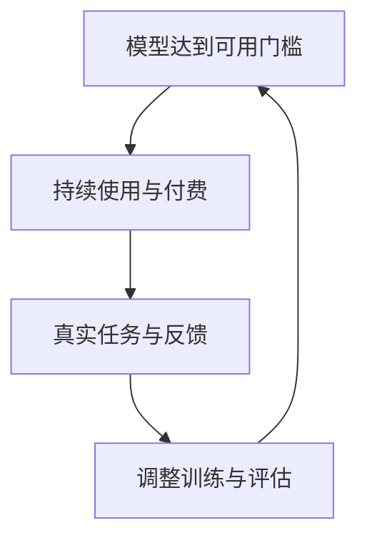

# 中美大模型的差距

## 不能只用一个排名回答的问题

王铁震 · Hugging Face 前亚太区生态负责人  
泰显知活 · 2026-05

---
layout: default
---

# 这场讨论在比较什么

<strong>前沿体验</strong> 复杂任务中，谁能稳定交付可用结果。

<strong>工程成本</strong> 缓存、推理、芯片适配如何改变部署成本。

<strong>训练条件</strong> 算力、融资与收入怎样限制迭代规模。

<strong>开源扩散</strong> 中国模型在海外研究与开发中的位置。

<strong>数据循环</strong> 真实任务怎样成为新的评估与改进信号。

<strong>能力之后</strong> 模型安全、工作强度与教育该如何面对。

---
layout: two-cols-header
---

# 差距的答案取决于比较对象

::left::

王铁震以自己使用 Claude、Codex 等产品的体验判断：美国前沿模型在复杂、多步骤、需调用工具的任务上仍明显领先。

但他没有把这当成唯一标尺。若问题改成国产模型能否帮普通用户完成工作、能否让用户付费，中国模型正跨过可用门槛。

主持人的标准更高：模型若无法独立完成自己不会做的工作，即使榜单靠前，也不算可用。

::right::

<strong>前沿使用体验</strong>
复杂任务、上下文与工具协作能否稳定完成。

<strong>实际可用门槛</strong>
是否已能解决部分工作问题，并获得持续付费。

同一模型在两种尺度下，可能得到不同结论。

---
layout: default
---

# 嘉宾看到的前沿体验差距

<strong>训练资源</strong> 美国拥有更充足的算力，模型更新节奏更快。

<strong>模型规模</strong> 王铁震认为，双方顶级模型的规模仍不在同一量级。

<strong>探索可见性</strong> 中国开源方案可被外部学习，闭源实验细节通常不可见。

<strong>使用数据</strong> 闭源产品更容易从持续使用中看到任务与反馈。

这些是嘉宾解释主观使用差距的四类条件，不是对模型能力的统一排名。

---
layout: two-cols-header
---

# DeepSeek V4 的成本改进来自缓存工程

::left::

王铁震把 KV cache 解释为模型已计算过的上下文结果：后续请求能复用这些结果，只计算新增部分。

他认为，DeepSeek V4 的一个重点是缩小 KV cache，使更多缓存能在 SSD 中保存得更久。缓存命中提高时，推理的预填充计算更少，成本和等待时间都会下降。

这不是用户界面里的长期记忆；用户通常只会在账单或响应速度上感到差别。

::right::

01
<strong>复用已算结果</strong>
后续对话只补算新增内容。

02
<strong>缓存放入 SSD</strong>
保存更多较早的上下文结果。

03
<strong>提高命中率</strong>
减少预填充计算与推理开销。

节目将这一工程改进视为降低推理成本的关键来源之一。

---
layout: two-cols-header
---

# 国产卡适配是一套系统工程

::left::

模型在训练卡上得到的数值结果，换到另一类硬件后不能出现大幅偏差；否则同一输入可能得到不可靠的输出。嘉宾以此解释，芯片适配不是单纯增加人手就能完成的工作。

他提到，DeepSeek 的投入不止于展示模型可以在国产卡上运行，而是把相关硬件用于实际部署。不同企业也在做适配，只是程度和规模不同。

::right::

<strong>运行时与算子</strong>
不同计算模式需要重新实现和优化。

<strong>框架与工具链</strong>
硬件、框架和应用层都要协同。

<strong>模型训练与量化</strong>
模型本身也可能需针对目标硬件调整。

目标是让不同硬件上的结果足够接近训练时的预期。

---
layout: default
---

# 训练天花板不只由芯片出口决定

王铁震认为，即便能购买更先进的芯片，中国公司仍未必能获得与美国实验室相当的卡量。训练预算还取决于公司估值、融资能力和收入规模。

<strong>资本规模</strong>
估值与融资决定能承受多少前期投入。

<strong>算力采购</strong>
卡的可得性之外，还要有持续购买能力。

<strong>迭代节奏</strong>
资源不足会压缩训练规模和更新频率。

训练是一次性投入；推理支出则会随实际调用量持续增长。

---
layout: two-cols-header
---

# 真实任务会改变模型的评估方向

::left::

节目讨论了排行榜与实际使用的落差。王铁震认为，研究团队缺少工业任务和用户反馈时，更容易围绕既有测试集优化；问题不在评估本身，而在题目是否贴近真实工作。

主持人举出地图调用、视频剪辑和量化策略等例子：这类任务要在长上下文中拆解步骤、调用多种工具，并把可检查的结果交付出来。任何关键步骤失败，任务就无法使用。

::right::

<strong>任务来自现场</strong>
企业和用户说明真正要解决的问题。

<strong>过程能协作</strong>
长上下文、多步骤与工具调用不能中断。

<strong>结果可验收</strong>
输出必须能直接使用，而非只在榜单得分。

节目将企业合作视为获得新评估题目的渠道。

---
layout: two-cols-header
---

# 可用门槛之后，才可能形成数据循环

::left::

王铁震的推演是：模型先达到足以让用户持续使用和付费的水平，才会得到更多真实任务与反馈；这些信号又能帮助后续训练和评估。

他也指出开源部署的边界：模型运行在用户自己的环境中，提供方不能天然获得使用数据。订阅产品与本地部署所能形成的数据闭环不同。

这解释了他为何把国内的可用门槛看得很重，却没有把未来的增长当成既成事实。

::right::

这是嘉宾的条件性推演；开源本地部署不会自动产生可用的数据反馈。

---
layout: default
---

# Hugging Face 的下载数据如何解读

<strong>节目所引数据</strong>
过去一年，中国模型下载份额为 41%，美国模型为 36.5%。

<strong>统计边界</strong>
王铁震说，Hugging Face 在中国大陆无法访问，国内下载不在这组数据中。

这组比例反映平台可见范围内的下载，不等于中国境内或全球全部使用量。

王铁震据此强调，中国开源模型的海外下载已经很重要；但他同时认为，缺少中国大陆数据会低估中国模型的总下载量。

---
layout: default
---

# 海外采用从试用走向开源默认选项

01
<strong>个人开发者试用</strong>
小团队先看性能、成本和可控性。

02
<strong>研究者微调</strong>
千问等模型因尺寸选择多、资料丰富而成为底座。

03
<strong>企业选择开源</strong>
部分讨论不再先问模型来自哪里，而是看能否部署。

这是王铁震基于开发者讨论和生态接触的观察，不是市场份额统计。

---
layout: two-cols-header
---

# 开源生态也需要可持续的收入

::left::

王铁震预计，开源竞争在 2026 年可能从大规模发布转向更重视商业可持续性。开源可以帮助模型公司扩散技术、建立品牌和吸引研究人员，但无法替代现金流。

他用 Stability 的经历提醒：公司若太晚考虑收入，可能连持续开源的能力也会失去。对他而言，能赚钱的开源公司，才有条件长期开放模型。

::right::

<strong>技术扩散</strong>
模型、工具与经验能被更多人试用和改造。

<strong>人才与品牌</strong>
公开成果也是研究人员和社区可见的记录。

<strong>商业收入</strong>
收入让持续投入和继续开源成为可能。

节目把开源视为产品进入市场和建立生态的一种方式。

---
layout: default
---

# 前沿探索的空间仍受资源和时间影响

<strong>高风险试错</strong> 王铁震认为，资源紧张时，公司更难长期探索未必成功的方向。

<strong>后发路径</strong> 他把中国在多个产业中的追赶经验看作一种现实选择，而非失败。

<strong>架构创新</strong> 他认为 DeepSeek 已显示出独立探索基础模型架构的能力。

因此，嘉宾没有把中国短期内难以承担大规模自由探索，直接推导成长期无法产生前沿创新。

---
layout: two-cols-header
---

# 能力扩散后，效用之外还有社会影响

::left::

王铁震把模型安全理解得比内容管控更广：模型进入生活后，是否会改变人的行为、工作压力和关系，同样需要讨论。

节目提到推荐系统造成的沉迷、AI 陪伴对青少年心理的影响，以及使用编程工具后可能不断延长工作时间。它们不是已经得到解决的问题。

两位嘉宾认为，公共讨论和社会反馈会影响监管重点；他们也比较了中国较多由政府规范、美国较多由产业与学界推动立法的不同路径。

::right::

<strong>注意力与行为</strong>
提高参与度是否也会强化成瘾和压力。

<strong>青少年陪伴</strong>
情绪互动的心理影响需要持续观察。

<strong>生产率边界</strong>
更快产出是否会变成更长的工作时间。

节目没有给出监管结论，只把这些后果列为能力增长后的议题。

---
layout: two-cols-header
---

# 下一批用户未必把自己当作程序员

::left::

王铁震认为，AI 的下一类广泛用途可能是为办公室人员制作演示文稿、设计和文档。主持人补充，非技术用户在意的是最终交付物，不会关心中间生成的是 HTML 还是其他代码。

两人因此质疑把产品明确叫作代码工具的做法：界面标签可能让非程序员误以为它与自己无关，即使它本质上也是对话和自动化流程。

Hugging Face 的 Spaces 则被介绍为另一种入口：不必下载大型模型，用户可直接试用研究论文对应的演示。

::right::

01
<strong>说清任务</strong>
用自然语言描述文档、设计或演示需求。

02
<strong>系统完成过程</strong>
模型调用代码和工具，但不要求用户理解细节。

03
<strong>验收成品</strong>
用户判断交付物是否能直接使用。

这个路径概括了节目中的产品设想，不代表现有产品已普遍做到。

---
layout: end
---

# 面对变化，保持尝试的能力

节目末尾把话题从模型带到孩子成长。两位嘉宾都承认，AI 可能改变工作和教育中的评价标准，因此没有给出一套固定的培养方案。

王铁震更看重孩子的情绪稳定、身体健康，以及愿意接触和尝试新事物的主动性。这个判断与本期关于模型的讨论相呼应：能力的价值最终仍要回到人如何使用它。
