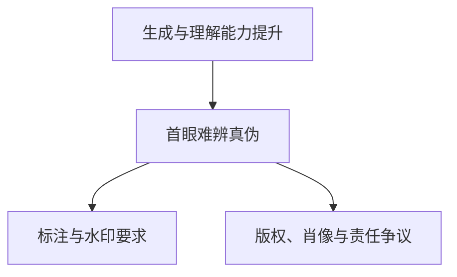
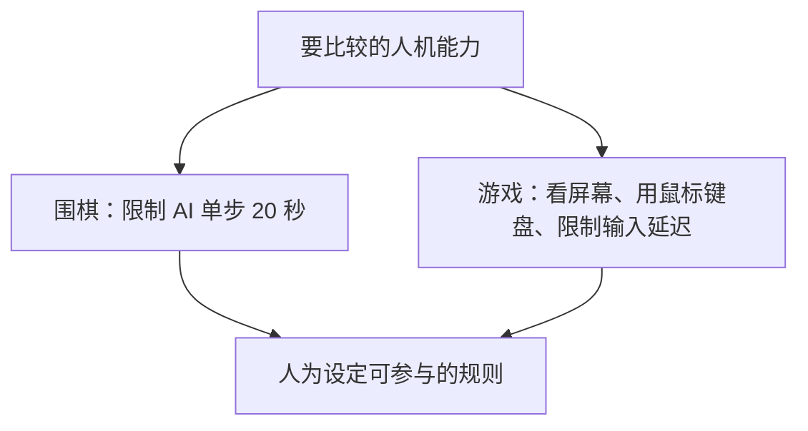

# “悲观者正确，乐观者成功”， 和好友亚婷聊聊 AI 行业的种种

《人类和AI》第 201 个故事

庄明浩 · 《屠龙之术》主理人、VC 从业者

从投资的试错节奏，到生成式 AI 越过能力门槛之后的工作、创作与公平

---
layout: default
---

# 这场对谈从投资，一直谈到人的位置

<strong>投资节奏变快</strong>

判断用户需求和团队的原则还在，做出一次尝试所需的时间与成本已缩短。

<strong>知识工作被拆开重做</strong>

收集、整理和统筹已大量交给 AI；最终表达仍取决于任务要求与个人选择。

<strong>应用公司的位置更不稳</strong>

垂直数据、工作流和合规能形成阶段性防线，但模型公司也会进入已经被验证的市场。

<strong>竞争转向公平与自处</strong>

模型能力、对齐标准和就业影响都还没有稳定答案，人只能在变化中设定边界。

---
layout: two-cols-header
---

# “屠龙之术”来自几次行业换挡

::left::

庄明浩在经纬有两段工作经历：第一段看中国移动互联网，后来因内容产业和游戏直播创业离开；2019 年回归后，元宇宙又迅速成为一级市场的热点。

他用“屠龙之术”形容旧方法的处境：曾经有用的增长、运营与早期 VC 经验，未必仍是市场最关心的能力。2024 年，他把这个词用作播客名称，为这些经验另找一个表达的场所。

::right::

01
<strong>2011—2015</strong>
经纬：移动互联网、内容与平台公司。

02
<strong>直播创业</strong>
做了三年多游戏直播，创业未成。

03
<strong>2019 回归</strong>
在经纬重新寻找战场，遇上元宇宙热潮。

04
<strong>2024 做播客</strong>
《屠龙之术》开始讨论旧经验与新技术。

时间点来自嘉宾回顾；“屠龙之术”是他对知识折旧的自嘲。

---
layout: default
---

# VC 的原则没有变，试错周期变了

<strong>相对稳定的判断</strong>
用户是否有需求、团队是否匹配、运营能否跟上，仍是他列出的底层问题。

<strong>被压缩的试错</strong>
AI 时代可用更低成本做更多轮尝试；过去一笔钱覆盖一个阶段，现在可能覆盖多个阶段。

嘉宾把前者称为战略层，后者称为战术层；这是他的投资观察，并非一条通用公式。

<blockquote class="mt-4 p-3 text-sm leading-relaxed border-l-4 border-blue-500 bg-blue-50 bg-opacity-30">
庄明浩：VC投資不是一個賭正確性的問題，它是一個賭概率的事情。
</blockquote>

他因此能理解在热潮中快速下注的逻辑，却也承认自己无法接受那种节奏。元宇宙一轮投资后来表现不佳，并没有让概率游戏的逻辑自动消失。

---
layout: two-cols-header
---

# 知识工作被拆成四段，AI 已进入前三段

::left::

庄明浩把日常的信息工作比作做菜：先找原料，再处理原料，然后安排多道菜和多个灶，最后才是实际下锅。

他认为 AI 已明显参与收集后的加工、文本与图表理解，也开始参与统筹。做演讲稿和 PPT 的最后一段，他仍多半亲自完成；在要求较低的场景，AI 也已经开始介入。

这里留下的手工部分，既有工具能力尚未完全满足的原因，也有他作为使用者的偏好；这条边界还会继续移动。

::right::

01
<strong>收集</strong>
浏览信息，带回可用材料。

02
<strong>加工整理</strong>
OCR、语义理解、图表说明。

03
<strong>统筹安排</strong>
决定材料、顺序与资源分配。

04
<strong>最终制作</strong>
把内容做成演讲稿和 PPT。

前 3 段的 AI 参与度更高；第 4 段的界线正在移动。

---
layout: two-cols-header
---

# 图像越像真的，难题越不像技术问题

::left::

嘉宾把图像生成与理解能力的跃迁视为一个转折：他以黄仁勋相关的 AI 合成图为例，认为普通人第一眼已经很难找出破绽。

这会改变审核的成本关系。节目没有把水印或标签说成解决方案，只把它们放在更广的治理问题中：版权、肖像、责任归属和平台规则都要重新处理。

他特别区分了技术可做与社会可接受。生成能力本身并不等于新的版权秩序已经形成。

::right::

节目把标注视为可能的治理手段；法律与社会规则仍在争论。

---
layout: two-cols-header
---

# 应用公司拿到收入后，护城河仍要接受检验

::left::

庄明浩观察到一种反复出现的市场节奏：某类 AI 应用证明需求、收入快速增长后，基础模型公司会更认真地进入这块市场。他用年化收入约 1 亿美元作为被关注的信号，而非因果定律。

他举了法律产品 Harvey、Legora 和编程产品 Cursor、Replit、Lovable：垂直产品已经在增长，Google 或前沿模型公司也会推出或加强对应能力。

数据、工作流、隐私与合规要求能带来阶段性保护；保护能持续多久、壁垒有多深，嘉宾的答案是未知。

::right::

01
<strong>需求被验证</strong>
某个任务在 AI 上显示出实际效果。

02
<strong>收入成为信号</strong>
快速增长会让市场和模型厂商更关注。

03
<strong>竞争上移</strong>
通用能力向该品类靠近，应用要重新说明差异。

这是嘉宾的市场归纳，不代表每家应用都会沿同一路径发展。

---
layout: default
---

# 三张主桌，是他对当下模型竞争的比喻

<strong>语言 → Agent</strong>
他把 OpenAI 放在这条主线上。

<strong>多模态</strong>
他认为 Google 的积累更深。

<strong>编程</strong>
Anthropic 让编程成为独立战场。

这是嘉宾对暂时格局的分类：若通用人工智能走向同一目标，三条战线可能重新合流。

他认为厂商无法同时把三条线都做到最好，资金、算力、人力和战略取舍会决定阶段性重点。

谈中美时，他把算力、数据与能源都视为竞争条件；也提到 DeepSeek 与华为的适配努力可能影响后续生态。

---
layout: default
---

# 企业不必等到标杆案例出现，才开始使用

<strong>ROI 还没有好答案</strong>

对“做出来什么、卖了多少”的追问已出现，但产出和宏观指标都常常滞后。

<strong>组织惯性会延后变化</strong>

大公司仍能运转，不等于 AI 没有影响；制度、协作和存量流程都需要时间改变。

<strong>在真实任务中练习</strong>

嘉宾主张从工作中的具体使用开始，靠反复操作形成判断，而不是留出一段时间“学 AI”。

<blockquote class="mt-4 p-3 text-sm leading-relaxed border-l-4 border-green-500 bg-green-50 bg-opacity-30">
庄明浩：先用起来再说嘛。
</blockquote>

---
layout: two-cols-header
---

# 对齐和评测，都没有一条现成的标准线

::left::

同一个问题交给 Kimi、豆包、DeepSeek、元宝、ChatGPT 或 Claude，嘉宾感到它们不仅措辞不同，情绪与人格感也不同。他把这种差异和后训练、指令以及价值取向联系起来。

因此，与人类对齐会遇到一个具体问题：要对齐的是谁的价值观？节目没有给出一条可画出来的界线。

他也保留了模型差距的分歧：有人认为差距在缩小，有人认为在扩大。现有 benchmark 仍在被使用，但他不认为分数能完整说明模型在真实场景中的好坏。

::right::

<strong>答案为何不同</strong>
模型的措辞、情绪与取向都会被使用者感知。

<strong>谁定义对齐</strong>
没有一个被节目认定为全体人类代表的标准。

<strong>分数说明什么</strong>
基准测试可比较一部分能力，但未覆盖全部体验与用途。

这些问题讨论模型评价体系，不能据此判断任一模型的全部能力。

---
layout: two-cols-header
---

# 人与 AI 竞赛时，公平是一组人为限制

::left::

庄明浩转述李世石与 AlphaGo 的后续经历：为了继续对弈，李世石曾要求 AI 每步在 20 秒内落子，自己则不受时间限制，还要求 AI 让子。规则只是在能力差距中保留了人类参与比较的条件。

他把同一问题带到游戏。节目提及可能的模型与 T1 对抗：若 AI 直接读取后台数据或以极低延迟操作，人类没有可比性；于是测试会要求它看屏幕、用鼠标键盘，并遵守接近人类的输入延迟。

::right::

这些条件模拟人类的操作方式，并不保证双方能力相等。

---
layout: end
---

# 技术跨过门槛后，人的问题仍留在现场

工作

他担心中间岗位的上升通道收窄，但也认为组织惯性会让变化拉长，并非瞬间到达终局。

协作

纯信息交换更容易被替代；眼神、身体状态、气味与现场氛围，是他认为会更稀缺的部分。

创作

他用音乐作极端设想：当作品供给充足，表达、被谁听见和得到何种回应仍会决定创作的意义。

节目没有承诺新的平衡何时出现；它留下的是人在变化已经发生时，怎样安排工作、关系与表达。

