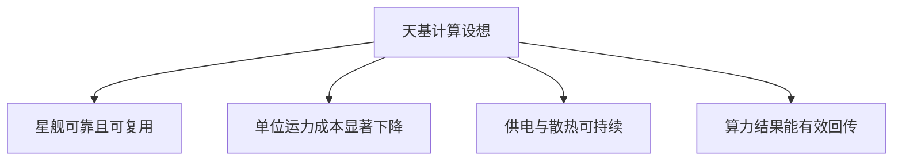
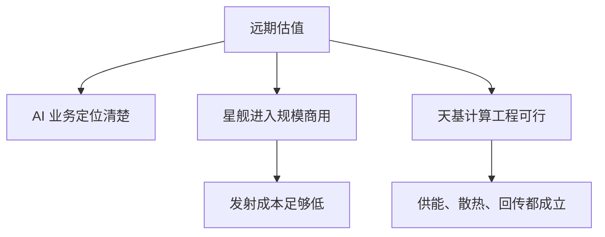

# 37. SpaceX IPO

## 一家火箭公司，如何同时被当作电信、AI 与资本市场事件来定价

台藓之火 Raymond × 听懂涨声 天南

2026 年 6 月 · 58 分钟串台讨论

---
layout: default
---

# 这期讨论的不是一个单一业务

<strong>业务底盘</strong> 火箭发射仍重投入；星链订阅被嘉宾视作收入与利润的核心。

<strong>xAI 合并</strong> 社交平台、模型和超算被装进同一家公司，融资逻辑随之改变。

<strong>估值方法</strong> 传统分部估值、增长溢价与马斯克个人溢价同时在起作用。

<strong>技术条件</strong> 星舰成本、AI 定位与天基数据中心的可行性彼此相连。

<strong>治理取舍</strong> 超级投票权让押注更集中，也缩小了小股东制衡空间。

<strong>市场影响</strong> 超大型 IPO 未必预示见顶，却会牵动指数、资金和同类资产。

---
layout: two-cols-header
---

# 先分清两块已成形的业务

::left::

<strong>太空发射</strong> 
节目转述其年收入约 40 多亿美元、占 22%。猎鹰 9 号承担高频商业发射；星舰仍在推进下一代运力。

<strong>连接业务</strong> 
星链把卫星网络与地面接收设备连成宽带服务。节目给出的收入约 114 亿美元、占 61%，并把订阅续费看作现金流基础。

这些金额和占比均为节目讨论时的转述，不是本笔记对公司财务的独立核验。

::right::

<strong>太空发射</strong>
约 40 多亿美元收入 约占 22%

<strong>星链连接</strong>
约 114 亿美元收入 约占 61%

一边继续投入火箭研发，一边依靠订阅制连接业务提供更稳定的收入。

---
layout: two-cols-header
---

# xAI 并入后，叙事与融资安排一起变了

::left::

Raymond 将 xAI 解释为一个打包体：X 社交平台提供语料场景，Grok 是模型，Colossus 是约 20 万张卡规模的超算中心。节目称，xAI 在 2026 年 2 月并入 SpaceX。

<strong>嘉宾给出的财务解释</strong> 
超算中心需要大量资金；把它和已盈利的星链、SpaceX 放在一起，可能降低集团层面的负债压力与融资成本。这是对合并逻辑的判断，不等于每项业务都已被证明成熟。

节目称 xAI 去年收入约 30 多亿美元，在合并后占比不到五分之一；它带来的主要增量是 AI 想象空间，而非当期收入规模。

::right::

01
<strong>X</strong>
社交平台与英文语料场景

02
<strong>xAI</strong>
Grok 模型加上 Colossus 超算

03
<strong>并入 SpaceX</strong>
节目称发生在 2026 年 2 月

节目把这次合并视为业务协同、融资安排和资本叙事的共同变化。

---
layout: default
---

# 分部估值能解释底盘，解释不了全部溢价

<strong>星链：增长溢价</strong> 
节目转述 Adam Jonas 的框架：星链约值 6000 亿美元；其市销率为 30 多倍，而 Verizon 等传统电信公司约为 7—8 倍。比较的是收入倍数，不是业务规模。

<strong>xAI：沿用并购锚点</strong> 
该框架把 xAI 记为约 2500 亿美元，理由是此前并入时使用过这个估值。嘉宾认为这是一种方便但偏负面的估法。

<strong>发射与远期期权</strong> 
星舰、天基计算和编程工具等远期项目难以按当期收入定价。Raymond 认为，市场还在为马斯克把项目做成的可能性付费。

传统做法会把业务分部相加后打折；节目观察到，当前市场反而可能给这组业务溢价。这个判断取决于未来增长能否兑现，并非估值已经得到验证。

---
layout: two-cols-header
---

# 天基数据中心是一组相互依赖的前提

::left::

节目认为，美国建设数据中心的突出约束是电力。设想中的太空方案依靠轨道上的太阳能，并试图减轻散热和地面供电压力。

<strong>运力是前置条件</strong> 
嘉宾转述的预期是：若星舰成功并实现复用，发射成本或可从约 1500—2000 美元/公斤降至约 200 美元/公斤。这个下降说的是单位运力成本。

星舰能否大规模商用、设备能否稳定供电散热、算力能否高效回传地球，节目都没有把它们当作已解决的问题。

::right::

节目将这些看作需要同时成立的工程条件，而不是已经实现的结果。

---
layout: two-cols-header
---

# 最大的不确定性，集中在 AI、星舰与工程可行性

::left::

<strong>AI 的身份与竞争位置</strong> 
嘉宾认为 xAI 已难称领先模型；它既有模型业务，也有超算和对外出租部分算力的角色，市场该按哪一种业务定价仍不清楚。

<strong>星舰从试验到规模化</strong> 
只有运力可靠、可复用且成本足够低，大量设备上天的经济性才有讨论基础。

<strong>条件叠加</strong> 
Raymond 的提醒是：多项成功概率相乘会快速压低整体把握，不能把每一步的乐观估计直接相加。

::right::

图中是节目梳理的依赖关系；任何一项尚未验证，都不能由另外几项替代。

---
layout: two-cols-header
---

# 超级投票权：把投资判断集中到马斯克身上

::left::

节目称，马斯克的经济利益约为 40%，投票权超过 80%，采用 AB 股结构。这让他处于绝对控制地位。

<strong>Raymond 的看法</strong> 
若投资理由本来就是相信马斯克，集中控制让判断更直接：投资人不必再为董事会和其他股东的取向逐一估算。

<strong>讨论保留的边界</strong> 
主持人与嘉宾都承认这取决于创始人。超级投票权可能减少小股东维权和外部监督的空间，不能被当作普遍适用的治理答案。

::right::

<strong>判断更集中</strong>
相信创始人能力的投资者，可把投资判断聚焦于他能否执行。

<strong>制衡更有限</strong>
小股东对管理层的影响与维权空间可能变小。

节目把执行确定性与治理制衡分开讨论，没有把任一安排视为普遍更优。

---
layout: two-cols-header
---

# 招股书让私人叙事进入可追责的公开流程

::left::

节目用 SpaceX 的招股书说明 IPO 的分水岭：私有阶段的传闻难以逐项核验；招股书经投行、审计和律师参与，披露内容具有法律后果。

节目称，公开披露后，公司要面对分析师和机构投资人路演；定价完成、挂牌交易之后，才开始接受持续的业绩检验。

上市是信息质量和责任边界的变化，不保证公司此后表现更好。嘉宾特别提到，上市后几个季度的财报才会不断修正市场判断。

::right::

01
<strong>筹备</strong>
聘请投行、审计与法律顾问，整理财务与文件。

02
<strong>招股书公开</strong>
公司信息进入公开且可追责的披露框架。

03
<strong>路演与定价</strong>
向机构投资人说明业务，收集购买意愿。

04
<strong>挂牌后披露</strong>
定期财报继续接受市场检验。

---
layout: default
---

# 超大型 IPO 不必然意味着市场见顶，但会重排资金

<strong>历史上没有简单因果</strong> 
嘉宾列举沙特阿美、阿里巴巴、工商银行等大型 IPO，认为大规模融资本身不能证明市场正处在顶部；上市后表现和当时宏观环境仍是另一回事。

<strong>流动性能否承接</strong> 
节目转述，美股日成交额约为 5000 亿至 1 万亿美元；即使单笔 750 亿美元很大，多个 IPO 若分时发生，资金未必无法承接。

<strong>指数带来的被动调仓</strong> 
嘉宾称，交易所曾为大型公司加快纳入指数；若万亿美元级公司进入指数前列，跟踪指数的基金需要决定买入、减持与再平衡。

<strong>真正的传导在上市之后</strong> 
若股价持续疲弱，压力可能传到商业航天和相关 AI 资产；若表现强劲，则可能抬高产业链与同类公司的风险偏好。

---
layout: end
---

# 上市后，哪些信号会改变判断

<strong>流动性与利率</strong> 
嘉宾把美联储政策、油价、通胀与就业数据放在首位：它们决定科技资产的资金成本和风险偏好。

<strong>AI 同行的业绩</strong> 
Anthropic、OpenAI 及半导体公司的收入和财报，会影响市场愿意给整个 AI 叙事多高的估值。

<strong>星链与发射进展</strong> 
星链的订阅增长提供当前基本面；星舰的成功、复用和成本下降决定远期项目能否继续获得信任。

<strong>季度披露而非单日热度</strong> 
节目认为，定价日只是市场投票的开始。随后几个季度的经营数据，才会逐步检验这套组合估值。

