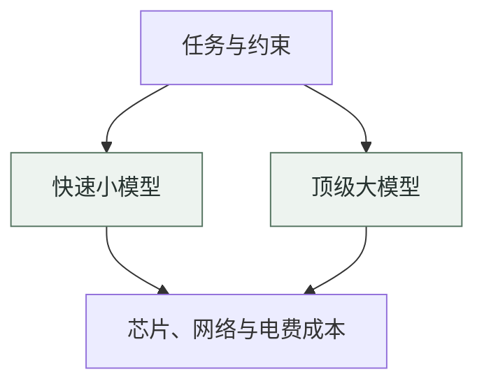
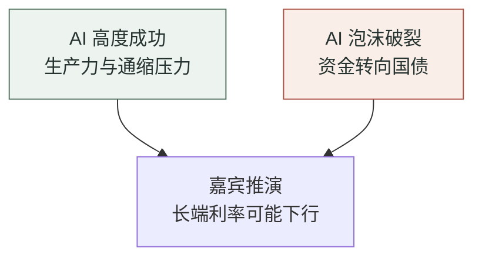

# 51. 闲聊8月

## AI 和机器人改变世界，这钱你出？

台前烟火 · 马克汤｜财搭子AI

从英伟达融资、模型价格战到人形机器人与长端利率

---
layout: default
---

# 为什么这期值得听

资本开支

英伟达财报稳住了情绪，但数据中心融资把真实需求推到讨论中心。

风险信号

循环交易、残值与信用利差，哪些指标能先于财报给出线索？

模型竞争

应用公司按任务、速度与成本路由，模型市场出现清晰的淘汰压力。

机器人

长期想象很大，短期仍要从一个用户愿意持续付费的场景开始。

办公 Agent

办公 AI 仍以辅助为主；数字员工会触及组织、预算与责任分配。

宏观约束

利率、财政与融资成本，决定长期叙事能否承受眼前的现金消耗。

---
layout: default
---

# 8 月的市场：价格反弹，情绪仍然脆弱

发生了什么

7 月大幅波动后，AI 与硬科技链的市场情绪在 8 月有所修复；英伟达财报也带来短暂提振。

投资人仍在担心什么

讨论仍集中在市场只是反弹，还是已经反转。增长速度能否维持，以及大额投入能否转成回报，继续受到审视。

这期对谈把市场的焦点归纳为同一个问题：AI 的需求是在自然扩张，还是被融资和叙事提前推到了前面？

---
layout: default
---

# 英伟达的两层融资叙事

数据中心资产化

主持人将一种融资方式概括为：让大型投资机构共同投入数据中心，再把现金流资产打包。这类似用长期收入支撑基础设施融资。

循环借贷的疑问

另一层争议在于，上游是否借由信用安排，提前拉动下游购买。嘉宾认为两种机制应当分开看，但都要回到终端需求核验。

需求仍在增长

融资加快建设

回款仍待验证

---
layout: two-cols-header
---

# 资本扩张必须穿透到链外需求

::left::

数据中心、芯片、云与模型可以在产业链内形成大量交易与投入。

嘉宾把检验点放在产业链外：有没有新的真实用户，持续为服务付费。

因此，token 用量和收入增长都不能单独充当终局答案。

::right::

01
<strong>融资与担保</strong>
支撑建设投入

02
<strong>数据中心</strong>
形成基础设施

03
<strong>算力供给</strong>
转为可用服务

04
<strong>链外真实用户付费</strong>
检验扩张是否有真实需求

供给扩张能否穿透到真实需求？

---
layout: default
---

# 芯片残值的风险，在于它是否同时失效

单点违约

一家客户失约时，仍有其他数据中心可能接手设备。访谈认为，这正是高流动性算力资产的乐观解释。

行业性收缩

若违约源于全行业需求降温，许多买家会同时减少采购。此时二手芯片的残值和流动性可能一起承压。

节目用房地产作类比：孤立的急售可以被市场吸收；一轮普遍的去杠杆，才会改变资产定价。

---
layout: two-cols-header
---

# A100 的价值，来自算力服务的分层

::left::

访谈没有接受新一代芯片推出后旧卡立刻无用的线性看法。

训练、高性能推理、低延迟服务和成本敏感任务，对同一代芯片的要求并不相同。

旧卡若能承担其中一层服务，就仍可能有租赁和转售需求；这并不等于它没有周期风险。

::right::

01
<strong>顶级训练与高难推理</strong>
追求性能与吞吐

02
<strong>延迟敏感推理</strong>
按服务速度分层定价

03
<strong>成本敏感任务</strong>
旧卡也可能继续被使用

一代算力可以服务不同任务；仍需观察周期风险。

---
layout: default
---

# Token 增长和经济回报，是两套指标

用量

更多请求、更多 token，说明模型被调用得更频繁。

价格

用量也可能来自更低价、免费或补贴的 token；它未必带来等比例收入。

结果

判断商业价值，还要看用户是否留下来，以及服务能否带来现金回收。

这一区分也解释了节目为何反复追问：产业链内部的采购和模型调用，能否转化为链外用户需求。

---
layout: default
---

# 在财报之外，嘉宾会盯哪些信号

经营现金流

关注业务是否带回现金，再结合资本开支判断自由现金流的压力。

存货与应收账款

它们有助于观察设备和收入是否积压；但披露频率低，通常滞后于市场变化。

信用违约掉期

嘉宾把英伟达、CoreWeave、Oracle 等主体的 CDS 变化列为风险偏好的敏感信号。

A100 的成交与价格

节目将它视为边缘算力资产的温度计：需求转弱时，可能比新卡更早出现变化。

---
layout: default
---

# AI 竞赛的国家叙事，也会改变融资解释

David Sacks 的表述

节目转述其观点：如果 AI 被视为国家级竞争，数据中心就不只是普通企业投资，也会被放进产业与安全的框架。

对投资者的含义

同一笔资本开支，会同时被解释为商业投入、基础设施建设和竞争性投入。不同解释对应不同的耐心与风险承担方式。

嘉宾没有把这套叙事当成估值保证；它只是说明，单靠短期财务口径很难解释所有参与者为何持续投入。

---
layout: default
---

# 人形机器人：长期愿景与当前产品要分开看

长期愿景

嘉宾想象，机器人若能承担更多劳动，生产能力和收入分配可能发生大幅变化。这是面向很长周期的判断。

当前现实

场景、能力、BOM 成本和终端需求都仍在形成。工厂里实际有效的方案，往往还是为单一任务调过的设备。

节目没有因为长期前景广阔，就略过今天能否交付、能否使用、能否被采购这些更具体的问题。

---
layout: default
---

# 洗碗机之问：家庭机器人先要解决谁的麻烦

一场由洗碗机引发的讨论

主持人以洗碗机为例：消费者会在意清洁效果、预处理、安装空间和使用频率。新设备的技术水平高，也不会自动进入家庭。

对家务机器人的提醒

人形外观容易把用户期待推到很高：人们会希望它理解偏好、处理例外，并在多个任务上可靠工作。

节目中的分歧集中在展示、曝光和试用之后，能否出现一个用户真正在乎的具体场景。

---
layout: two-cols-header
---

# 先把一个场景做透，再讨论泛化

::left::

分拣、搬运、单点操作等任务，有更清楚的效果、成本和失败标准。

人形机器人被期待处理更多例外；这会提高用户对可靠性的要求。

嘉宾提出的顺序是：先在高频场景交付价值，再把能力扩展到相邻任务。

::right::

01
<strong>特定任务先做稳定</strong>
从一个具体使用场景开始

02
<strong>效果可以被用户感知</strong>
检验交付的实际价值

03
<strong>再扩展到更多任务</strong>
由相邻场景支撑能力泛化

机器人从单点任务走向更多能力。

---
layout: default
---

# 看好机器人行业，还要问公司能否活到拐点

行业层面

嘉宾长期看好机器人，理由是制造能力、政策支持和应用需求都可能继续积累。

公司层面

单一公司还要经历交付、融资、供应链和商业化的检验。行业扩大，并不承诺每一家企业都能留下来。

节目借互联网泡沫后的网易作参照：资本储备可以帮助公司穿过竞争出清期，但并不是成功的充分条件。

---
layout: default
---

# 机器人的资本热，会走向筛选

供给很多

嘉宾估计，中国已有约千家机器人创业公司在推进产品与合作。

交付仍小

节目提到，多数公司的年交付仍是数百到数千台量级，离大规模普及还有距离。

资金决定时间

当融资变难，企业会被淘汰、合并或转向更垂直的产品。能否持续积累，成为重要差异。

---
layout: default
---

# 模型市场出现了斩杀线

竞争为何残酷

软件模型的替换成本很低。只要更便宜或更强的选择可用，用户就能快速迁移，原有产品很难靠一次购买锁住用户。

应用公司的选择

嘉宾所在团队会按评测、稳定性、价格和场景效果更换底层模型。模型编号越来越多，采购逻辑却越来越直接。

节目以 DeepSeek V4 为例描述一条竞争边界：能力明显更弱、价格又更高的模型，留在调用名单里的理由会很少。

---
layout: two-cols-header
---

# 应用公司把任务路由给不同模型

::left::

简单、高频任务更看重速度和价格；较小模型往往足够完成工作。

复杂、多步推理任务，才需要调度到能力更强、成本也更高的模型。

模型只是其中一层。芯片、网络、电费和部署方式共同决定总拥有成本。

::right::

应用公司关心的是任务效果与总拥有成本。

---
layout: default
---

# 大模型和小模型，各自占据一段任务带

顶级模型

适合要求高准确率、低幻觉或多步推理的任务。嘉宾认为，这一层能力仍会被企业保留给关键流程。

够用的模型

后端数据处理、单步工作流等场景，常常只要求模型别犯低级错误。此时成本和吞吐更关键。

任务达成率

单位成本

调用稳定性

---
layout: default
---

# 企业开始把 token 当成一项预算

用量限制出现

嘉宾观察到，一些企业为模型调用设置额度，尤其对昂贵的闭源模型更谨慎。员工不能只证明自己消耗得多。

预算需要对应产出

更高额度需要与工作结果相连：产品被更多同事使用、流程更快完成，或单位人力产出确实改善。

模型采购因此成为一项持续的运营选择：哪些任务值得用最贵的能力，哪些任务应交给更便宜的选项。

---
layout: default
---

# 蒸馏在访谈中被放回技术语境

从大到小

嘉宾先用常见的技术含义解释蒸馏：把大模型的一部分能力迁移到更小、部署更轻的模型，以降低使用成本。

争议从哪里来

当它涉及竞品输出、真实生产数据和竞争关系时，蒸馏又会带来法律、伦理和组织策略的争论。

节目没有把不同含义混为一谈：技术上的知识迁移、商业中的模仿和数据来源问题，分别需要讨论。

---
layout: two-cols-header
---

# 嘉宾把模型优化拆成三部分

::left::

架构优化改变模型如何计算，例如注意力机制、缓存和部署效率。

数据优化包含训练数据和合成数据；它决定模型能看见和学到什么。

蒸馏优化则试图将已获得的能力迁移到新的模型或更轻的形态。

::right::

01
<strong>架构优化</strong>
改变模型如何计算

02
<strong>数据优化</strong>
决定模型看见和学到什么

03
<strong>蒸馏优化</strong>
把能力迁移到更轻的模型

模型迭代的三个方向；蒸馏是其中一类方法。

---
layout: default
---

# 蒸馏争议背后，是组织能力之争

反对者担心

长期依赖模仿，可能让团队停留在追赶，而没有积累预训练和数据处理能力。

支持者强调

开源技术报告、架构思路与实际产品经验本来就在行业中相互学习。

嘉宾的判断

公司可以同时做架构、数据和后训练；关键在于能否把这些工作组织成持续的能力。

---
layout: default
---

# 最好的模型，仍有切换成本

性能差异还在

即使开源和低价模型迅速逼近，部分用户仍愿意为更好的响应、稳定性或熟悉的工作方式付费。

习惯也在发挥作用

嘉宾以自己继续使用 Codex 为例说明：边际改进有限时，熟悉的工具链和使用习惯仍会影响选择。

模型市场还受性能、价格、配额、组织政策和迁移成本共同影响，用户会持续重新权衡。

---
layout: default
---

# 中国办公 AI：广告密度背后的采用预期

节目里的机场观察

主持人从中国机场看到密集的办公 AI、云和数据库广告；在日内瓦，视野中更多是运动品牌。两地广告投放呈现不同的产品预期。

广告不是使用证明

投放意味着厂商相信下载、认知或使用时长会改善，却不能单独说明产品已形成长期留存或稳定收入。

节目转述 QuestMobile 的 7 月月活数据，用来说明办公 AI 已有一批产品在争夺用户；具体产品的后续留存仍需继续观察。

---
layout: two-cols-header
---

# 办公 AI 的下一步，会触及组织方式

::left::

辅助阶段，人负责交付，AI 帮助写作、整理或完成局部任务。

替代阶段，产品开始接管一段稳定流程，团队要重新界定谁审核、谁承担结果。

数字员工阶段，采购者面对的是岗位、组织设计和长期预算，而不只是软件订阅。

::right::

01
<strong>辅助 · 人完成工作</strong>
当前主要阶段

02
<strong>替代 · 部分流程</strong>
重新界定审核与结果责任

03
<strong>数字员工 · 承担角色</strong>
购买决策涉及组织和预算

这是阶段推演，不代表后两阶段已经普遍实现。

---
layout: default
---

# 数字员工为什么比工具更难卖

工具的购买逻辑

团队可以用活跃、留存、转化或节省的时间评估一项辅助工具；它通常不要求重写组织结构。

数字员工的购买逻辑

一旦产品承担职责，管理者要决定业务边界、人员配置、出错责任和预算来源。这类决策会慢得多。

节目认为，成熟案例可能需要先由少数公司试出来。较容易起步的场景，是主要与广告平台、数据和线上工作流打交道的营销工作。

---
layout: default
---

# Agent 网络把协作对象从人扩展到软件

个人助手

每个人先用自己的 Agent 处理资料、写作和局部事务。

组织内协作

不同团队的 Agent 可能代表不同岗位，在固定授权下交换任务与结果。

对外工作流

供应商与客户之间也可能出现 Agent 对 Agent 的沟通；支付和责任边界会随之变复杂。

节目把它视为一个发展方向，而不是已经完成的市场事实。决定产品价值的，仍是具体工作能否被可靠地完成。

---
layout: default
---

# 宏观利率会反过来约束 AI 叙事

高利率的直接影响

数据中心与大模型公司都需要持续投入。无论依赖股权还是债务，融资成本上升都会压缩回报率。

节目关注的背景

美债、日元、石油和财政操作共同影响长期利率。嘉宾认为，这些变量会影响市场愿意给成长型科技多少估值。

资本市场讨论 AI 泡沫，不能只看模型发布和芯片供给；同一笔扩张计划在不同利率环境下，会有不同的资金压力。

---
layout: two-cols-header
---

# 两种 AI 结局，指向一场利率推演

::left::

条件一：AI 高度成功，生产率上升并带来通缩压力。嘉宾据此推演，长端利率可能下行。

条件二：AI 泡沫破裂，风险资产受压，资金转向国债；嘉宾同样推演长端利率可能下行。

眼前的财政与通胀压力，则可能使短期利率仍维持高位。

::right::

财政与通胀压力，是访谈所说的短期反向力量。

---
layout: default
---

# 利率变化，落在融资成本和估值上

公司现金流

嘉宾提到，一些大型科技公司自由现金流承压，需要继续筹措资金完成投入。

资本回报

利率抬升时，项目的融资成本上升，ROI 与 ROIC 面临更高的门槛。

市场定价

投资人会重新衡量长期增长值多少钱；这也解释了科技股对长端利率格外敏感。

---
layout: default
---

# 核心金句（一）

围绕资本开支、算力供给与机器人落地的几句原话

“它也是镇定剂，它不是强心剂。”
— 英伟达财报后的市场情绪

“token的使用量的增加并不一定代表最后的经济效益是增加的。”
— 用量与回报不能混为一谈

“外面的链外的那个需求如果不出现真实的上升的话，这里面再怎么变都没有用。”
— 对产业链内部循环的检验

“A100是更边缘的资产，更边缘所以它会更敏感。”
— 嘉宾挑选的前置观察指标

“在特定的场景打穿了有明显的use case，那就泛化再说。”
— 机器人产品的落地顺序

---
layout: default
---

# 核心金句（二）

围绕模型竞争、办公 Agent 与宏观环境的几句原话

“大部分的模型其实没有存在的必要。”
— 模型市场的淘汰压力

“蒸馏在科技界其实之前不是一个负面的词。”
— 技术语义与商业争议

“AI就是輔助你嘛。”
— 当前办公 AI 的基本定位

“最後可能是Buddy跟悟空要聊。”
— 对 Agent 网络的想象

“市場在通過交易的方式在逼著美聯儲去加息。”
— 对长端利率压力的感受

---
layout: end
---

# 一个月之后，仍回到同一组问题

“大家都從山裡回來了。”

下一轮市场变化，要继续用需求、现金流、使用场景与融资成本一起检验。

