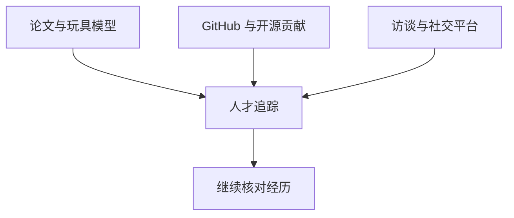

# 智力的价格

## AI 研究员凭什么比 NBA 球星贵？

高岱恒（Sam）· Dinq 创始人 
台险之火 · 2026 年 9 月 · 1 小时 21 分

---
layout: default
---

# 一场关于人才价格与找人方法的讨论

<strong>作品怎样替代履历</strong> 
高岱恒从土木专业转向算法，靠博客与开源贡献建立可见的能力记录。

<strong>高薪对应什么稀缺性</strong> 
讨论把薪酬放回训练资源、实际经验与代表作的共同约束中理解。

<strong>方向为何快速轮换</strong> 
多模态、后训练、数据与推理基础设施的需求，未必遵循旧的论文评价方式。

<strong>Dinq 怎样找人</strong> 
它把分散的人才资料接到自然语言搜索与智能体工作流中，也面对产品化边界。

---
layout: two-cols-header
---

# 公开作品先让陌生人看见能力

::left::

高岱恒在土木工程研究生阶段转向 AI 时，没有实验室资源和相关背景。他先在 CSDN 写博客，再给 PyTorch、TensorFlow 提交 PR；最初只是修正拼写，随后才逐步处理更难的问题。

他把这种路径称为公开地积累作品。代码被合并、文章被阅读，既留下可核验的记录，也让招聘方能较快判断一个人的主动性和技术能力。后来拿到 Meta、英伟达和达摩院的机会，他认为都与这些公开作品有关。

::right::

01
<strong>公开写作</strong>
用博客整理学习与实践。

02
<strong>开源贡献</strong>
从小修正开始参与项目。

03
<strong>能力可见</strong>
他人可据作品判断水平。

这是高岱恒回顾个人转行经历时给出的路径，不是通用招聘保证。

---
layout: two-cols-header
---

# 一次虚拟试衣项目，让他重新估计算法的价值

::left::

2023 年，高岱恒在团队中尝试人物动作与虚拟试衣。起初，团队把许多精力放在扩散模型的算法调整上；后来发现，干净、高分辨率、标注清楚的服装照片已经能明显改善结果。

同一时期，Copilot 已能完成不少简单脚本。对他来说，这两个观察指向同一个判断：当数据质量和工具能力成为主要变量，重复的工程实现不再是自己最稀缺的部分。因此他在 2024 年 4 月离开达摩院，转去研究人与人才信息。

::right::

<strong>原先投入</strong>
反复调整扩散模型与求解过程。

<strong>项目观察</strong>
数据变干净后，效果已经显著改善。

<strong>工具变化</strong>
简单脚本开始可由 Copilot 协助完成。

高岱恒只根据这个项目调整了自己的职业判断；它不能概括所有算法研究的价值。

---
layout: default
---

# 他把注意力放在做出关键工作的研究者身上

<strong>从技术作者开始</strong> 
高岱恒从 2019、2020 年前后开始写 StyleGAN、RAG 等技术背后的作者，希望把研究成果和具体的人连起来。

<strong>不把学历当作结论</strong> 
他关注一些不在传统精英路径上的研究者，认为完成了什么作品比毕业院校更能说明问题。

<strong>个人闪光与团队协作</strong> 
他也承认，ChatGPT 之后，许多前沿进展已从少数人的灵光一现转向大规模团队协作。

<strong>记录仍有意义</strong> 
论文、代码和成长经历能帮助后来者理解一项成果如何在具体环境中出现。

---
layout: two-cols-header
---

# 高薪不是按论文数量计价

::left::

节目把普通工程师的职业阶梯与少数前沿研究者分开讨论。高岱恒认为，后者被高价争夺，并不只因为有博士学位或会议论文，而在于是否参与过一项已经证明重要的工作，以及能否在昂贵训练中承担关键职责。

主持人列举过极高的总包传闻；高岱恒的估计是，达到上亿美元总包的研究者只是很小的群体。数字在节目中是市场观察，不是独立核实的薪酬榜单。

::right::

| 讨论维度 | 常规技术岗位 | 被争夺的前沿研究者 |
| --- | --- | --- |
| 判断线索 | 职级、工作年限、岗位职责 | 代表作、训练经验、当前方向 |
| 能力验证 | 可由团队分工覆盖 | 常与一次关键实验或发布直接相关 |
| 市场处境 | 有较明确的职业阶梯 | 供给少，且多家公司同时追踪 |
| 薪酬构成 | 现金、股票和期权 | 节目强调股票与期权的影响更大 |

表格整理自两位对人才市场的解释，不把任何薪酬数字当作已验证事实。

---
layout: two-cols-header
---

# 稀缺性来自受限资源里的可验证经验

::left::

高岱恒把大规模训练经验视为一种重要信号：训练基础设施、推理基础设施和机房运维并不是同一种工作；前者需要在真实的千卡、万卡级环境中处理并行、调度和精度对齐等问题。

这里的限制不只在人。一次训练需要算力、数据与时间，团队往往不能让多个候选方案同时在同等资源下试错。于是，做过这种工作的人会成为招聘方追踪的对象。

::right::

<strong>训练资源</strong>
算力、数据与训练时间都有限。

<strong>真实运行</strong>
大规模环境才会暴露调度与精度问题。

<strong>经验信号</strong>
代码贡献与项目记录可留下线索。

这是嘉宾解释人才价格的机制；它不表示所有大规模训练岗位都能获得相同回报。

---
layout: two-cols-header
---

# 方向变化，会改写旧有的评价标准

::left::

高岱恒认为，过去一两年里，多模态、视觉与视频的一部分工作已更受数据管线和算力约束；单靠算法拉开差距的空间变小。因此，过去用顶会一作数量衡量应届博士的办法正在失效。

主持人保留了一个反例：视频产品的用户需求看起来很强。这使讨论区分了产品是否有市场，与研究方向中算法人才是否更稀缺，这不是同一个问题。

::right::

<strong>嘉宾看法：多模态的算法溢价走低</strong> 门槛更多转向数据、算力与数据管线，算法侧的边际差异有限。

<strong>嘉宾看法：数据、后训练与基础设施需求走高</strong> 这些方向直接关系到怎样在有限计算资源下提高模型能力或吞吐。

<strong>保留条件</strong> 方向判断是节目嘉宾的市场观察，不等于对技术前景或产品需求的定论。

---
layout: two-cols-header
---

# OPD：用更强模型的输出，减少手工奖励设计

::left::

节目把 OPD 解释为 On-Policy Distillation。高岱恒的说法是，许多团队没有无限的 GPU 小时数；若完全依赖强化学习，就要为每类任务设置奖励信号与细致的评分标准，成本高且不一定很快带来结果。

另一条路是学习表现更强的模型输出：离好答案更近的结果被视为更好。高岱恒认为，除 OpenAI 与 Anthropic 外，这类需求在很多模型团队中都较普遍；它是技术潮流，不属于某一位单独的发明者。

::right::

01
<strong>资源有限</strong>
GPU 小时数限制试错次数。

02
<strong>手工奖励昂贵</strong>
每类任务都要设计评分标准。

03
<strong>学习强模型输出</strong>
用已有好答案提供训练方向。

图示复述节目中的机制解释，未评价该路线在所有任务上的效果。

---
layout: two-cols-header
---

# 技能切换，不只是多学一门技术

::left::

高岱恒用人才半衰期形容变化速度：一项曾经稀缺的技能，可能在较短时间内失去市场价格。他举对抗生成网络为例，也提到传统搜索推荐人才未必能直接转入大模型研发。

他认为，难点在思维方式。广告系统可以围绕点击率与收入做确定优化；模型能力的提升则常要面对多套基准、主观体验和人类偏好，单一指标可能诱导团队只刷分数。

::right::

<strong>确定型反馈</strong>
指标变化可较快对应收入或转化。

<strong>模型研发反馈</strong>
基准、用户体验与偏好并不总是一致。

嘉宾以此解释转型困难，也提醒基准排名不能替代真实使用体验。

---
layout: two-cols-header
---

# 论文变少，人才仍然会留下公开线索

::left::

两位认为，大语言模型的路线逐渐收敛后，公司对发表论文的限制更明显，核心工作更难从论文直接看见。但高岱恒不认为这会让人才搜寻彻底失效。

新人仍会在玩具模型、开源仓库、技术访谈和社交平台留下痕迹。招聘方可以据此从宽泛信号逐步确认方向；真正只能完全在水下辨认的人，在他看来并非整体中的多数。

::right::

公开信号用于缩小范围，不能单独证明一个人在保密项目中的职责。

---
layout: default
---

# Cursor 的招聘启发：先追踪少数人，再确认匹配

<strong>预先定义范围</strong> 
节目以 Cursor 为例：先判断某一领域最值得持续关注的 50 到 100 人，而不是等职位出现再筛简历。

<strong>长期而具体的接触</strong> 
对候选人的项目、兴趣与动态保持了解；高岱恒把这与传统海量投递、漏斗式筛选区分开。

<strong>用协作观察通才</strong> 
节目提到 work trial：面试和静态作品未必能判断一个人是否能迅速适应新问题，短期协作能补充信息。

这种做法的前提是团队愿意先做判断、再投入时间。主持人也指出，它需要资源和耐心，未必适合所有公司。

---
layout: two-cols-header
---

# 留人也有时间错配：归属期比技能变化更长

::left::

节目讨论 DeepSeek 时提到，原有股权激励的归属期是 10 年。高岱恒认为，在研究方向与岗位需求快速变化的环境里，这种期限会让一部分人担心：自己未必能在同一位置待到权益兑现。

他还提到另一种取舍。高度保密可以保护商业领先性，却可能减少技术人员公开写作、发布代码和交流观点的空间；而对一部分人来说，开源反馈本身也是工作动力。

::right::

<strong>长期归属</strong>
股权激励希望将人才留在组织内。

<strong>快速变化</strong>
研究方向与个人价值可能在数年内重排。

这是节目对激励设计的讨论，并非对某家公司制度成效的独立判断。

---
layout: two-cols-header
---

# Dinq 的问题：分散的人才库怎样变成一次搜索

::left::

高岱恒把 Dinq 描述为面向找人的路由层。传统搜人需要在多个招聘与职业平台之间切换，分别付费、检索、核对；Dinq 试图将这些渠道通过 API 接到同一套服务中，也能供 CrewAI、LangGraph 或 AutoGen 之类的智能体调用。

他的预期是，用户会越来越习惯直接描述需求，而不是逐个平台设置筛选条件。这样，找人服务的价值从打开多少网站，转向能否返回合适的候选范围。

::right::

<strong>多类资料源</strong>
职业平台、论文与公开项目留下不同格式的数据。

<strong>统一接口</strong>
将分散查询接入同一搜索服务。

<strong>自然语言需求</strong>
用户或智能体描述要找的人与条件。

图示按高岱恒对产品的描述整理，不表示数据覆盖或检索结果的保证。

---
layout: two-cols-header
---

# 从关键词匹配，转向理解工作之间的关联

::left::

高岱恒举的例子是：想找世界模型相关的人，候选人的公开资料未必写着世界模型，可能只写自己参与了某个视频生成项目。传统关键词搜索因此容易漏掉相关人。

他希望用智能体理解需求和经历之间的语义关系，再从候选资料中做更泛化的匹配。这一层并不替代人工判断；它先减少跨平台搜集信息的成本，再由招聘方确认人选是否合适。

::right::

01
<strong>描述需求</strong>
例如某类研究与工作经验。

02
<strong>连接相关线索</strong>
理解项目、论文和技能的关联。

03
<strong>人工确认</strong>
招聘方仍需核验职责与匹配度。

产品主张是更泛化地召回线索，不是自动作出录用决定。

---
layout: default
---

# 产品化与高端搜寻之间，仍有未解的取舍

<strong>产品化的理由</strong> 
高岱恒希望降低跨平台搜索的门槛。对不愿购买高价企业账号、又有临时需求的用户，按需使用比长期采购更轻。

<strong>主持人的追问</strong> 
若主要客户是少数大型公司、寻找的又是极少数顶尖人才，服务是否更接近高触达猎头，而非产品驱动增长？

<strong>高岱恒的回答</strong> 
除了顶尖研究者，人才盘点、海外销售和特殊设计人才也都有搜索需要；他认为用户习惯会决定产品能否成立。

<strong>留下的条件</strong> 
智能体是否会成为日常入口、搜索额度如何被感知，以及数据是否足够新，都会影响这种模式的边界。

---
layout: end
---

# 价格是结果，追踪能力才是过程

本期把极高薪酬解释为一组条件的叠加：有限训练资源中的实际经验、能被外界识别的作品，以及某个方向恰好进入需求上升期。它也保留了不确定性：方向会变，公开信号会减少，薪酬和组织设计都未必跟得上技能更新的速度。

Dinq 想解决的正是这个过程中的信息问题：当职位、论文标题和真实能力不再一一对应时，如何从分散线索中找到值得进一步了解的人。

