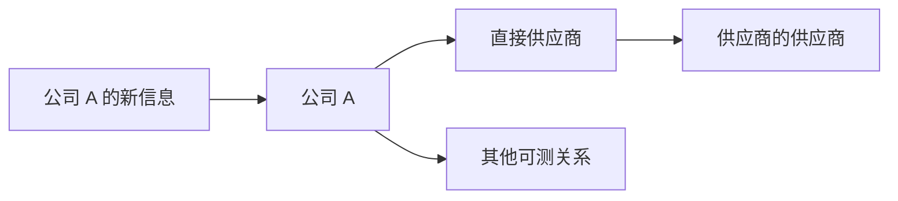

# Stacie Mintz： 把质性基本面转成量化因子

Flirting with Models · S7E33

PGIM Quantitative Solutions 量化股票主管谈：风险模型、基本面因子与 LLM 研究

---
layout: default
---

# 从策略结构到文本信号

<strong>模型为何要自建</strong>
风险模型会改变组合，而不只是约束组合。

<strong>何为基本面量化</strong>
每个因子要有经济逻辑，并适合特定公司。

<strong>怎样面对冲击</strong>
多数时候坚持模型，少数情形由团队介入。

<strong>LLM 放在何处</strong>
用它抽取文本信息，也要防范泄漏与幻觉。

本期从 PGIM 的研究实践出发，讨论量化模型如何保留可解释的基本面判断。

---
layout: two-cols-header
---

# 1996 年的起点：把行为偏差变成可研究的问题

::left::

PGIM 当时为一位多资产客户管理指数基金。客户认为主动经理的表现不够稳定，希望团队尝试指数之外的股票策略。

- 市场已熟悉低市盈率、高动量等异常现象。
- 团队把投资者过度自信、损失厌恶、锚定买入价等行为偏差，作为解释异常的线索。
- 关键不只是发现异常，而是判断它是否持续、在哪些股票上更有用。

策略于 1996 年上线；1999 年，团队发表有关行为偏差、估值与主动管理的论文。

::right::

01
<strong>客户难题</strong>
寻找比指数更主动的做法。

02
<strong>行为研究</strong>
辨认偏差在哪些股票中更明显。

03
<strong>系统化策略</strong>
把可持续的异常转成研究框架。

---
layout: two-cols-header
---

# 自建风险模型，是为了不让风险约束抵消研究结论

::left::

Mintz 说，组合由 alpha 模型与风险模型共同决定。团队早期同时看重成长与价值，却发现外部风险模型把价值暴露识别为风险，持续将其削弱，组合因而失去原本的平衡。

1999 年转向自建模型后，团队可以：

- 按自己的定义衡量并分散风险；
- 随数据和研究演进调整模型；
- 将客户的偏好或额外信息纳入风险管理。

::right::

01
<strong>研究信号</strong>
成长与价值本应在组合中平衡。

02
<strong>外部约束</strong>
把价值一侧视为风险并压低。

03
<strong>自建模型</strong>
按团队的风险判断配置与分散。

风险模型并非组合构建后的附属环节；它会决定哪些 alpha 观点能够保留。

---
layout: default
---

# 2007 年量化震荡暴露了拥挤风险

Mintz 将 2007 年 8 月的事件描述为从一处平仓蔓延的去杠杆。PGIM 的不同风险模型没有隔绝冲击，但使其配置与许多同业不完全相同。

<strong>拥挤的来源</strong> 若许多机构使用相近的历史风险判断，可能被引导到同一只看似较低风险的股票。

<strong>模型的取向</strong> PGIM 当时更强调分散特质风险，而非断言哪只股票未来一定较安全。

---
layout: default
---

# 金融危机后，研究标准加入了差异化与可实施性

<strong>问题</strong>
智能贝塔 ETF 能以较低成本提供简单因子暴露。

<strong>研究方向</strong>
从简单的估值或价格信号，扩展到质量、替代数据与公司基本面。

<strong>筛选标准</strong>
候选想法要符合投资理念，也要有差异、规模化条件与落地可行性。

团队每年 12 月举办内部研究提案会：研究员提出三四个想法，资深与初级研究员、投资组合经理共同质询。它决定研究议程，而不是自动把表现最好的回测结果投入模型。

---
layout: default
---

# 基本面量化：因子必须说得清为何有效

<strong>目标公司的样子</strong>
有成长前景、质量较高，且价格合理；模型试图系统化地复现传统选股者会做的判断。

<strong>接受一个新因子的条件</strong>
除了统计表现，还要理解其经济逻辑、适用的市场环境，以及它与现有因子的互补关系。

模型的位置有限。一个缺乏解释、只是历史回测好看的信号，会挤占已有因子的权重，也难以判断它在未来压力期会怎样表现。

---
layout: two-cols-header
---

# 融资因子：同样增长，资金来源也有区别

::left::

金融危机后，团队把公司如何为增长融资纳入质量研究。

- 对一组增长公司，依靠经营现金流推进项目者，在其研究中往往优于反复向市场募资者。
- Mintz 的解释是：外部资金充裕时，企业可能继续投资边际回报较低的项目；受内部现金流约束时，取舍会更严格。
- 这个概念先以较简单的方法实现，之后随新增信息和技术继续演化。

该因子把融资方式视为一项与增长质量相关的候选信号，不对单一公司的融资行为作道德判断。

::right::

01
<strong>增长需求</strong>
同一行业的公司都在投入扩张。

02
<strong>资金约束</strong>
内部现金流会迫使项目排序。

03
<strong>质量线索</strong>
观察融资方式与后续表现的关系。

---
layout: two-cols-header
---

# 因子按公司所处阶段调整权重

::left::

PGIM 将因子归为成长、联结、质量与估值四组。分类便于沟通与业绩归因；实际模型中的相互作用更复杂。

同一套因子不会等权用于每家公司：

- 增长快、处于较早阶段的公司，更看重未来增长；
- 成熟、稳定的公司，更看重估值与买入价格；
- 质量在两端都重要。

这是一套每日、逐公司运行的系统化权重调整，不是投资经理的临时判断。

::right::

<strong>高增长、较早阶段</strong>
成长因子权重更高；估值不是主要判断。

<strong>成熟、较稳定阶段</strong>
估值因子权重更高；重视折价与收入流。

<strong>汇总为组合</strong>
成长与价值的平衡，来自不同类型的股票。

---
layout: default
---

# 联结因子：从公司之间的信息流寻找线索

行业联动是最直观的例子。PGIM 还尝试识别跨行业、跨国家的客户—供应商等关系，并衡量关系强度，以判断信息冲击可能传到哪里。

联结因子不是直接重复公司的成长指标：它从其他公司与其关系中，补充观察增长前景与冲击传导。

---
layout: default
---

# 不直接使用价格动量，改看事件附近的信息动量

<strong>价格动量</strong>
价格变化里混有公司事件、行业冲击与投机噪声，未必都能归因于企业本身。

<strong>信息动量</strong>
围绕公司特定事件观察价格反应，试图保留信息部分、排除较无关的波动。

Mintz 说，团队的研究认为信息动量长期效果不弱于价格动量，但下行风险约为后者的一半。这是其因子设计同时考察风险与收益的例子。

---
layout: default
---

# 数据越来越常见，难处转到加工与使用

<strong>数据本身</strong>
Mintz 认为独家数据过去更重要；如今数据较容易取得，但大规模获取仍有成本。

<strong>加工选择</strong>
需判断相关性、变换和标准化方式、时间窗口、时间加权，以及如何处理缺失值。

<strong>使用位置</strong>
还要决定因子在何种公司上更有效，而非把同一权重套到整个股票池。

PGIM 的模型按地区约有 25 到 40 个概念，每个概念可能包含多个组成部分。团队宁愿让每项都有明确作用，也不希望堆叠数百个难以归因的信号。

---
layout: two-cols-header
---

# 市场冲击来临时：少改模型，也不能放弃判断

::left::

Mintz 把新冠疫情、迷因股热潮与 AI 视为会改变市场状态的基本面冲击。冲击难以事先预测，目标是让模型从不同角度观察公司，在不同环境中保持韧性。

- 新冠期间，团队强调不应因短期失效就推翻投资理念；人工裁量应当有限。
- 俄罗斯入侵乌克兰时，模型因估值便宜而看好俄罗斯，投资组合管理团队则认为需要调整。
- 事后复盘有时不会改变模型，有时会带来下一轮更能抵御冲击的研究线索。

::right::

01
<strong>冲击发生</strong>
承认模型会有暂时不工作的时期。

02
<strong>原则与例外</strong>
一般坚持模型；特殊地缘情势由团队讨论介入。

03
<strong>复盘研究</strong>
找出可纳入下一版模型的教训。

---
layout: default
---

# 回测不是通行证：先理解它在哪些时候会失灵

<strong>过于平滑的回测</strong>
Mintz 对每年都表现良好的历史结果保持警惕：它可能隐藏了不合理的设定，而不是证明模型稳健。

<strong>有弱点的回测</strong>
若能解释弱点出现的原因，团队才能在未来相似的市场环境中知道模型的边界。

新因子与新数据的历史可能只有五至七年，不再总能覆盖过去希望看到的二十年周期。对此，团队要求更深入地理解理论基础，并可能先以较低权重使用，积累更多观察。

---
layout: two-cols-header
---

# LLM 是研究工具，先有概念再选工具

::left::

团队不从 LLM 出发寻找用途，而是先明确希望加入模型或组合的概念、数据集与问题，再比较适合的工具。

- 从更简单的办法起步，再逐步增加复杂度；
- 在研究阶段理解工具到底改变了什么；
- 新因子的评估方式，决定了工具是否能安全地进入其余模型。

这套次序是为了避免强大的模型把原有、已验证的研究过程破坏掉。

::right::

01
<strong>投资概念</strong>
明确想补充的基本面问题。

02
<strong>工具选择</strong>
从简单方法比较到更复杂模型。

03
<strong>研究验证</strong>
确认输出能否融入现有模型。

---
layout: two-cols-header
---

# 把董事会构成这类质性信息转成可比信号

::left::

公司文本数据的覆盖面很广：财报电话会记录、新闻等都能提供信息。难点不在于取得文字，而在于抽取真正相关的内容，并让不同公司、行业与地区的结果可以比较。

董事会是一个例子。团队不只看履历，还试图描绘董事在不同董事会之间的联结：有价值的董事可能同时服务于多个企业，由此形成信息流动的渠道。

其研究发现，对经营困难的公司，董事会联结较强者往往比同业更有韧性。这是观察到的关联，而非对单一公司的保证。

::right::

01
<strong>文本资料</strong>
取得企业与董事会相关信息。

02
<strong>联结提取</strong>
识别董事会之间的关系与强度。

03
<strong>可比评分</strong>
在投资股票池中转为可比较的分数。

---
layout: default
---

# LLM 输出要经得起时间、版本与重复提问的检验

<strong>控制测试数据</strong>
防范幻觉、前视偏差与记忆化；模型可能从线索猜出股票并倒推结果。

<strong>选择可外样本检验的模型</strong>
模型应采用较新的技术，也要留出其发布后的测试时段。

<strong>交叉比较回答</strong>
用多个模型回答相近问题，并测试同一模型对重复或微调提示的稳定性。

<strong>回到销售与盈利</strong>
最终检查抽取的洞见能否与公司的销售或盈利建立联系。

这些检查针对的是研究过程中的模型风险；它们不保证单一信号一定预测正确。

---
layout: end
---

# 可解释性贯穿模型的每一层

从风险模型、融资方式和公司联结，到 LLM 抽取的文本特征，Mintz 的标准一致：信号要有基本面解释，知道它适用于哪里、可能在哪些环境下承压，并能放回整个组合中检验。

本期嘉宾：Stacie Mintz · PGIM Quantitative Solutions

