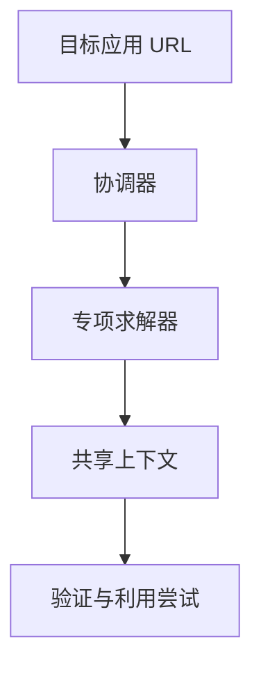

# Snake Oilers：watchTowr、XBOW 与 CoreView

三家安全厂商，三处需要缩短的时间差

Risky Business · 2026 年 9 月 · 42 分钟

Ben Harris（watchTowr） · Fede Kirschbaum（XBOW） · Andrew McAllister（CoreView）

---
layout: default
---

# 三段访谈，分别处理不同的安全断点

<strong>watchTowr</strong> 
从新漏洞信号出发，确认外部暴露，并在正式补丁前部署现有边界控制。

<strong>XBOW</strong> 
面向自定义应用的运行时黑盒测试；重点放在验证能否形成利用，不止罗列问题。

<strong>CoreView</strong> 
汇总 Microsoft 365 租户的配置、权限与使用信息，关注配置漂移和遗留应用。

本期是付费赞助节目。以下内容整理嘉宾对产品能力、案例和适用场景的说明，不构成独立产品评测。

---
layout: two-cols-header
---

# 补丁之前，先把攻击路径收窄

::left::

Ben Harris 说，大型或受监管组织的补丁流程包含稳定性、可用性和变更控制，不能把紧急补丁当成一个按钮来按。watchTowr 因此把重点放在漏洞披露或早期信号出现后的数小时内：确认客户是否暴露，再把复现结果转成检测或拦截规则。

这层缓解不是补丁的替代品。它的作用是让团队能按自己的变更流程完成修复，同时降低首轮利用成功的机会。

::right::

01
<strong>出现信号</strong>
披露或早期攻击迹象

02
<strong>确认暴露</strong>
检查资产是否受影响

03
<strong>部署规则</strong>
转成 WAF、IDS 或 IPS 控制

04
<strong>完成修复</strong>
组织按流程测试并打补丁

嘉宾描述的流程：缓解用于争取补丁前的处置时间。

---
layout: two-cols-header
---

# 蜜罐的作用：看见设备被攻破后的动作

::left::

watchTowr 为了复现漏洞，需要取得同一产品的已修补与未修补版本并比较差异；这也意味着要绕过设备的限制。Harris 介绍，他们把名为 Stab 的内存驻留组件经由 hypervisor 注入虚拟设备，以获得 shell。

这项能力后来被用在蜜罐：设备看起来像真实的 VPN、邮件服务器等网络设备，团队却能收集利用前后的遥测和痕迹。Harris 用一个常见风险说明其价值：设备被攻破并留下后门后，即使管理员很快打上补丁，后门仍可能存在。

::right::

01
<strong>比对固件</strong>
识别已修补与未修补版本的差异

02
<strong>注入 Stab</strong>
取得设备内部的可观测性

03
<strong>部署蜜罐</strong>
伪装为可被攻击的真实设备

04
<strong>提取痕迹</strong>
观察 web shell、后门等利用产物

目的是把设备上的攻击行为转成可用于远程检测的线索。

---
layout: two-cols-header
---

# 规则部署要赶在首轮利用之前

::left::

Harris 说，watchTowr 不打算在客户环境里再引入一套新的 WAF，而是接入 Akamai、Cloudflare、Imperva 等既有企业级 WAF。这样做是为了避免在应急时增加新的稳定性和变更风险。

他把竞争点放在规则生成和下发的速度上：团队的目标是在漏洞被知晓后的 30 分钟内完成规则；若两天后才有同样的规则，对拦截最初一波利用的帮助已很有限。

::right::

<strong>既有 WAF</strong>
Akamai、Cloudflare、Imperva 等已在运行的控制面

<strong>快速规则</strong>
把漏洞复现结果转为可部署的拦截或检测条件

厂商选择复用客户已有的边界控制，而非在事故中再安装新产品。

---
layout: default
---

# LLM 降低利用门槛后，研究对象不再只是传统边界设备

<strong>此前的重点</strong> 
Harris 列举的高风险类别包括 VPN、远程访问方案、数据管理系统和邮件服务器：它们通常本就不适合直接暴露在互联网。

<strong>他观察到的变化</strong> 
LLM 让复现与开发利用所需的专业门槛下降，攻击者会尝试更多边缘资产，难度较高的目标也不再能被忽略。

watchTowr 的应对是把研究过程规模化：研究人员为内部 harness 提供方法与判断，再围绕客户实际使用的技术复现漏洞。Harris 将这描述为比等待厂商披露和补丁更靠前的一层防御。

---
layout: two-cols-header
---

# XBOW 的目标：从发现问题走到证明影响

::left::

XBOW 目前主要测试应用安全，尤其是企业自行开发、对外暴露的应用。Kirschbaum 以 SQL 注入举例：时间延迟只说明输入可能影响后端；还要继续判断它能否带来实际的数据读取、令牌提取或会话伪造。

::right::

01
<strong>发现异常</strong>
针对应用安全问题寻找可疑行为

02
<strong>放回上下文</strong>
判断问题在这套应用里能否发挥作用

03
<strong>验证利用</strong>
继续检查是否能读取数据、取得令牌或改变登录状态

Fede Kirschbaum 对产品目标的说明：结果应是经验证的利用路径，而不只是很长的问题清单。

---
layout: two-cols-header
---

# 运行时黑盒测试：协调器管理专项求解器

::left::

Kirschbaum 将 XBOW 分成身体和大脑：前者是能调用工具、解释输出的 harness；后者是混合模型。不同模型适合不同工作，有的更激进，有的更谨慎，有的擅长读源码却不擅长和线上站点互动。

产品的默认方式是运行时黑盒测试：提供 URL 后开始工作；凭据和源码可以提供，但不是必要前提。协调器把任务交给只专注一种问题的求解器，再把各自的输出放入共享上下文，供后续验证使用。

::right::

图中是一条简化关系；访谈中提到会有多个专注不同漏洞类型的求解器。

---
layout: default
---

# 自动化提高测试基线，人类仍负责范围与判断

<strong>机器的优势</strong> 
Kirschbaum 认为，模型可以熟读文档、持续尝试选项，并由专项求解器保持对某一类问题的专注。它们的价值不只在于扫描，也在于把多份结果合并后继续验证。

<strong>人的位置</strong> 
主持人认为，渗透测试更普及会让更多组织负担得起基础检查；人类测试人员仍要界定范围、处理偏离脚本的问题，并在模型认为无法继续时提供方向。

Kirschbaum 把产品的发展方向称为验证层：针对某个资产提出具体问题，给出是否存在漏洞的判断，并尽量拿出证明。这是他对渗透测试、漏洞扫描和黑盒应用测试边界逐渐靠近的看法。

---
layout: two-cols-header
---

# CoreView：把 Microsoft 365 租户状态集中起来

::left::

Andrew McAllister 介绍，CoreView 接入 Microsoft 365 租户后，会通过 Graph API、其他 API 与自有脚本收集服务使用的元数据，也读取工作负载的配置、设置和策略。

他的出发点是管理信息分散：这些信息分布在大约 30 个 Microsoft 365 管理控制台中。CoreView 把它们汇总到一个位置，让运营人员和安全团队看到同一份租户状态。

::right::

<strong>服务使用</strong>
收集租户内 Microsoft 365 服务的元数据

<strong>配置与策略</strong>
读取设置、策略与工作负载配置

<strong>集中视图</strong>
把分散的管理信息放入同一平台

这是 McAllister 对平台可见性层的描述。

---
layout: two-cols-header
---

# 备份设置，与备份数据是两回事

::left::

McAllister 把租户里的数据与配置分开讨论。数据备份不能回答谁改了条件访问、邮件转发、应用权限或其他关键设置；配置本身也需要有可恢复的基线。

CoreView 声称每天保存不可变的配置备份，并近乎实时地发现关键配置漂移。运营或安全团队可据此把设置恢复到已知健康的基线；这也是它对业务连续性和灾难恢复价值的定义。

::right::

01
<strong>保存基线</strong>
每日留存关键配置状态

02
<strong>发现变化</strong>
识别关键设置偏离基线

03
<strong>通知团队</strong>
把变化交给运营或安全人员

04
<strong>恢复设置</strong>
回到已知健康的状态

流程依据的是嘉宾对 CoreView 配置层备份和回滚能力的说明。

---
layout: two-cols-header
---

# 遗留的 Entra 应用，可能绕开管理员账号这道门

::left::

McAllister 特别提到连接到租户的第三方 Entra 应用。旧的自建应用可能使用较弱的权限模型，却保有读写权限；攻击者不一定要先攻破租户管理员账号，也可能从这类应用进入环境。

CoreView 的做法是盘点应用，为其建立治理生命周期，标示读写权限与没有更新的证书。它也提供可排程的修复动作，让团队把安全基线写成策略，在发现偏离时自动执行相应处置。

::right::

01
<strong>盘点应用</strong>
识别连接租户的第三方应用

02
<strong>检查信号</strong>
查看读写权限和证书状态

03
<strong>定义基线</strong>
将允许状态写成治理策略

04
<strong>处理偏离</strong>
以排程或自动方式运行修复

嘉宾主张以持续检查取代只在半年一次审计时才处理问题。

---
layout: default
---

# 配置漂移往往藏在日常操作里

<strong>邮件设置</strong> 
管理员临时启用不安全的取信协议，或为 Exchange Online 邮箱设置自动转发规则。

<strong>外部共享</strong> 
项目结束后，SharePoint 或 OneDrive 的外部共享仍然保留，权限模型会随时间失控。

<strong>身份验证</strong> 
用户或管理员没有默认启用多重身份验证，团队却未必能轻易查到这项风险。

这些是 McAllister 用来说明产品要收集的指标。平台的主张不只是报告风险，还包括将常用修复措施做成可自动化、可排程的策略。

---
layout: default
---

# 安全评估里出现过的三类失控状态

<strong>33 名全局管理员</strong> 
一处大型公共部门租户为了方便而赋予过多高权限。McAllister 说，Microsoft 建议一个租户只保留三到四名全局管理员。

<strong>带邮箱的高权限账号</strong> 
他见过重要租户把邮箱分配给全局管理员账号；高权限与钓鱼入口叠加，会扩大账号失守后的影响。

<strong>6 万至 7 万个 SharePoint 站点</strong> 
某大学项目留下的大量站点没有关闭；有的仍开着外部共享，有的已没有管理员，其中包含个人可识别信息。

这些未具名案例来自 McAllister 介绍的客户安全评估，用于说明他所说的 Microsoft 365 权限与配置累积风险。

---
layout: end
---

# 三家产品都在处理安全处置中的时间差

watchTowr 
把漏洞信号与正式修复之间的时间，用暴露确认和边界规则填起来。

XBOW 
把发现异常与确认影响之间的时间，交给协调器和专项求解器继续验证。

CoreView 
把配置发生变化与下一次人工审计之间的时间，缩短为持续可见和可回滚的状态。

作者概括：三段访谈的共同对象，是从风险出现到拿到证据、采取缓解或恢复动作之间的间隔。

