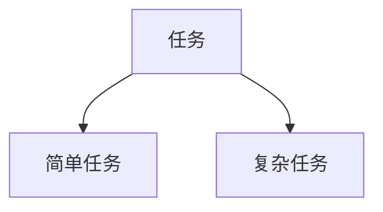

# Resonote Visual Notes — Editorial and Production Rules

Turn one podcast transcript into Chinese visual notes that a reader can understand without hearing the episode. Preserve the reasoning, evidence and limits of the discussion. These rules define content and production requirements; the task prompt defines the workflow.

For editorial structure, this file is the source of truth. Read CLAUDE.md only for compatible technical and shared-style guidance; its older page-count, diagram-ratio and fixed-structure prescriptions do not apply. Do not change repository instructions or tooling during episode generation.

## RULE 0 — Write in Chinese (中文)

**All slide content must be written in Chinese (中文)**, including:
- Slide titles, headings, and body text
- Topic card labels and descriptions
- Quote translations and context labels
- Diagram labels and annotations in shared HTML cards and Mermaid
- Summary and core_ideas in `meta.yml`
- Article HTML body content

The only exceptions where English is allowed:
- Guest names, company names, product names, technical terms that have no standard Chinese translation
- Original English quotes shown alongside Chinese translation (optional, not required)
- Code snippets, URLs, and filenames

When the transcript is in English, **translate the ideas into Chinese** rather than copying English text verbatim. Write naturally in Chinese, not as awkward translations of English phrasing.

## RULE 0.5 — Chinese prose quality and comparison sanity check

Before finalizing `slides.md`, `meta.yml`, or `article.html`, revise the Chinese so it reads naturally and suits the episode's subject, rather than resembling compressed English notes.

Mandatory checks:
- Make the actor, action, and reference clear in context. Chinese may omit a repeated subject and does not require an object in every sentence. Do not stack company names, product names, numbers, and conclusions into one slogan-like fragment.
- For comparisons, state the metric and compare like with like. A comparison must answer: what is faster/cheaper/larger, compared with what, on which metric?
- Never write malformed comparisons such as `AI 实验室比联合航空快一千倍`. If the transcript mentions United Airlines as a Natomi customer, write that as a deployment example, not as the object of an AI-lab speed comparison.
- Keep numbers only when the transcript supports the same metric. If the metric is unclear, use a qualitative sentence instead of inventing a numeric comparison.
- Company names and customer names are not automatic actors. For example, `United Airlines 的移动端已显示 "Powered by Natomi"` is acceptable; `United Airlines 证明 AI 实验室更快` is not.
- Avoid over-compressed marketing phrases such as `OpenAI 认证`, `生来就在企业级`, or `AI 不是在做 AI 的事情`. Rewrite them as complete claims with attribution.
- Use established Chinese names and translations where available; introduce the original name once if needed for identification. Otherwise retain the original spelling. Keep naming consistent across slides, metadata, and article; natural pronouns are fine when their reference is clear.
- No translationese or AI-flavored filler. Review the text for these patterns and rewrite or delete:
  - Nominalized verbs: write `分析日志` / `调整配置`, not `对日志进行分析` / `作出配置调整`.
  - Abstract business verbs used as filler: `赋能` `助力` `解锁潜力` `释放潜力` `注入活力` — state who did what and what resulted.
  - Mechanical frames: `通过……从而确保……`, `不仅是……更是……`, `不是……而是……`, `随着……不断……，……正日益……` — check the actual relation: causation needs evidence, contrast needs a meaningful distinction. Keep a natural, supported contrast even in paraphrase; remove invented opposing claims and repetitive rhetorical frames.
  - Editor-at-work narration: do not tell the reader how to read the article with headings or transitions such as `先把……说清楚`, `先别……`, `别急着……`, `先看……再谈……`. Name the actual subject, event, or finding instead.
  - Pseudo-revelation frames: avoid repeatedly announcing `真正的问题是……`, `关键不在……而在……`, `结论不是……`, or `不是起点，也不是终点`. State the concrete constraint or conclusion without staging a reveal or inventing an opposition.
  - Post-hoc disclaimers: avoid standalone corrections such as `这不应被读作……`, `节目要说明的不是……`, `这里讨论的是……`, `更准确地说……`, or `这是一个待检验的假设`. Put the speaker, time, estimate, condition, or uncertainty in the factual sentence itself.
  - Filler framing: `值得注意的是`, `在这个时间点`, `从本质上讲`, `对于……而言` — delete and state the fact directly.
  - Empty elevation and vague attribution: `标志着……新篇章`, `未来可期`, `专家认为`, `行业报告显示` — delete unless the guest said it (then RULE 1 grep applies).
  - Unidiomatic evaluatives: `一等的方案`, `上佳选择`, `颇具价值` — use an ordinary evaluation, or state the concrete evidence instead. (Fixed terms like `一等公民` stay as-is.)
  - Pseudo-analysis endings: `从而确保`, `进一步彰显`, `反映了……` — keep only a real causal chain; delete the commentary tail if there is none.
  - Relation avoidance: use `是` / `有` for simple relations, not `作为……`, `充当……`, `拥有……`.
  - Forced triads and fake ranges: don't arrange points into threes or same-length clauses for rhythm; `从 X 到 Y` only when X and Y share one scale.
  - Abstract editorial metaphors: don't say a question was `往前推`, a view was put `进同一张账`, a disagreement `落在` an abstraction, or facts were organized into a `链` merely to make the prose sound analytical. Use the specific action and consequence. Do not mix unrelated map, race, ledger, chain, foundation, or battlefield metaphors; retain a metaphor only when it comes from the transcript and improves understanding.
  - Decoration: no dash-driven suspense, no bold-label-then-colon on every list item, no emoji icons.
  - Over-hedging: keep one layer of uncertainty, not `可能潜在地或许会`.
  - Slogan endings: never close a slide or section with an empty uplifting line; end on a fact, a quote, or a concrete consequence.

Process each flagged sentence with a decision, not a reflex swap:
1. Fixed use (formal term, quote, genre-normal)? → keep as-is.
2. Is there a more common phrasing that keeps the same meaning, strength, and tone? → use it.
3. Does the transcript provide facts to replace the evaluation with? → write the concrete action, number, or result. No evidence, no concretization (RULE 3).
4. No safe rewrite? → narrow the claim to what the evidence supports, or delete.

These are review cues, not mechanical bans. Check context before rewriting; never change a term that has an operational definition or a grep-verified quote. However, repetition is itself a problem: if the same framing device appears in two headings or three body paragraphs, rewrite the repeated instances even when one use would be defensible.

Examples:
- Bad: `AI 实验室比联合航空快一千倍。`
- Good: `Natomi 已在 United Airlines 移动端落地；OpenAI 将它列为大规模部署生成式 AI 的案例。`
- Bad: `Puneet 生来就在企业级。`
- Good: `Puneet 的背景是华尔街自动化交易系统，因此他把 Natomi 设计成面向大型企业部署的产品。`
- Bad: `AI 不是在做 AI 的事情，而是在替代预算。`
- Good: `Natomi 的目标是替代企业原本投向客服、销售和营销流程的人力预算。`

## RULE 1 — Every quote must be grep-able

**Before writing a direct quote**, run `rg`/Grep to locate the exact original-language passage and read its context. For a translation, verify the original and check the translation preserves its meaning and strength. If the proposed wording is unsupported, either:
- use an attributed paraphrase only if another verified passage supports the same meaning, OR
- find a different quote that IS in the transcript, OR
- delete the sentence

**Never** write something like `"How hard can it be?"` unless you ran `grep "how hard can it be"` on the transcript and saw it.

Persist that verification in `episodes/<id>/quote-evidence.yml`. For every
quoted passage in `slides.md` or `article.html`, record the artifact name, an
exact substring copied from the artifact, and the exact transcript excerpt that
supports it. Translated quotes use the translated artifact excerpt plus the
original-language transcript excerpt. The orchestrator verifies both strings.

Treat verification as a state, not a feeling:
- A quote you remember or can reconstruct from memory is a **candidate** — it is not verified.
- A quote is **verified** only once the exact phrase appeared in the grep output for THIS episode's transcript.
- Never promote a candidate because it "sounds like something they would say". If grep fails, find source support before paraphrasing; otherwise drop the sentence. Removing quotation marks does not make an unsupported claim acceptable.

## RULE 2 — No cross-episode contamination

You are working on ONE episode only. Do not let your training knowledge of OTHER podcasts bleed in. Do not assume "this speaker probably said X in this interview" based on other interviews.

**If you catch yourself thinking "I remember this from..."**, stop and grep the transcript. If it's not there, it's not in scope.

Example: If the transcript is Jensen Huang's interview, do NOT insert the "miso" story (that's Boris Cherny's Lenny's Podcast interview, not Jensen's Lex Fridman interview).

## RULE 2.5 — Handle transcription uncertainty

Correct a transcription error only when the surrounding transcript makes the intended entity or term unambiguous. For example, `chat GPT` can be normalized to `ChatGPT`; `cloud code` in an AI conversation is not sufficient on its own to identify a product. Do not automatically map ambiguous words to familiar company or product names.

Keep exact source excerpts unchanged in quote evidence. A normalized or translated displayed quote must preserve meaning; mark a material correction or translation when needed. If the intended wording remains unclear, omit the uncertain detail or state the uncertainty. Never invent a number, name or timestamp to repair a transcript.

## RULE 3 — No fabricated specifics

- If the guest said "DRAM CEOs", do NOT invent "Samsung / SK Hynix"
- If the guest said "about 3 years ago", do NOT invent "2016-2018"
- If the guest said "space is big", do NOT invent "Not this decade, but someone will do it"

You may condense and reorganize the discussion, but must preserve who said what, when, under which conditions, and with what evidence. A claim made in the transcript is not automatically an independently established fact.

When you need a generic framing that isn't in the transcript, mark it clearly as your gloss:
- Label a new editorial grouping or inference as “作者概括” and support it with transcript passages; the label does not permit adding outside facts.
- Bad: Writing it in quotes as if the guest said it

## RULE 4 — Organize explanations before allocating pages

Choose scope and length from the distinct questions, reasoning and useful examples in the episode. There is no minimum page count, theme count, content percentage or quote quota. Transcript length and speaking time are context, not page budgets. Concision must not remove major arguments, relevant counterexamples or conditions.

Build a reading order suited to the material:
- Multi-topic discussion: group related passages into independent topics; do not invent a single thesis connecting unrelated subjects.
- Personal history: preserve events, decisions and consequences in their meaningful order.
- Technical explanation: introduce the problem and terms before mechanisms, examples and limits.
- Debate: place competing claims and their evidence together; preserve unresolved disagreement.
- Industry analysis: connect observed changes to the speakers' explanations and implications, retaining uncertainty.
These are options, not templates to fill. Mix them when the episode requires it.

An explanation unit answers one reader question. Keep its claim, necessary context, supporting example or mechanism, and relevant limits close together. Not every unit needs all of these elements. Do not turn this checklist into four mandatory boxes. Keep a complete explanation on one page when readable; split only when the material requires it, with specific titles that make the continuation clear.

Deck structure:
1. One cover identifying the episode.
2. A concise topic overview when it helps navigation, especially for multi-topic episodes. Use meaningful labels in the actual reading order; no fixed card count or mandatory “为什么这期值得听” heading. Do not invent navigation controls or links.
3. Explanation units carrying the substance. Introduce unfamiliar terms before relying on them. Merge repeated passages while preserving changes of opinion, time and speaker.
4. The last page uses `layout: end` for player compatibility. It may finish the final useful point or briefly collect the episode's supported conclusions. Do not add a second ending, closing quote, generic lesson or invented open question.

Do not generate standalone quote collections or “核心金句” chapters. Optional quotes belong next to the point they explain, with attribution and verified evidence.

Every page must add information. Remove a page if it merely restates the previous one; do not delete a needed example or qualification merely to shorten the deck. Greetings, ads and repeated filler can be omitted. Record consequential omissions and unresolved source ambiguity in the final report, not as published editorial commentary.

## RULE 5 — Choose visuals for the relationship they explain

There is no required number or percentage of diagrams. Choose the clearest form after establishing the content:

| Information relationship | Preferred form |
|---|---|
| Parallel items | Short list or shared HTML cards |
| Comparison on common dimensions | Table or shared HTML comparison |
| Supported sequence or stages | Steps or timeline |
| Conditional choice, causation or interaction | Mermaid with meaningful edges |
| Explanation requiring connected sentences | Short paragraphs |

A visual must make a relationship easier to understand. If the diagram repeats the adjacent prose, merge them or use the prose only for evidence, an example or a necessary qualification. Do not add decorative nodes, numbering or arrows. Label branches with their selection conditions; distinguish a prediction from an observed sequence, and a possible causal link from an established one. Parallel categories must not look like a ranking. Use color consistently for meaning, not one arbitrary color per sentence.

Use `layout: default` for a diagram-led page when adjacent prose adds no value. Use `two-cols-header` only when the two columns provide complementary information: full-width title, `::left::` body, `::right::` diagram. Reserve `two-cols` for independently titled columns. Do not force all diagrams into two columns.

Use shared HTML for cards, comparisons, tiers and steps; use Mermaid when edges carry meaning. Reuse existing classes. Do not add per-episode components, CSS or JSON drawing files.

Native diagrams need a Chinese accessible label, a meaningful `data-note-diagram` name and at least two `rn-note-card` items. Use `rn-note-cards` for parallel concepts, `rn-note-steps` for ordered steps/stages, `rn-note-tiers` for service layers, or `rn-note-compare` for two sides. Maximum four items, short labels and one short explanatory line per item. Arrows in steps imply order; parallel cards must not imply a sequence.

```html
<div class="rn-note" data-note-diagram="process" role="group" aria-label="两个工作阶段">
<div class="rn-note-steps">
<div class="rn-note-card"><span class="rn-note-index">01</span><div><strong>准备</strong><p>具体说明</p></div></div>
<div class="rn-note-card"><span class="rn-note-index">02</span><div><strong>交付</strong><p>具体说明</p></div></div>
</div>
<p class="rn-note-caption">说明关系的含义或适用条件。</p>
</div>
```

Mermaid uses a plain fence (no `{scale: ...}`, frontmatter or `%%{init}%%` overrides), within the same `rn-note` container. Keep labels short, avoid external images/icons/fonts, and split a large graph instead of shrinking its text. The build produces a self-contained SVG data image in the episode module, not a new diagram file or client renderer.

````markdown
<div class="rn-note" data-note-diagram="routing" role="group" aria-label="任务路由">



<p class="rn-note-caption">根据任务需要选择路径。</p>
</div>
````

## RULE 6 — Shared presentation contract

Read the project's `CLAUDE.md` for:
- Theme: `academic` + `colorSchema: light`
- New decks: `diagramMode: static`; the Excalidraw addon is only required for legacy `<Excalidraw>` references
- Color card system (blue/green/orange/red/yellow/purple)
- Two-cols template
- No `v-click` animations (everything shows at once)
- No `layout: section` divider pages
- No `layout: fact` standalone-number pages

The orchestrator temporarily stages the canonical `style.css` while generating,
auditing, developing, and building a deck. Treat it as read-only shared state:
- Do not create, replace, or rewrite `style.css`, and do not add a slide-local `<style>` block.
- Let the shared theme handle the paper background, typography, card radius,
  shadows, and semantic colors. Use the existing Tailwind card utilities to
  describe meaning, not to invent a new visual language for each episode.
- Keep one clear visual focal point per slide: title + either a card group,
  a diagram, a comparison, or a quote. Do not make every sentence a separate box.
- Reserve `opacity-40` / `opacity-50` for metadata and attribution only. Body
  explanations must remain fully readable (`opacity-70` or stronger).
- Do not use emoji as structural icons or card labels. Use numbered labels,
  short text labels, or simple CSS shapes instead.
- Titles should be sentence case, concise, and preferably fit on one or two
  lines. Do not use ALL CAPS as decoration.

## RULE 6.5 — Slide capacity budget (prevents export clipping)

Slidev renders to a fixed 16:9 canvas. Treat each slide as a poster with a hard capacity budget, not a scrollable page.

Mandatory capacity limits:
- Dense overview/card pages: use `mt-4`, `gap-3`, `p-3`, `text-sm`, `leading-relaxed`; each card gets one short claim plus one short explanation.
- Keep cards to short labels and explanations. If a card needs a paragraph, use prose or reconsider the grouping before adding a page.
- 3-column grids are for labels, numbers, or single-sentence cards only.
- 4-column and 5-column grids are for numbers/keywords only; never put paragraph text in those cards.
- Keep any contextual quote next to the point it supports; do not collect quotes into separate pages.
- Diagrams use `rn-note` (shared maximum width 440px). Keep any adjacent text short; this width is not a guarantee that every graph will be readable. Inspect the rendered result.
- Avoid `mt-8`, `gap-6`, `p-5`, and large quote blocks on dense pages. Use smaller spacing or split the slide.
- A slide should not contain multiple `#` headings.

Resolve overflow by removing duplication, simplifying the presentation or splitting a complete explanation at a meaningful boundary. Do not shrink text to fit or add pages merely to meet a quantity target.

## RULE 7 — Site navigation

The build orchestrator injects the site home and adjacent-episode navigation
after Slidev produces HTML. Do not create, copy, or edit `global-bottom.vue`
inside an episode directory.

## RULE 8 — Review structure, evidence and rendered pages

Before rendering, review the whole reading sequence against the transcript:
- Coverage: major questions, supporting examples, disagreements and conditions are retained.
- Coherence: terms and background precede dependent claims; each page contributes to its topic.
- Economy: adjacent pages and text/diagram pairs do not duplicate each other.
- Attribution: facts reported by a speaker, opinions, estimates and editorial inferences remain distinguishable.
- Relationships: ordering, grouping, branches and arrows are supported by the source.
- Independence: titles and necessary context make a deep-linked page understandable without repeating background on every page.

After editing, run the shared layout audit from the repository root:
`pnpm run audit:layout -- --id=<episodeId> --png --keep`

Inspect every PNG in `episodes/<id>/audit-layout/png`. Check readable text, natural title wrapping, Chinese glyphs, overflow, diagram relationships and navigation overlap. Whitespace is acceptable; do not fill it with repetitive cards. Fix affected content, regenerate the audit and inspect the updated pages. If source evidence is insufficient or an audit fails, report the actual problem rather than declaring completion.

Mechanical validation checks artifact contracts and evidence strings; it does not prove semantic completeness, quote translation fidelity or the truth of a speaker's claims. Those require the editorial review above.

## RULE 9 — Write only editorial fields in `meta.yml`

```yaml
title: "<Chinese display title; default to the input title>"
guest: "<guest name>"
guest_role: "<e.g. Anthropic CEO>"
tags: [...]              # pick from tags.yml
summary: |
  2-3 sentence summary
core_ideas:
  - 3-6 bullet items
```

The orchestrator owns and overwrites `id`, `source`, `source_title`, `published`,
`published_sort`, `duration`, `url`, `thumbnail`, `category`, `status`,
`generated_at`, `article_path`, and `base`. Do not infer or write those fields.
It adds `generated_at` only after the deck passes static and layout audits.

The `tags` field MUST only contain values from `tags.yml`. Do not invent tags.

YAML safety for `core_ideas`:
- If a list item contains `:` followed by a space, wrap the entire item in single quotes.
- If a list item contains both a speaker label and a technical phrase with colons, wrap the entire item in single quotes.
- Inside a single-quoted scalar, encode every apostrophe as two apostrophes: write `D''Amaro`, not `D'Amaro` or `D\'Amaro`.
- Never write `- Speaker: claim` as an unquoted YAML list item.
- Before finishing, parse `meta.yml` (for example with `node -e "const fs=require('fs'); const YAML=require('yaml'); YAML.parse(fs.readFileSync(process.argv[1], 'utf8'))" episodes/<id>/meta.yml`) and fix any syntax error.

## RULE 10 — Article HTML generation

After slides.md and meta.yml are complete, generate a standalone HTML article at `episodes/<id>/article.html`.

**Format requirements:**
- Complete semantic HTML document; the build makes the published output self-contained.
- Do not embed `<style>`, stylesheet links, inline `style="..."` attributes,
  JavaScript, navigation, or reader chrome. `scripts/build-all.ts` injects the
  current shared theme and chrome into every article.
- Use one semantic `<article>` wrapper with `<header>`, content, and `<footer>`.
- Use the shared semantic classes: `.meta`, `.tag`, `.cards`, `.card` plus
  `.c-blue|green|orange|red|purple|yellow`, `.info-box`, `.compare`, and
  blockquote `.attr`.
- Editorial typography, reading width, line-height, responsive behavior, focus
  states, and print styles are all defined by the shared theme.
- Responsive to mobile
- File size between 5KB and 500KB

**Content requirements:**
- Header with title, guest, source, date
- Footer with source episode link

**行文目标：像一篇读得顺的中文杂志文章。** 让没听过节目的人读一遍就能跟上事情的经过、观点的来由和讨论的推进。事实准确是底线；在这个前提下，优先保证叙述连贯、解释明白、语气自然。长短句交替，保持克制，不刻意幽默，也不强加第一人称。

- 开头直接交代本期讨论的对象、事件或具体场景，随后沿事实关系解释相关机制。沿着材料中读者容易跟上的顺序展开；沿用访谈顺序本身没有问题，只有反复或跳跃妨碍理解时才重排。文章可以与幻灯片共享主题，但不要逐页扩写。
- 每段围绕一个读者此刻需要理解的重点。通常用几句就把一层意思说清，具体案例需要时再展开。背景、名单、数字和评论多到需要回读时，拆段或取舍；不要为了合并章节，把几个问题挤进一个长段。短段落是阅读节奏，不是字数配额。
- 后一句接住前一句已经出现的人、事或问题，再带出新信息。转折和因果应由相邻事实自然显现；只有材料确有因果时才使用因果连词，同一种转场不要反复出现。不要另起一句评论前文完成了何种解释，也不要用抽象判断把无关话题硬连起来。
- 用普通中文直接说明人物做了什么、为什么这样做、后来发生了什么。保持必要的术语和人名；少把具体动作改写成“进入价格表”“放进同一组资源”等抽象说法。小标题只标明下面谈的人、事、问题或发现，不向读者发指令，不预演编辑步骤，不用假对立或“真正的……”制造深刻感。
- 将观点归属、时间与不确定性写进原句，例如“主持人预计当月发布”，而不是先写成事实，再补一句“这不应被当成已经兑现的事实”。关键的反例、分歧和适用条件必须保留；只有确实影响理解时才专门解释边界，不为每个事实附加通用的警示或评论。
- 引文用于保留有表现力的原话，不必重复正文刚解释过的意思，也不必每节安排一条。忠实转述自然标明观点归属；新增的编辑框架、类比或推断才按 RULE 3 标为“作者概括”，标签不豁免证据要求。直接引文仍须按 RULE 1 核验。
- 节数、段数、概览卡片和金句均不设配额，RULE 4 的幻灯片组织建议不规定文章结构。列表和卡片按阅读需要使用。结尾把本期最后一个有用的意思讲完即可，不额外制造警句、升华或未解之问。文件大小契约不构成填充文字的理由。

## RULE 11 — Persist quote evidence

After slides and article are final, write `episodes/<id>/quote-evidence.yml`:

```yaml
episode_id: <id>
quotes:
  - artifact: slides.md
    artifact_excerpt: '<exact substring copied from slides.md>'
    transcript_excerpt: '<exact substring copied from the transcript>'
  - artifact: article.html
    artifact_excerpt: '<exact substring copied from article.html>'
    transcript_excerpt: '<exact substring copied from the transcript>'
```

If neither artifact contains direct quotes, write `quotes: []`; do not invent a quote to populate evidence.

Use one entry per quote occurrence. Both excerpts are checked with exact string
matching, so do not normalize the transcript excerpt or omit markup that occurs
inside the artifact excerpt.

---

## Enforcement reminder

If you output a quote without grep-verifying it, you have violated Rule 1.
If you mix content from other episodes, you have violated Rule 2.
If you invent company names or dates, you have violated Rule 3.
Do not satisfy page or diagram counts by repeating content or inventing relationships. Apply the coverage and structural review in RULES 4 and 8.
If you skip visual audit, you have violated Rule 8.

**All rules apply. All the time.**
